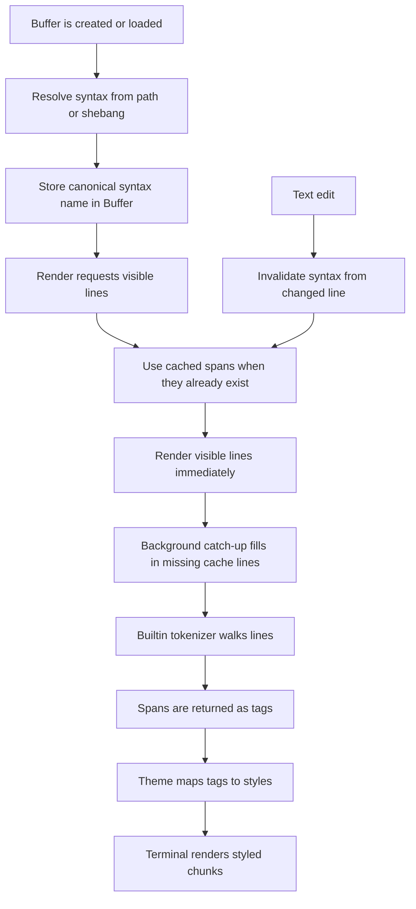

# Syntax Highlighting Tutorial

This document explains how urvim's syntax highlighting works from end to end.

urvim does not parse source code into an AST. Instead, it chooses a syntax definition, walks the buffer line by line, produces tagged spans, maps tags to theme styles, and renders the result to the terminal.

## Main Files

| File                                 | Role                                                                                                                       |
| ------------------------------------ | -------------------------------------------------------------------------------------------------------------------------- |
| `src/syntax/mod.rs`                  | Exposes syntax definitions, the builtin registry, and tokenizer dispatch entry points.                                     |
| `src/syntax/builtin.rs`              | Defines builtin syntax metadata such as names, aliases, filename patterns, shebang patterns, glyphs, and comment prefixes. |
| `src/syntax/definition.rs`           | Defines syntax metadata and the `SyntaxTokenizer` enum used for dispatch.                                                  |
| `src/syntax/registry.rs`             | Builds the builtin syntax registry and resolves syntax names, aliases, filename matches, and shebang matches.              |
| `src/syntax/builtin_tokenizers/*.rs` | Builtin builtin scanners. Each tokenizer walks one line and returns tagged spans plus any cross-line state.                |
| `src/buffer/io.rs`                   | Chooses an initial syntax when a buffer is created from text or a file path.                                               |
| `src/buffer/mod.rs`                  | Stores the active syntax name, resolves display labels, and refreshes syntax when the buffer changes.                      |
| `src/buffer/syntax.rs`               | Tokenizes lines, caches syntax state, and computes highlight spans.                                                        |
| `docs/background-jobs.md`            | Describes the internal deferred-work framework that syntax catch-up uses.                                                  |
| `src/editor_tab/buffer_view/view.rs` | Requests spans for visible lines and converts tags into highlight overlays.                                                |
| `src/theme/model.rs`                 | Defines theme style data, including the unified highlight-name mapping.                                                    |
| `src/editor_tab/render.rs`           | Applies the chosen line base style and writes styled chunks to the terminal screen.                                        |

## Core Concepts

### Syntax definition

A syntax definition contains:

- metadata such as `name`, `display_name`, `alias`, `filename`, `shebang`, and `comment_prefix`
- a `SyntaxTokenizer` value that selects the builtin tokenizer implementation

### Tokenizer

A tokenizer is Rust code under `src/syntax/builtin_tokenizers/`. It scans a single line from left to right, pushes `SyntaxSpan` values with semantic tags, and returns updated `SyntaxState` for constructs that can continue onto later lines.

### Tag

A tag is the semantic label attached to a match, such as `keyword`, `string`, or `comment.line`.

### Syntax cache

The buffer keeps a cache of syntax state and spans line by line, so edits only invalidate the necessary suffix of the buffer.

When a buffer is rendered, urvim uses any cached spans it already has for the visible viewport. If the cache has not reached a line yet, the editor paints that line with the base theme style first and lets background syntax catch-up fill in the missing spans later.
Background syntax catch-up is submitted in latest-only mode, so rapid edits can cancel older queued highlight work before it runs. The editor keeps showing the last completed syntax state while fresher work is still pending.

## High-Level Flow

## Choosing A Syntax

Syntax selection happens before highlighting begins.

The key entry point is `src/syntax/registry.rs`, where `SyntaxRegistry::resolve_for_path` checks:

1. `shebang` patterns
2. filename patterns
3. the fallback syntax, which is `plaintext`

The syntax resolution code also handles aliases.

## Tokenization

`Buffer::syntax_spans_for_line()` in `src/buffer/syntax.rs` asks the syntax cache to compute the requested line.

The cache makes sure earlier lines have already been tokenized, then returns the cached spans for the requested line.

If the requested line is not cached yet, the render path does not block waiting for the full file. It uses the current base style for that line and relies on the background job framework to catch up afterward.
That background work may be superseded by newer edits, but the last completed highlight stays visible until a fresher result is accepted.

The tokenizer walks the line from left to right. Most tokenizers are structured as an ordered sequence of direct byte-level checks, so specific patterns should come before broad fallback patterns.

## Syntax State

urvim keeps state across lines so multiline strings, block comments, code fences, and injected bodies can continue correctly.

Context markers are the main way rules communicate with later rules:

- `ctx.contains(...)` checks whether a marker is already active
- `ctx.push(...)` and `ctx.push_with_payload(...)` add markers or payload-bearing entries
- `ctx.pop(...)` removes the most recent matching entry

## Rendering

The tokenizer returns spans tagged with semantic labels like `keyword`, `string`, or `markup.code`.

`src/editor_tab/buffer_view/view.rs` translates those tags into highlight overlays, then `src/editor_tab/render.rs` applies the chosen line base style and writes the final styled chunks to the terminal.

After the syntax spans are available, urvim can layer comment-scoped todo highlighting on top of them during rendering. That overlay scans only comment spans, looks for configured standalone markers such as `TODO` and `FIXME`, and applies marker-specific tags like `comment.todo` without changing the underlying buffer text.

Theme highlights use the unified hierarchical naming model:

- UI chrome uses `ui.*` names such as `ui.status_bar`, `ui.diagnostic.error`, and `ui.window.active_line`
- input prompts use `ui.input.prompt` as the base style, with optional refinements like `ui.input.prompt.exact`, `ui.input.prompt.fuzzy`, and `ui.input.prompt.separator`
- gutter row emphasis uses `ui.window.gutter.active_line`
- syntax styling uses `syntax.*` names such as `syntax.comment` and `syntax.string.interpolation`
- the lookup rules are hierarchical, so the nearest defined parent wins when a specific highlight is missing
- highlight lookup returns the explicit overlay for that name; renderers decide which base style to layer underneath it

When a syntax tag is resolved, urvim maps the raw tag into the syntax highlight namespace before asking the theme for an overlay. That keeps the tokenizer vocabulary and the theme vocabulary aligned without requiring tokenizer code to include the `syntax.` prefix.

Renderers then choose the base style explicitly. An editor-tab line uses the theme default style on ordinary lines and `theme.default_style().overlay(ui.window.active_line)` on the active line before chunk overlays are applied.

So the pipeline is:

`tokenizer -> tags -> unified theme overlays -> renderer-chosen base style -> terminal output`

## After An Edit

Text edits live in `src/buffer/edit.rs`.
Every mutation invalidates syntax from the first changed line onward.

That matters because syntax state can spill across lines.
If line 10 changes, urvim cannot safely trust syntax results from line 10 onward, so it recomputes from that point forward using the preserved state from earlier lines.
Any background catch-up result carries the buffer generation it was computed against, and stale results are discarded if the buffer changed in the meantime.
Older queued catch-up jobs for the same buffer are also pruned before execution, which keeps the worker focused on the newest visible syntax state.

## Practical Advice

- Put comments, strings, and other structural matches before broad fallback matches.
- Prefer direct byte-level checks such as `tail.starts_with(...)`, byte indexing, and `char_indices()` over allocation-heavy helpers in hot paths.
- Precompute reusable tags with `static LazyLock<Tag>`.
- Use lookahead logic for call-style identifiers when you want the name highlighted only when a delimiter like `(` follows immediately after optional whitespace.
- Use `ContextStack` when a construct can continue across lines or when a token only makes sense after an earlier opener.
- Use nested tokenization/injection helpers when a body needs another syntax, such as Markdown code fences or HTML `<script>` bodies.

See `docs/syntax/grammar.md` for the current builtin-tokenizer authoring guide.

The tokenizer contract lives in the [builtin syntax grammar guide](grammar.md#tokenizer-contract).
