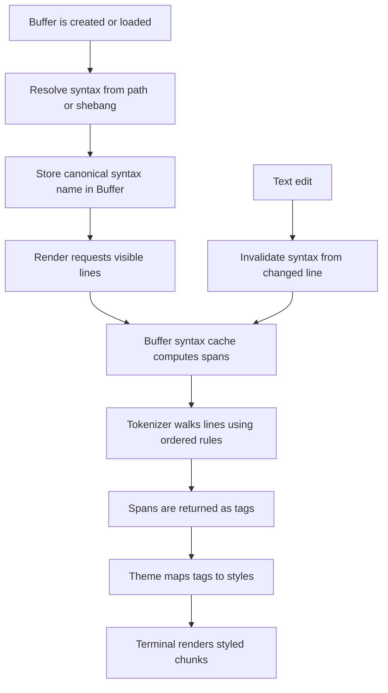

# Syntax Highlighting Tutorial

This document explains how urvim's syntax highlighting works from end to end.

urvim does not parse source code into an AST. Instead, it chooses a syntax definition, walks the buffer line by line, produces tagged spans, maps tags to theme styles, and renders the result to the terminal.

## Main Files

| File | Role |
|---|---|
| `src/syntax/mod.rs` | Loads and validates syntax grammar files, builds the registry, resolves syntax names, and promotes compiled syntax definitions on demand. |
| `src/syntax/builtins/*.toml` | Built-in syntax grammar files. |
| `src/buffer/io.rs` | Chooses an initial syntax when a buffer is created from text or a file path. |
| `src/buffer/mod.rs` | Stores the active syntax name, resolves display labels, and refreshes syntax when the buffer changes. |
| `src/buffer/syntax.rs` | Tokenizes lines, caches syntax state, and computes highlight spans. |
| `src/window/view.rs` | Requests spans for visible lines and converts tags into theme styles. |
| `src/theme/model.rs` | Defines theme style data, including the syntax tag-to-style mapping. |
| `src/window/render.rs` | Writes styled chunks to the terminal screen. |

## Core Concepts

### Syntax definition

A syntax definition contains:

- metadata such as `name`, `display_name`, `alias`, `filename`, and `shebang`
- one ordered `rules` list

### Rule

Rules are matched in order. The supported rule kinds are:

- `regex`
- `injection`

### Tag

A tag is the semantic label attached to a match, such as `keyword`, `string`, or `comment.line`.

### Syntax cache

The buffer keeps a cache of syntax state and spans line by line, so edits only invalidate the necessary suffix of the buffer.

## High-Level Flow



## Choosing A Syntax

Syntax selection happens before highlighting begins.

The key entry point is `src/syntax/mod.rs`, where `resolve_builtin_syntax` checks:

1. `shebang` patterns
2. filename patterns
3. the fallback syntax, which is `plaintext`

The syntax resolution code also handles aliases.

## Tokenization

`Buffer::syntax_spans_for_line()` in `src/buffer/syntax.rs` asks the syntax cache to compute the requested line.

The cache makes sure earlier lines have already been tokenized, then returns the cached spans for the requested line.

The tokenizer walks the line from left to right and tries the active rules in order.
The first matching rule wins, so specific patterns should come before broad fallback patterns.

## Syntax State

urvim keeps state across lines so multiline strings, block comments, code fences, and injected bodies can continue correctly.

Context markers are the main way rules communicate with later rules:

- `requires` checks whether a marker is already active
- `push` adds markers or payload-bearing entries
- `pop` removes the most recent matching entry

## Rendering

The tokenizer returns spans tagged with semantic labels like `keyword`, `string`, or `markup.code`.

`src/window/view.rs` translates those tags into active theme styles, then `src/window/render.rs` writes the final styled chunks to the terminal.

So the pipeline is:

`grammar -> tags -> theme styles -> terminal output`

## After An Edit

Text edits live in `src/buffer/edit.rs`.
Every mutation invalidates syntax from the first changed line onward.

That matters because syntax state can spill across lines.
If line 10 changes, urvim cannot safely trust syntax results from line 10 onward, so it recomputes from that point forward using the preserved state from earlier lines.

## Practical Advice

- Put comments and other structural matches before broad fallback matches.
- Keep regexes narrow.
- Use `context` when a rule only makes sense after an earlier opener.
- Reach for `injection` when a body needs nested highlighting.

## Example

```toml
[metadata]
name = "example"
display_name = "Example"
filename = ["\\.ex$"]
shebang = []

[[rules]]
kind = "regex"
pattern = "#.*$"
tag = "comment"

[[rules]]
kind = "injection"
selector = { capture = "^[ \\t]*([A-Za-z0-9_+-]+)" }
fallback = "unstyled"
context = { requires = ["script_host"] }
```
