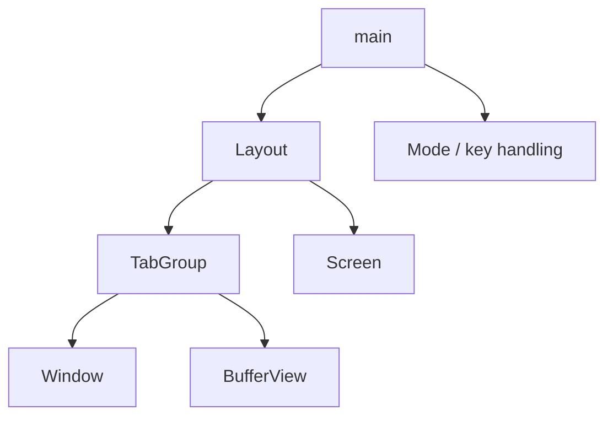

# Layout - Technical Design

## Architecture Overview
The new `layout` layer becomes the root UI container for urvim. In the first implementation, it owns a single existing `TabGroup` and gives it the full terminal region to render into. That makes `Layout` a structural wrapper today while establishing the container boundary needed for future support of multiple tab groups and other top-level widgets.

The important design choice is to keep the existing tab-group and window behavior intact. `Layout` does not reinterpret editing actions or change how buffers render. Instead, it becomes the top-level container that:

1. receives the terminal `origin` and `size`,
2. stores the current root geometry,
3. forwards rendering to the active child tab group, and
4. forwards widget actions to that child.

This keeps the current user experience stable while moving the application root from `TabGroup` to `Layout`.

## Interface Design

### Layout

```rust
pub struct Layout {
    tab_group: TabGroup,
    origin: Position,
    size: Size,
}

impl Layout {
    pub fn new(tab_group: TabGroup) -> Self;
    pub fn from_paths(paths: &[PathBuf]) -> Self;

    pub fn tab_group(&self) -> &TabGroup;
    pub fn tab_group_mut(&mut self) -> &mut TabGroup;

    pub fn active_buffer_view(&self) -> &BufferView;
    pub fn active_buffer_view_mut(&mut self) -> &mut BufferView;
    pub fn visual_cursor(&self) -> Option<Position>;

    pub fn render(&mut self, screen: &mut Screen, origin: Position, size: Size);
}

impl Widget for Layout {
    fn process_action(&mut self, action: &Action) -> ActionResult;
}
```

### Module exposure

The layout module should be exported from the crate root so `main` can construct it directly, just as it currently constructs `TabGroup`.

## Data Models

### Layout state

| Field | Type | Purpose |
|-------|------|---------|
| `tab_group` | `TabGroup` | The initial and only child widget for this stage |
| `origin` | `Position` | The top-left screen coordinate assigned to the layout |
| `size` | `Size` | The full terminal region assigned to the layout |

### Child model

The first version uses a single child only. That is enough to introduce the container boundary without committing to the final multi-child shape yet. The design intentionally leaves room for a later child list or tree structure without changing the external API exposed to `main`.

## Key Components

### Layout

**Responsibilities**
- Own the root terminal region.
- Own the initial tab group child.
- Forward rendering to the child with the full available region.
- Forward widget actions to the child.
- Expose the active buffer view and cursor location for snapshot and cursor management.

**Public behavior**
- `new` builds a root container around an existing `TabGroup`.
- `from_paths` creates the same startup state the application currently builds, but places it under `Layout`.
- `render` stores the latest root geometry and renders the child inside it.
- `process_action` delegates to the tab group so editing and tab navigation continue to behave as they do now.
- `visual_cursor` returns the active child cursor so the terminal cursor can still be positioned correctly.

**Dependencies**
- `TabGroup`, `Widget`, `Action`, `ActionResult`, `Screen`, `Position`, `Size`, `BufferView`

### Main loop integration

`main` should treat `Layout` as the root widget instead of `TabGroup`.

The main loop responsibilities remain the same:
- mode handling still lives in `main`,
- undo/redo still operate on the active buffer,
- snapshot bookkeeping still uses the active buffer view,
- `Layout` only owns the container boundary and child routing.

That means the application flow changes only at the root object, not at the editing semantics layer.

### TabGroup

`TabGroup` remains the existing tab container under the new root. Its responsibilities do not change in this stage. The layout layer simply wraps it so future UI layers can be inserted above or beside it later.

## User Interaction

The user-visible behavior should remain unchanged from the current tab-group editor:
- the tab bar still renders at the top of the screen,
- the active window still fills the remaining space,
- `[b` and `]b` still switch tabs,
- terminal resize events still produce a clean redraw.

The only structural change is that the application root now reserves the full terminal region for `Layout` first, and then `Layout` hands that region to the child tab group.

## External Dependencies

No new crates are required.

The layout layer reuses:
- existing `TabGroup` startup loading and rendering,
- existing `Widget` action routing,
- existing `Screen` drawing primitives,
- existing terminal size reporting,
- existing buffer and window rendering behavior.

## Error Handling

| Scenario | Handling |
|----------|----------|
| No startup files are provided | `Layout::from_paths` should still create a usable tab-group-backed editor state |
| All startup files fail to load | The editor should still start with a single empty tab group child |
| Terminal size is zero in one dimension | `render` should still avoid panics and forward the size safely to the child |
| Child geometry becomes inconsistent due to a bug | The layout layer should preserve a valid root region and let the child clamp or normalize its own state |

## Security

No new security-sensitive behavior is introduced by the layout layer.

- The layout container does not handle authentication or secrets.
- The layout container does not parse external network input.
- The layout container only rearranges internal UI ownership and geometry.

## Configuration

No new user-facing configuration is required for the first layout stage.

The layout root is fixed:
- one `Layout`,
- one `TabGroup` child,
- full-screen root ownership.

Future expansion may add user-selectable layout policies, but that is explicitly out of scope for this stage.

## Component Interactions



### Runtime flow

1. `main` creates `Layout` from startup paths.
2. `main` passes terminal `origin` and `size` to `Layout::render`.
3. `Layout` renders the child `TabGroup` inside the full root region.
4. `main` sends completed editor actions to `Layout::process_action`.
5. `Layout` forwards those actions to the tab group.
6. `main` queries the active buffer view and visual cursor through `Layout` for undo, snapshot, and cursor placement.

## Platform Considerations

The first layout implementation is terminal-only and inherits the current editor constraints:
- it must work with resizes of arbitrary terminal dimensions,
- it must preserve Unicode-aware rendering behavior already used by the tab group and windows,
- it must keep drawing logic compatible with the existing double-buffered `Screen`,
- it must not assume a fixed minimum terminal size.

Because this stage only adds a structural wrapper, the implementation should remain portable across the same platforms supported by the current editor.
