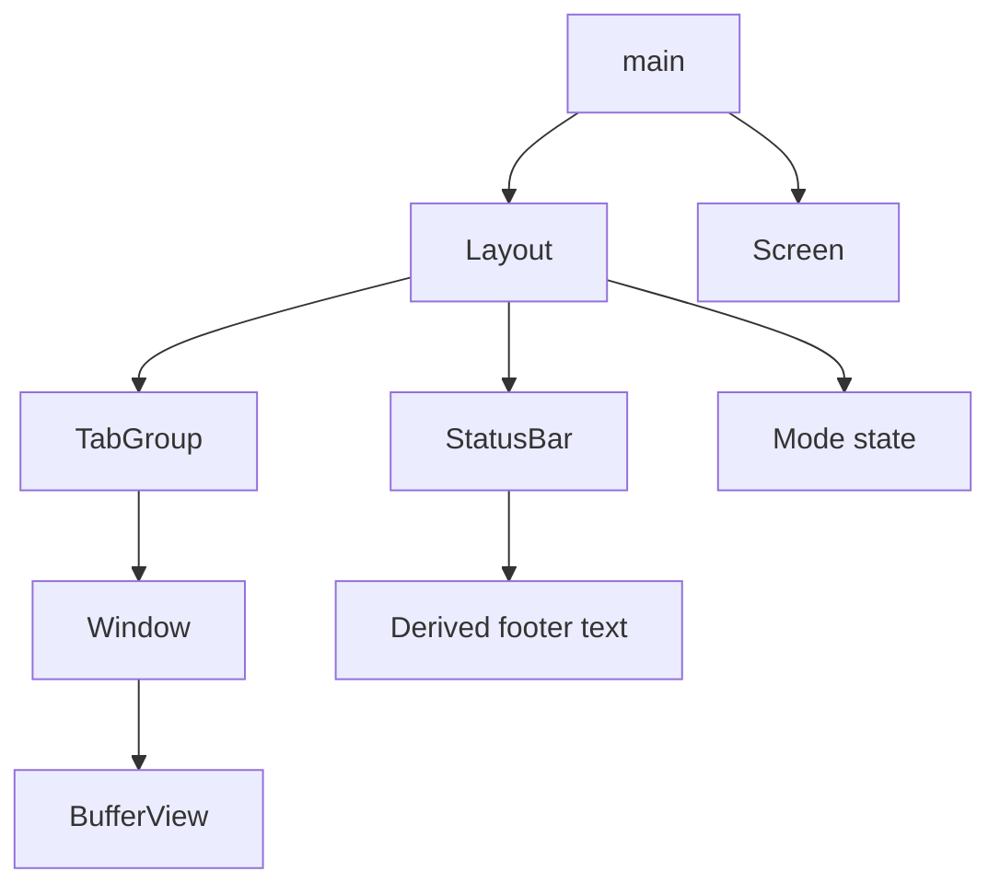

# Layout Status Bar - Technical Design

## Architecture Overview
The root `Layout` container should expand from a structural wrapper into the owner of the editor’s top-level UI chrome. In this stage, `Layout` keeps the existing `TabGroup` as the main content region, adds a one-row status bar footer, and tracks the current mode kind so the footer can display mode information without depending on `main` for rendering state.

The rendering split becomes:

1. the existing tab bar remains in the first row of the tab-group area,
2. the main buffer content occupies the rows between the tab bar and the status bar, and
3. the new status bar occupies the last usable row of the layout.

This preserves the current editing model while giving the root UI a stable place for editor metadata.

## Interface Design

### Mode

```rust
pub enum ModeKind {
    Normal,
    Insert,
}

pub trait Mode {
    fn handle_key(&mut self, key: &Key) -> HandleKeyResult;
    fn cursor_style(&self) -> CursorStyle;
    fn is_waiting(&self) -> bool;
    fn clear_buffer(&mut self);
    fn kind(&self) -> ModeKind;
}
```

### Layout

```rust
pub struct Layout {
    tab_group: TabGroup,
    status_bar: StatusBar,
    mode_kind: ModeKind,
    origin: Position,
    size: Size,
}

impl Layout {
    pub fn new(tab_group: TabGroup, mode_kind: ModeKind) -> Self;
    pub fn from_paths(paths: &[PathBuf]) -> Self;

    pub fn tab_group(&self) -> &TabGroup;
    pub fn tab_group_mut(&mut self) -> &mut TabGroup;

    pub fn mode_kind(&self) -> ModeKind;
    pub fn mode_label(&self) -> &str;
    pub fn set_mode_kind(&mut self, mode_kind: ModeKind);

    pub fn active_buffer_view(&self) -> &BufferView;
    pub fn active_buffer_view_mut(&mut self) -> &mut BufferView;
    pub fn visual_cursor(&self) -> Option<Position>;

    pub fn render(&mut self, screen: &mut Screen, origin: Position, size: Size);
}
```

### StatusBar

```rust
pub struct StatusBar;

impl StatusBar {
    pub fn new() -> Self;

    pub fn render(
        &self,
        screen: &mut Screen,
        origin: Position,
        size: Size,
        context: &StatusBarContext,
    );
}
```

### StatusBarContext

```rust
pub struct StatusBarContext<'a> {
    pub mode_label: &'a str,
    pub buffer_name: &'a str,
    pub cursor_line: usize,
    pub cursor_byte_col: usize,
    pub line_count: usize,
}
```

The status bar should receive already-derived context from `Layout` rather than reaching back into the rest of the editor tree. That keeps formatting logic isolated from layout ownership and makes the footer easier to test.

`ModeKind` is an editor-facing enum that mirrors the live editor mode for display purposes. `main` is responsible for converting the active `Mode` implementation into a `ModeKind` value whenever the mode changes, using the `Mode::kind` method.

## Data Models

### Layout state

| Field | Type | Purpose |
|-------|------|---------|
| `tab_group` | `TabGroup` | The existing tab container and editor workspace |
| `status_bar` | `StatusBar` | The footer renderer for editor metadata |
| `mode_kind` | `ModeKind` | The active editor mode label owned by the layout |
| `origin` | `Position` | The top-left coordinate of the root layout |
| `size` | `Size` | The full terminal region assigned to the layout |

### Status bar context

| Field | Type | Purpose |
|-------|------|---------|
| `mode_label` | `&str` | Human-readable current mode name |
| `buffer_name` | `&str` | Active buffer file name or fallback label |
| `cursor_line` | `usize` | Current cursor line, expressed in user-facing line numbering |
| `cursor_byte_col` | `usize` | Current cursor column in bytes |
| `line_count` | `usize` | Total number of lines in the active buffer |

## Key Components

### Layout

**Responsibilities**
- Own the root terminal geometry.
- Own the active `TabGroup`, current mode kind, and footer renderer.
- Split the available screen space between the tab group and the status bar.
- Keep the status bar synchronized with the active buffer, cursor, and mode kind.
- Continue forwarding editor actions to the tab group so editing behavior stays unchanged.

**Public behavior**
- `new` builds a layout from an existing tab group and an initial mode.
- `from_paths` creates the startup state under the new layout root.
- `render` stores the latest root geometry, computes the footer row, and renders the tab group and status bar into their assigned regions.
- `mode_kind`, `mode_label`, and `set_mode_kind` let the main loop continue to drive key handling while the rendering label itself lives in the layout.
- `visual_cursor` still reports the cursor position the terminal should place visually.

**Dependencies**
- `TabGroup`, `StatusBar`, `ModeKind`, `Screen`, `BufferView`, `Position`, `Size`

### StatusBar

**Responsibilities**
- Format and render a single-line footer.
- Present the current mode, active buffer name, cursor position, and file progress.
- Truncate gracefully when the terminal width is too small to fit the full footer text.

**Formatting rules**
- The mode label should be derived from the current `ModeKind` value, using `Normal` or `Insert`.
- The buffer name should use the active buffer’s file name when available and the project’s existing unnamed fallback otherwise.
- The cursor position should show the active line number and byte column.
- File progress should be computed from the cursor line and total line count, and should clamp to `100%` on the last line.

**Dependencies**
- `Screen`, `Position`, `Size`, `StatusBarContext`

### Main loop integration

`main` should continue owning the live `Mode` object and set `Layout`'s `ModeKind` whenever the mode changes. The undo/redo and snapshot flow should continue to use the active buffer view exposed by `Layout`.

### TabGroup

`TabGroup` remains the existing editing workspace under the new root. Its tab bar stays at the top of the content area, and it should not become aware of the status bar except through the reduced height it receives from `Layout`.

## User Interaction

The editor should continue to feel like the current tab-group-based UI, with one new line of persistent metadata:

- the tab bar remains at the top,
- the active window continues to occupy the central editor area,
- the status bar appears at the bottom,
- mode changes update the footer immediately,
- buffer switches update the file name and progress fields,
- cursor motion updates the cursor position and percentage fields.

When the cursor reaches the final line of the file, the status bar should show `100%` rather than a smaller rounded value.

## External Dependencies

No new crates are required.

The feature reuses:
- existing mode implementations,
- existing buffer file-name and cursor APIs,
- existing tab-group rendering,
- existing screen drawing and resize handling.

## Error Handling

| Scenario | Handling |
|----------|----------|
| The buffer has no file name | Render the existing unnamed fallback label rather than leaving the field blank |
| The terminal is too narrow for the full footer | Clip the footer text to the available width |
| The terminal is too short for both content and footer | Preserve safe rendering and let the available rows collapse naturally |
| The active cursor or buffer state is temporarily inconsistent | Clamp derived values and avoid panics during status-bar formatting |
| The buffer is a single line | Treat the file progress as complete and render `100%` |

## Security

No new security-sensitive behavior is introduced.

- The status bar only formats local editor state.
- The layout does not process network input or secrets.
- The feature does not change authentication, authorization, or persistence behavior.

## Configuration

No new user-facing configuration is required.

The status bar layout is fixed for this stage:
- footer row at the bottom,
- existing tab bar at the top,
- no user-adjustable formatting yet.

## Component Interactions



### Runtime flow

1. `main` creates `Layout` from startup paths.
2. `main` routes key events through the mode object owned by `Layout`.
3. `main` passes completed actions to `Layout::process_action`.
4. `Layout` forwards editing actions to the active tab group.
5. On redraw, `Layout` computes the status-bar context from the active mode kind and active buffer view.
6. `Layout` renders the tab group in the main region and the status bar in the footer row.
7. `main` continues to use `Layout` for visual cursor placement while independently managing terminal cursor style updates from the live mode.

## Platform Considerations

The feature remains terminal-only and should continue to behave correctly across the same platforms as the current editor.

Because the status bar is constrained to a single line, the implementation should:
- handle narrow terminals without assuming a minimum footer width,
- handle short terminals without panicking when little or no content space is available,
- preserve existing Unicode-aware rendering behavior for buffer names and mode labels,
- stay compatible with the double-buffered screen renderer already used by the editor.
