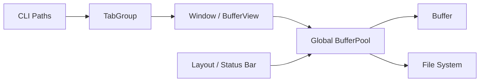

# Global Buffer Pool - Technical Design

## Architecture Overview
urvim will replace direct `Buffer` ownership in windows and views with a process-global `BufferPool` that owns every live buffer. Each buffer will be addressed by a `BufferId`, a newtype wrapper around `usize`, and windows will resolve the buffer they need from the pool when rendering or handling actions.

The pool will be the single entry point for buffer creation, file loading, file saving, deduplication, and mutable access. It will maintain both an ID index and a path index so file-backed buffers can be reused when the same absolute path is opened more than once.

## Interface Design

### BufferId
```rust
pub struct BufferId(pub usize);
```

- `BufferId` is opaque to callers except for copy/compare behavior.
- IDs are assigned sequentially starting at `0`.
- The ID only identifies a pool entry; it does not own the buffer.

### BufferPool
```rust
pub struct BufferPool { ... }
```

Public responsibilities:
- Create new empty buffers and return their `BufferId`
- Open file-backed buffers from paths and deduplicate them by absolute path
- Resolve a `BufferId` to shared buffer access for read and write operations
- Save existing buffers back to disk using their stored path or an explicit path
- Expose lightweight read-only helpers for UI code such as file name lookup and line counts

Representative methods:
```rust
pub fn new() -> Self;
pub fn create_buffer(&mut self) -> BufferId;
pub fn create_buffer_with_path(&mut self, path: impl AsRef<Path>) -> io::Result<BufferId>;
pub fn open_buffer(&mut self, path: impl AsRef<Path>) -> io::Result<BufferId>;
pub fn get(&self, id: BufferId) -> Option<&Buffer>;
pub fn get_mut(&mut self, id: BufferId) -> Option<&mut Buffer>;
pub fn save_buffer(&mut self, id: BufferId) -> io::Result<()>;
```

### Buffer View
`BufferView` will store:
- `buffer_id: BufferId`
- `scroll_offset`
- `cursor`
- `remembered_visual_col`

It will no longer store a `Buffer`. Its methods will accept a buffer lookup handle or pool reference when they need to inspect or mutate buffer contents.

### Window and Layout Flow
`Window::render` and `TabGroup::render` will obtain the current buffer from the global pool at render time using the active view’s `BufferId`. Status bar rendering will also resolve the active buffer from the pool to read metadata such as the file name and line count.

## Data Models

### BufferId
- Type: `usize` newtype
- Constraints: unique within a running process, monotonically assigned

### BufferPool State
- `next_id: usize` for ID generation
- `buffers: HashMap<BufferId, BufferEntry>` for ID-based lookup
- `paths: HashMap<AbsolutePath, BufferId>` for file deduplication

### BufferEntry
Each entry will store:
- `buffer: Buffer`
- `path: Option<AbsolutePath>`

The stored path will be the canonical absolute path used for deduplication when present. Unsaved buffers will have no path and will not be indexed in the path map.

### Global Access Point
The pool will live behind a global accessor, likely in `globals.rs`, so the rest of the editor can retrieve the active pool without threading ownership through every call site. The design assumes a single-threaded editor loop, so the global can be used as mutable application state rather than a concurrent shared resource.

## Key Components

### BufferPool
Responsibilities:
- Own all buffer state
- Resolve absolute paths before open/create operations
- Deduplicate by path
- Keep ID assignment stable
- Provide read/write access for editing and rendering

Dependencies:
- `Buffer`
- `AbsolutePath`
- File I/O and path resolution helpers

### BufferView
Responsibilities:
- Track cursor and scroll state for a window
- Remember visual cursor columns across vertical motion
- Carry only a `BufferId` reference to shared buffer state

Dependencies:
- `BufferId`
- Buffer lookup access from the pool

### Window
Responsibilities:
- Render visible buffer content by resolving the buffer at render time
- Route editing operations to the active buffer through the pool
- Preserve existing window scrolling and cursor behavior

Dependencies:
- `BufferView`
- `BufferPool`

### TabGroup and Layout
Responsibilities:
- Create buffers through the pool when opening CLI paths or spawning new tabs
- Pass buffer IDs into windows
- Resolve active buffer metadata for the status bar

Dependencies:
- `BufferPool`
- `BufferView`
- `Window`

## User Interaction
The user-facing workflow should remain the same:
- Opening files from the CLI or editor commands still produces tabs and windows as before
- Opening the same file twice should now reuse the same underlying buffer
- Editing a shared buffer in one window should immediately affect all other windows that reference that buffer

No new UI controls are required for `BufferId`. The ID is an internal implementation detail used for shared ownership and deduplication.

## External Dependencies
- `std::path::absolute` for path normalization
- `std::fs::File` and standard read/write APIs for file I/O
- Existing `AbsolutePath` wrapper for canonical path storage
- `std::collections::HashMap` for the buffer and path indexes

## Error Handling
- Opening a path that cannot be resolved, read, or parsed must return an I/O error and must not allocate a pool entry.
- If path resolution succeeds but buffer loading fails, the pool must not register the buffer in either index.
- Looking up an invalid `BufferId` should return `None` at the pool boundary and be treated as a programmer error in internal editor flow.
- Saving a buffer with no associated path should require an explicit path or return an error, depending on the call site.

Recovery strategy:
- Callers that open files should keep the existing warn-and-skip behavior for CLI startup paths.
- Window and status bar rendering should avoid panicking on missing buffer IDs by treating lookup failures as a non-renderable editor state.

## Security
The buffer pool does not introduce new authentication or authorization concerns. It only manages local editor state and file access. Path resolution should use absolute paths to reduce ambiguity and accidental duplicate opens, but it is not a sandboxing mechanism.

## Configuration
No new user-facing configuration is required. The pool behavior is always enabled because it is part of the core buffer ownership model.

## Component Interactions


Interaction flow:
1. `TabGroup` requests a new buffer or opens a path through the pool.
2. The pool resolves and deduplicates the buffer, returning a `BufferId`.
3. `BufferView` stores the `BufferId`.
4. `Window` and `Layout` resolve the `BufferId` back into a buffer only when they need to render or inspect metadata.
5. Editing operations mutate the shared buffer in the pool, so every view sees the same content.

## Platform Considerations
- The existing editor is single-process and effectively single-threaded, so a simple global pool is sufficient.
- Path normalization must behave consistently across supported platforms so that deduplication works for equivalent relative paths.
- Absolute-path comparisons should respect the platform’s native path representation through the existing `AbsolutePath` type.
