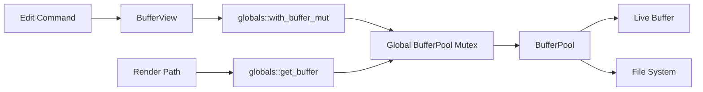

# Detached Buffer Mutation Guard - Technical Design

## Architecture Overview
The current buffer pool uses a clone-and-commit mutable guard, which is unsafe once buffer access can happen from multiple threads. The redesign removes the detached mutable snapshot pattern and makes all writes happen while the buffer pool is still in control of the live buffer entry.

The key change is that mutable buffer access becomes a pool-mediated operation, not an owned object that can be carried away and dropped later. Read access may continue to use snapshots, but writes must stay synchronized through the pool so there is always one authoritative buffer state.

The global `Mutex<BufferPool>` remains the coordination point. That is intentionally coarse-grained, but it guarantees correctness without introducing unsafe lifetime tricks or hidden commit ordering.

## Interface Design

### BufferPool
```rust
pub struct BufferPool { ... }
```

Public responsibilities:
- Own all live buffers and assign stable `BufferId` values
- Deduplicate file-backed buffers by absolute path
- Provide read access by ID
- Provide synchronized mutation by ID through a closure-based API
- Save and open buffers without exposing detached mutable state

Representative methods:
```rust
pub fn new() -> Self;
pub fn create_buffer(&mut self) -> BufferId;
pub fn register_buffer(&mut self, buffer: Buffer) -> BufferId;
pub fn create_buffer_with_path(&mut self, path: impl AsRef<Path>) -> io::Result<BufferId>;
pub fn open_buffer(&mut self, path: impl AsRef<Path>) -> io::Result<BufferId>;
pub fn get(&self, id: BufferId) -> Option<&Buffer>;
pub fn with_buffer_mut<R>(&mut self, id: BufferId, f: impl FnOnce(&mut Buffer) -> R) -> Option<R>;
pub fn save_buffer(&mut self, id: BufferId) -> io::Result<()>;
```

### BufferView
`BufferView` continues to store:
- `buffer_id: BufferId`
- `scroll_offset`
- `cursor`
- `remembered_visual_col`

It no longer hands out an owned mutable buffer guard. Instead, it exposes a small set of edit-oriented helpers that route buffer mutations through the pool while the pool lock is held. UI code should treat the view as an index into the pool, not as a buffer owner.

### Global Access
The helpers in `globals.rs` remain the public entry point for the rest of the editor:

```rust
pub fn with_buffer_pool<R>(f: impl FnOnce(&mut BufferPool) -> R) -> R;
pub fn get_buffer(id: BufferId) -> Option<Buffer>;
pub fn with_buffer_mut<R>(id: BufferId, f: impl FnOnce(&mut Buffer) -> R) -> Option<R>;
```

`with_buffer_mut` becomes the only supported write path for code that is not already holding the pool lock. The closure executes while the pool is locked, so no mutable buffer state can escape beyond the synchronization boundary.

## Data Models

### BufferId
- `usize` newtype used as a stable lookup key
- Unchanged from the current pool implementation

### BufferPool State
- `next_id: usize` for sequential ID generation
- `buffers: HashMap<BufferId, Buffer>` for direct lookup
- `paths: HashMap<AbsolutePath, BufferId>` for file deduplication

The stored `Buffer` value remains the source of truth for each entry. What changes is how callers are allowed to reach it: they can inspect a clone or mutate through a callback, but they cannot keep an owned mutable snapshot that later overwrites the pool.

### Mutable Access Result
Mutable access returns the callback result, not a guard object. The mutation helper has this shape:

```rust
Option<R>
```

`None` means the `BufferId` did not exist at the time the pool was locked. The closure is never invoked in that case.

## Key Components

### BufferPool
Responsibilities:
- Serialize all writes to a given pool entry
- Preserve path indexes when buffer contents change
- Keep path-based deduplication stable
- Return `None` or `io::Result` on missing entries and I/O failures

Dependencies:
- `Buffer`
- `AbsolutePath`
- `std::sync::Mutex`

### BufferView
Responsibilities:
- Track window-local cursor and scroll state
- Request read snapshots for rendering
- Route editing commands through pool-managed mutation helpers

Dependencies:
- `BufferId`
- `BufferPool`

### Window Commands and Edit Paths
Responsibilities:
- Convert user actions into closure-based buffer mutations
- Update cursor values from the callback result when the buffer operation succeeds
- Avoid assuming that a mutable buffer object can be stored and reused later

Dependencies:
- `BufferView`
- `globals::with_buffer_mut`
- `Buffer` editing methods

## User Interaction
No user-visible behavior should change. Opening files, editing text, undo/redo, and rendering should continue to work as before. The only observable difference should be that concurrent edits can no longer silently overwrite one another through a detached guard.

## External Dependencies
- `std::sync::Mutex` and `std::sync::OnceLock` for global coordination
- Existing `AbsolutePath` path normalization helper
- Existing file I/O APIs already used by the buffer module

No new concurrency crate is required for the initial fix.

## Error Handling
- If a `BufferId` is missing, mutation helpers return `None` and the caller should treat that as a stale or invalid handle.
- If path resolution or file loading fails, no pool entry should be created.
- If a write callback panics, the global mutex poisoning behavior should be handled the same way as other editor global state.

Recovery strategy:
- Rendering should continue to use snapshot reads and should fail gracefully if a buffer ID is missing.
- Editing commands should no-op or surface a programmer-facing failure when the targeted buffer no longer exists.

## Security
This change improves safety by removing the last-writer-wins mutable snapshot pattern. It does not introduce new authorization concerns or external trust boundaries. All access remains confined to local editor state.

## Configuration
No configuration changes are required. Safe multi-threaded buffer access is always enabled as part of the core buffer pool behavior.

## Component Interactions


Interaction flow:
1. A command or editing action targets the active `BufferView`.
2. The view asks the global helper to run a mutation callback for its `BufferId`.
3. The global pool mutex is held for the duration of the callback.
4. The callback mutates the live `Buffer` in place and returns any cursor or status result needed by the caller.
5. Rendering continues to read snapshot clones, but it never mutates shared state.

## Platform Considerations
- The current editor remains effectively single-process, so a global mutex is an acceptable correctness-first synchronization primitive.
- Coarse locking keeps the design simple and portable across supported platforms.
- If later performance work requires finer granularity, the public API should still avoid detached mutable snapshots so the concurrency model stays explicit and safe.
