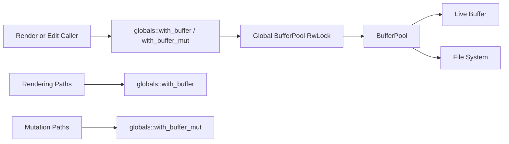

# Buffer Read Lock Refactor - Technical Design

## Architecture Overview
The refactor changes the global buffer access model in two ways.

First, read access no longer returns an owned `Buffer`. Callers instead use a closure-scoped helper to inspect the live buffer while holding a shared read lock on the pool. That removes the clone boundary and makes it explicit that reads are short-lived.

Second, the global `BufferPool` is moved from a `Mutex` to an `RwLock`. Immutable callers can now share the pool concurrently, while mutable callers still take exclusive access for edits and pool mutations.

The pool remains the single owner of all live `Buffer` values. What changes is the synchronization shape around access, not the underlying ownership model.

## Interface Design

### Global State
```rust
pub fn buffer_pool() -> &'static RwLock<BufferPool>;
pub fn with_buffer_pool<R>(f: impl FnOnce(&mut BufferPool) -> R) -> R;
pub fn with_buffer<R>(id: BufferId, f: impl FnOnce(&Buffer) -> R) -> Option<R>;
pub fn with_buffer_mut<R>(id: BufferId, f: impl FnOnce(&mut Buffer) -> R) -> Option<R>;
```

Responsibilities:
- Expose the global pool through a read-write lock
- Provide closure-scoped read access for a `BufferId`
- Provide closure-scoped mutable access for a `BufferId`
- Keep lock lifetimes internal to the helper functions

### BufferPool
```rust
pub struct BufferPool { ... }
```

Public responsibilities:
- Own all live buffers
- Assign and preserve stable `BufferId` values
- Deduplicate file-backed buffers by absolute path
- Support immutable lookup and mutable lookup within the pool
- Continue to manage open/save operations without exposing detached mutable state

Representative methods:
```rust
pub fn new() -> Self;
pub fn create_buffer(&mut self) -> BufferId;
pub fn register_buffer(&mut self, buffer: Buffer) -> BufferId;
pub fn create_buffer_with_path(&mut self, path: impl AsRef<Path>) -> io::Result<BufferId>;
pub fn open_buffer(&mut self, path: impl AsRef<Path>) -> io::Result<BufferId>;
pub fn get(&self, id: BufferId) -> Option<&Buffer>;
pub fn get_mut(&mut self, id: BufferId) -> Option<&mut Buffer>;
pub fn with_buffer_mut<R>(&mut self, id: BufferId, f: impl FnOnce(&mut Buffer) -> R) -> Option<R>;
pub fn save_buffer(&mut self, id: BufferId) -> io::Result<()>;
```

### BufferView
`BufferView` remains the window-local handle to a buffer, but it no longer needs to act like a buffer owner.

It should expose:
- the `BufferId`
- local cursor and scroll state
- read-oriented helpers that route through the global closure-based buffer access API
- mutation-oriented helpers that route through the global mutable access API

The key rule is that `BufferView` should not force callers into an owned buffer snapshot just to read state.

## Data Models

### BufferId
- Unchanged stable `usize` newtype
- Still assigned monotonically from `0`

### BufferPool State
- `next_id: usize`
- `buffers: HashMap<BufferId, Buffer>`
- `paths: HashMap<AbsolutePath, BufferId>`

These fields remain the source of truth for buffer ownership. The synchronization wrapper changes, but the stored data model does not.

### Closure-Scoped Access Result
Read and write helpers return the callback result, not an owned buffer handle.

```rust
Option<R>
```

`None` means the buffer was not found at the time the lock was held.

## Key Components

### Global Buffer Access Helpers
Responsibilities:
- Acquire the appropriate read or write lock
- Look up a buffer by `BufferId`
- Execute the callback while the lock is held
- Return the callback result or `None` if the buffer is missing

Dependencies:
- `BufferPool`
- `std::sync::RwLock`

### BufferPool
Responsibilities:
- Own buffers and path indexes
- Keep buffer lookup stable
- Serve both read and write access through short-lived callbacks
- Preserve file-backed deduplication rules

Dependencies:
- `Buffer`
- `AbsolutePath`
- `HashMap`

### BufferView and Read Callers
Responsibilities:
- Request read data through closure-scoped helpers
- Compute cursor, scroll, and render state from live buffer reads
- Avoid storing or returning owned buffer snapshots where not needed

Dependencies:
- `BufferId`
- `Buffer`
- global access helpers

## User Interaction
No user-visible editor behavior should change. Rendering, cursor movement, editing commands, and file-backed buffer deduplication should work as before.

The observable difference should be internal:
- read-heavy code can share access more efficiently
- the codebase no longer depends on cloning a full `Buffer` for ordinary reads

## External Dependencies
- `std::sync::RwLock`
- Existing `Buffer`, `BufferPool`, and `AbsolutePath` code
- Existing window, layout, motion, and rendering modules

No new third-party concurrency crate is required.

## Error Handling
- Missing buffer IDs must return `None` from the closure helper.
- Lock poisoning should follow the same panic-propagation behavior used elsewhere in the editor globals.
- Path resolution and file I/O failures must continue to return `io::Result` errors without partially registering a buffer.
- Read helpers must not outlive the lock scope or expose borrowed buffer state beyond the callback.

Recovery strategy:
- Rendering should treat a missing buffer as an empty or default state where the existing code already does so.
- Editing flows should continue to no-op or fail clearly when the target buffer is absent.

## Security
This change improves clarity and safety by making the read/write split explicit through the type system and lock choice. It does not add trust boundaries, external inputs, or `unsafe` code.

## Configuration
No configuration changes are required.

## Component Interactions


Interaction flow:
1. A caller needs buffer state for rendering or editing.
2. The caller invokes the appropriate global helper with a `BufferId`.
3. The helper acquires a read or write lock on the global pool.
4. The helper looks up the buffer and executes the callback while the lock is held.
5. The callback returns the computed result without cloning the full buffer.

## Platform Considerations
- `RwLock` is a good fit for the current single-process editor model.
- The design keeps the concurrency model explicit and portable.
- If later work needs finer-grained concurrency, the public API should still remain closure-scoped so callers never rely on detached snapshots.
