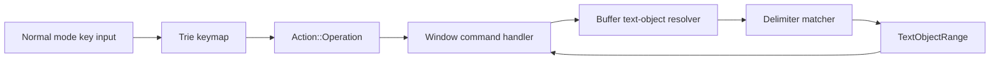

# Bracket Text Objects - Technical Design

## Architecture Overview

This feature extends the existing operator-pending text-object path so bracket selections are resolved through the same `Action::Operation(Operator, OperatorTarget)` flow used by other text objects.

The high-level flow is:

```text
Keypress -> NormalMode keymap
         -> Action::Operation(Operator, OperatorTarget::TextObject(...))
         -> Window command handling
         -> Buffer resolves matching delimiter range
         -> Buffer deletes or changes the resolved range
         -> Cursor lands at the start of the affected region
```

The implementation should keep delimiter matching logic isolated from key parsing so future text objects can reuse the same resolution path.

## Interface Design

### Action Model

Extend `TextObject` with bracket-aware variants that represent both scope and delimiter family:

```rust
pub enum TextObject {
    InnerWord,
    AroundWord,
    InnerBracket(BracketKind),
    AroundBracket(BracketKind),
}

pub enum BracketKind {
    Paren,
    Square,
    Curly,
    Angle,
}
```

This keeps operator-pending targets explicit while preserving the current `Action::Operation` shape.

### Normal Mode Keymap

Register direct operator-pending sequences for the supported bracket families and their Vim aliases:

```rust
"di(" -> Operation(Delete, TextObject::InnerBracket(BracketKind::Paren))
"da(" -> Operation(Delete, TextObject::AroundBracket(BracketKind::Paren))
"dib" -> same as `di(`
"dab" -> same as `da(`
```

Equivalent inner/around bindings should exist for square, curly, and angle bracket families, accepting both opening and closing delimiter keys where Vim does.

### Buffer Range Resolution

Add bracket-aware range helpers in the buffer layer:

```rust
impl Buffer {
    pub fn get_bracket_text_object_range(
        &self,
        cursor: Cursor,
        object: TextObject,
        count: usize,
    ) -> Option<TextObjectRange>;
}
```

The helper should:

- locate the innermost matching pair that encloses the cursor
- if the cursor is outside any pair, search for the next valid pair that starts on the current line
- expand outward when a count greater than one is requested
- return `None` when no matching pair exists
- preserve the existing `TextObjectRange` contract of start-inclusive, end-exclusive ranges

## Data Models

### `BracketKind`

- Type: enum
- Purpose: identify the delimiter family being matched
- Constraints:
  - must remain small and copyable
  - must map cleanly to opener and closer characters

### `TextObject`

- Type: enum
- Purpose: represent operator-pending text objects
- Constraints:
  - existing word variants remain unchanged
  - bracket variants must encode both scope and delimiter family

### `TextObjectRange`

No schema change is required.

The range model remains:

- `start: Cursor`
- `end: Cursor`

## Key Components

### `src/editor/normal.rs`

Responsibilities:

- register the bracket text-object key sequences in the normal-mode trie
- keep `d` and `c` waiting for bracket-object completion when a prefix is partial
- preserve existing count parsing behavior

### `src/editor/action.rs`

Responsibilities:

- define the bracket-aware `TextObject` variants
- keep `Action::Operation` countable and snapshottable

### `src/buffer/text_object.rs`

Responsibilities:

- resolve word text objects
- resolve bracket text objects
- own the delimiter-matching logic or delegate to a focused helper module if the implementation grows

### `src/window/commands.rs`

Responsibilities:

- apply the resolved bracket range through the existing delete/change execution path
- preserve cursor placement and undo snapshot behavior

## User Interaction

### Key Sequence Behavior

The new commands should slot into normal mode the same way existing text objects do:

```text
d -> wait
  i -> wait for inner object completion
  a -> wait for around object completion
```

Bracket families should resolve on the second or third keystroke depending on the alias used, for example `di(`, `da[`, `diB`, or `da>`.

### Range Semantics

Bracket text objects should behave as follows:

1. Inner objects
   - select only the text between the matched delimiters
   - exclude both delimiters

2. Around objects
   - select the delimiters and the enclosed text
   - keep the selection stable for nested delimiter pairs

3. Nesting
   - the innermost matching pair enclosing the cursor wins
   - if a count is applied, the final resolved region should reflect the multiplied count before deletion or change is applied

## External Dependencies

No new external dependencies are required.

The feature should reuse:

- existing trie keymap support
- existing buffer cursor and multi-line traversal logic
- existing undo/redo infrastructure

## Error Handling

| Scenario | Behavior |
| --- | --- |
| Cursor is outside any supported delimiter pair but a later pair starts on the current line | Resolve against the next valid pair on that line |
| No matching opener/closer exists on the current line | Return no range and leave the buffer unchanged |
| Count resolves beyond available nested pairs | Clamp to the widest valid matching pair or fail cleanly if no valid pair exists |
| Delimiters are malformed or unbalanced | Ignore the operation rather than making a partial edit |

The implementation should not fabricate a range when the delimiter pair cannot be proven valid.

## Security

No security-sensitive behavior is introduced.

The feature only interprets editor text and key input already available to the local process.

## Configuration

No new configuration options are required for the first release.

## Component Interactions



The delimiter matcher should stay inside the buffer layer so operator execution does not need to understand nesting rules.

## Platform Considerations

- The implementation must remain Unicode-safe for cursor positions and range boundaries.
- Multi-line selections should work consistently on all supported terminals.
- Angle-bracket matching should avoid relying on terminal-specific rendering behavior.
