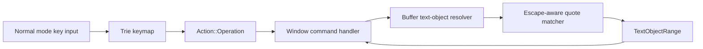

# Quote Text Objects - Technical Design

## Architecture Overview

This feature extends the existing operator-pending text-object path so quote selections are resolved through the same `Action::Operation(Operator, OperatorTarget)` flow already used for word and bracket text objects.

The runtime flow stays the same:

```text
Keypress -> NormalMode keymap
         -> Action::Operation(Operator, OperatorTarget::TextObject(...))
         -> Window command handling
         -> Buffer resolves matching quote range
         -> Buffer deletes or changes the resolved range
         -> Cursor lands at the start of the affected region
```

The quote resolver should stay isolated from key parsing and operator dispatch. That keeps quote matching reusable and avoids mixing text-object syntax rules into normal-mode input handling.

## Interface Design

### Action Model

Extend `TextObject` with quote-aware variants and add a small enum for quote families:

```rust
pub enum QuoteKind {
    Single,
    Double,
    Backtick,
}

pub enum TextObject {
    InnerWord,
    AroundWord,
    InnerBracket(BracketKind),
    AroundBracket(BracketKind),
    InnerQuote(QuoteKind),
    AroundQuote(QuoteKind),
}
```

This keeps operator-pending targets explicit while preserving the current `Action::Operation` shape.

### Normal Mode Keymap

Register direct operator-pending sequences for the supported quote families:

```text
di' -> Operation(Delete, TextObject::InnerQuote(QuoteKind::Single))
da' -> Operation(Delete, TextObject::AroundQuote(QuoteKind::Single))
ci' -> Operation(Change, TextObject::InnerQuote(QuoteKind::Single))
ca' -> Operation(Change, TextObject::AroundQuote(QuoteKind::Single))
```

Equivalent bindings should exist for double quotes and backticks:

```text
di" -> ...
da" -> ...
di` -> ...
da` -> ...
```

Unlike angle-bracket bracket aliases, quote bindings do not need alternate canonical names because the quote characters themselves are already the user-facing keys.

### Buffer Range Resolution

Add quote-aware range helpers in the buffer layer:

```rust
impl Buffer {
    pub fn get_quote_text_object_range(
        &self,
        cursor: Cursor,
        object: TextObject,
        count: usize,
    ) -> Option<TextObjectRange>;
}
```

The helper should:

- find the innermost valid quote pair of the requested family that encloses the cursor
- ignore escaped quote characters when identifying valid delimiters
- expand outward when a count greater than one is requested by walking to the next enclosing valid pair of the same family
- fall back to the next valid pair that starts on the current line when the cursor is not already inside one
- return `None` when no valid pair can be proven
- preserve the existing `TextObjectRange` contract of start-inclusive, end-exclusive ranges

For implementation, the quote matcher can use a small line-scanning state machine:

1. scan the buffer for candidate quote delimiters of the requested kind
2. skip delimiters preceded by an escape character
3. build candidate spans from the valid delimiters
4. choose the smallest span that contains the cursor
5. if no span contains the cursor, choose the next valid span that begins on the current line

This keeps the logic deterministic without requiring syntax-aware parsing.

## Data Models

### `QuoteKind`

- Type: enum
- Purpose: identify the quote family being matched
- Constraints:
  - must remain small and copyable
  - must map cleanly to a single delimiter character

### `TextObject`

- Type: enum
- Purpose: represent operator-pending text objects
- Constraints:
  - existing word and bracket variants remain unchanged
  - quote variants must encode both scope and quote family

### `TextObjectRange`

No schema change is required.

The range model remains:

- `start: Cursor`
- `end: Cursor`

## Key Components

### `src/editor/normal.rs`

Responsibilities:

- register the quote text-object key sequences in the normal-mode trie
- keep `d` and `c` waiting for quote-object completion when a prefix is partial
- preserve existing count parsing behavior

### `src/editor/action.rs`

Responsibilities:

- define the quote-aware `TextObject` variants and `QuoteKind`
- keep `Action::Operation` countable and snapshottable

### `src/buffer/quote_text_object.rs`

Responsibilities:

- resolve quote text objects
- own the escape-aware quote matching logic
- keep delimiter scanning isolated from normal word and bracket resolution

If the implementation grows, this module can delegate to a focused helper for candidate collection and span selection, but the public buffer API should stay simple.

### `src/window/commands.rs`

Responsibilities:

- apply the resolved quote range through the existing delete/change execution path
- preserve cursor placement and undo snapshot behavior

## User Interaction

### Key Sequence Behavior

The new commands should slot into normal mode the same way existing text objects do:

```text
d -> wait
  i -> wait for inner object completion
  a -> wait for around object completion
```

Quote families should resolve on the second or third keystroke depending on the command, for example `di"`, `da'`, `ci\``, or `ca"`.

### Range Semantics

Quote text objects should behave as follows:

1. Inner objects
   - select only the text between the matched quotes
   - exclude both quote characters

2. Around objects
   - select the quote characters and the enclosed text
   - keep the selection stable for nested valid quote regions

3. Escapes
   - escaped delimiters inside the region are treated as literal content
   - escaped delimiters do not start or end a region

4. Nesting
   - the innermost valid matching pair enclosing the cursor wins
   - if a count is applied, the final resolved region should reflect the multiplied count before deletion or change is applied

## External Dependencies

No new external dependencies are required.

The feature should reuse:

- existing trie keymap support
- existing buffer cursor and multi-line traversal logic
- existing undo/redo infrastructure

## Error Handling

| Scenario | Behavior |
| --- | --- |
| Cursor is outside any supported quote pair but a later valid pair starts on the current line | Resolve against the next valid pair on that line |
| No matching valid quote pair can be proven | Return no range and leave the buffer unchanged |
| Count resolves beyond available nested pairs | Clamp to the widest valid matching pair or fail cleanly if no valid pair exists |
| Quote delimiters are escaped or malformed | Ignore the escaped delimiter or reject the ambiguous span rather than making a partial edit |

The implementation should not fabricate a range when the quote pair cannot be proven valid.

## Security

No security-sensitive behavior is introduced.

The feature only interprets editor text and key input already available to the local process.

## Configuration

No new configuration options are required for the first release.

## Component Interactions



The quote matcher should stay inside the buffer layer so operator execution does not need to understand delimiter escaping rules.

## Platform Considerations

- The implementation must remain Unicode-safe for cursor positions and range boundaries.
- Multi-line selections should work consistently on all supported terminals.
- Literal quote and backtick key bindings should not depend on platform-specific keyboard behavior.
