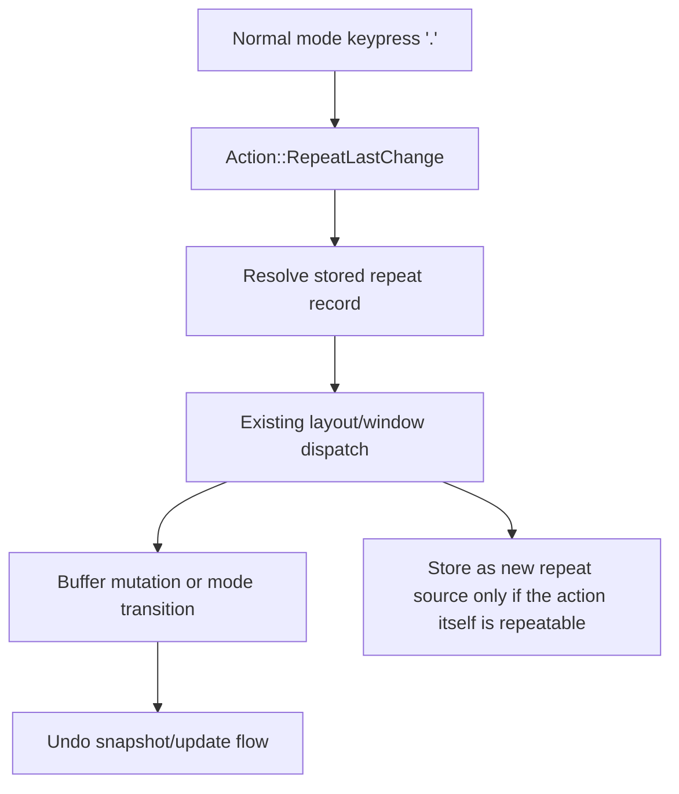

# Dot Repeat - Technical Design

## Architecture Overview

Basic dot repeat is implemented as a small editor-level replay system that remembers the most recent successful repeatable normal-mode edit and replays that edit when `.` is pressed.

The design keeps the existing action dispatch path intact:

1. Normal mode maps `.` to a dedicated repeat action.
2. The repeat action resolves to the last stored repeat source.
3. The resolved action is sent through the existing app/window action pipeline.
4. If the replay succeeds, the normal undo snapshot flow runs exactly as it does for any other successful edit.

Repeat state is stored separately from the action stream so that replaying `.` does not overwrite the original change with a second-level repeat record.

## Interface Design

### New Action

- Add a dedicated normal-mode action for dot repeat, such as `Action::RepeatLastChange`.
- Map `.` in normal mode to that action.
- Make the repeat action countable so `2.` or `10.` can override the stored repeat count.

### Repeat Source Classification

- Add an action-level helper that identifies whether an action should become the new repeat source after it succeeds.
- The helper should include the current buffer-modifying normal-mode actions and the current insert-starting actions.
- The helper should exclude pure motions, undo/redo, command-line actions, and the repeat action itself.

### Stored Repeat Record

- Store a normalized repeat record that contains:
  - the repeatable action to replay
  - the original count used for that action
  - enough information to know whether the action should still switch to insert mode when replayed
- The stored record should represent the original user change, not the `.` command that replays it.

## Data Models

### Repeat Record

Suggested shape:

```text
RepeatRecord {
    action: Action,
    count: usize,
}
```

Constraints:

- `action` is always a repeat source action, not `RepeatLastChange`
- `count` is the count used by the original edit, or `1` when no explicit count was supplied
- the record is only replaced by a newly successful repeatable edit

The implementation can keep this in a small global slot alongside the existing character-search repeat state, or in another editor-global store with equivalent lifetime.

## Key Components

### Normal Mode Keymap

- Adds `.` to the normal-mode command map.
- Produces the repeat action directly, without needing a multi-key sequence.

### Action Classification

- Separates replayable edit sources from non-replayable actions.
- Lets the main loop decide when to update repeat state after a successful action.

### Repeat Replay

- When `.` is executed, the repeat record is converted back into the stored action.
- If the user supplied a count before `.`, that count replaces the stored count for this replay only.
- The replayed action then goes through the existing widget/window dispatch path, so cursor movement, buffer edits, mode switches, and undo snapshots stay centralized.

### Main Event Loop

- After a successful handled action, the loop updates repeat state only if the action is a repeat source.
- The repeat action itself does not become the new stored source.
- This prevents `.` from recursively replacing the last real edit with the repeat command.

## User Interaction

- Pressing `.` repeats the most recent successful repeatable edit.
- Pressing a count followed by `.` repeats the same edit size with the new count.
- If the stored source action enters insert mode, replaying `.` also enters insert mode after the structural edit.
- Inserted text is not replayed in this phase, so insert-starting actions only restore the buffer-editing setup and mode transition.

## External Dependencies

- No new external dependencies are required.
- The feature reuses the existing action system, window dispatch, and undo snapshot flow.

## Error Handling

- If there is no stored repeatable edit, `.` is a no-op.
- If the stored edit replays to an empty or invalid region, the buffer should remain unchanged and the stored repeat record should remain available.
- If an action is not a repeat source, it must not replace the stored repeat record.
- If a repeat succeeds but resolves to no visible mutation because the buffer state makes the target empty, that should not clear the last valid repeat source.

## Security

- No security-sensitive behavior is introduced.
- The feature only replays local editor actions against the current buffer state.

## Configuration

- No new configuration options are required.

## Component Interactions



- Normal mode only needs to recognize `.` and pass the repeat action upward.
- The app loop resolves the repeat action into the stored source before dispatching to the layout.
- Window and buffer code remain the source of truth for the actual edit behavior.
- Undo behavior stays unchanged because the replayed action is treated like any other successful edit.

## Platform Considerations

- Behavior should remain consistent across terminals and operating systems because it is built on existing editor actions.
- Unicode handling is unchanged because the replay reuses the same buffer operations already used by normal edits.

## Notes

- This phase intentionally stops short of recording and replaying inserted text.
- The design leaves room to extend the repeat record later so insert-mode payloads can be captured without changing the normal replay entry point.
