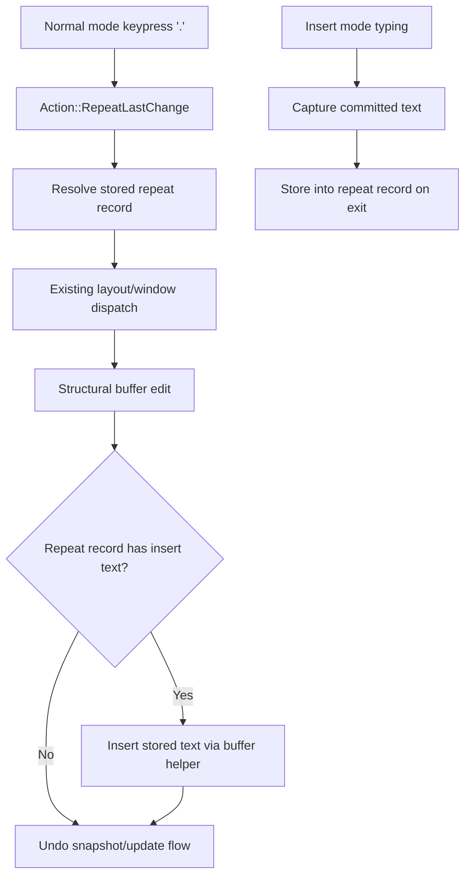

# Insert-Mode Dot Repeat - Technical Design

## Architecture Overview

This feature extends the existing dot-repeat system from replaying only the structural normal-mode action to replaying the completed edit, including text entered in insert mode.

The current replay flow stays in place:

1. Normal mode maps `.` to `Action::RepeatLastChange`.
2. The action resolves against the stored repeat record.
3. The resolved repeat is dispatched through the existing editor, layout, and window pipeline.

The difference is that repeat state now stores two parts of a completed edit:

- the repeatable normal-mode action that set up the change
- the committed insert-mode text that followed that action, if the action entered insert mode

Replay remains deterministic because the stored insert payload is applied as committed text, not as a recorded key sequence.

## Interface Design

### Repeat Record

Extend the stored dot-repeat state to capture the final inserted text alongside the original action and count.

Suggested shape:

```text
RepeatRecord {
    action: Action,
    count: usize,
    insert_text: Option<String>,
}
```

Constraints:

- `action` is the original repeatable normal-mode action, not `RepeatLastChange`
- `count` is the count used by the original edit, or `1` when no count was supplied
- `insert_text` is present only after a successful insert session has been committed
- `insert_text` stores the final text produced by the insert session, not the raw key stream

### Insert Session Capture

Add a small insert-session capture path so insert mode can report the text it committed when the user leaves insert mode.

The capture interface should:

- accumulate the text that would be inserted into the buffer during the session
- remain local to the active insert mode instance
- expose the committed text exactly once when insert mode ends successfully

This keeps the normal editing loop simple and avoids depending on live mode internals after the mode object is replaced.

### Repeat Replay

When `.` is pressed, the resolved repeat record is replayed as a compound edit:

- if `insert_text` is `None`, the existing action replay path is unchanged
- if `insert_text` is present, the editor applies the stored normal-mode action first and then inserts the stored text directly at the resulting cursor position

The replay branch must not re-enter interactive insert mode. The stored text is inserted programmatically so `.` completes as a single normal-mode command.

## Data Models

### Repeat Record

Fields:

- `action: Action`
- `count: usize`
- `insert_text: Option<String>`

Behavioral rules:

- the record is replaced only after a successful repeatable edit has fully completed
- a failed or aborted insert session does not replace the stored text payload
- the repeat record remains valid even if a later replay attempt fails

### Insert Text Payload

The payload is an owned string containing the final insert-session text.

Constraints:

- the payload can contain multiple characters and newlines
- the payload preserves the user-entered text exactly as committed
- the payload is replayed through the same buffer text insertion path used by normal editing

## Key Components

### Action Classification

The existing repeat-source classification continues to identify actions that can update dot-repeat state after success.

It should continue to include:

- change-style actions that transition into insert mode
- direct insert-entry actions such as `SwitchToInsert`
- other existing repeatable buffer mutations already covered by dot-repeat

The repeat action itself must remain excluded from repeat-source updates.

### Insert Mode

Insert mode needs a commit-facing text capture path in addition to its existing key parsing buffer.

Responsibilities:

- record the text that would be inserted during the current insert session
- update that capture when insert-mode text keys are processed
- expose the committed text when the user leaves insert mode
- clear transient capture state after the session is finalized or abandoned

### Main Event Loop

The main loop becomes responsible for sealing the repeat record once an insert session ends.

Flow:

1. A repeatable normal-mode action succeeds and may enter insert mode.
2. Insert mode accumulates committed text during the session.
3. When insert mode exits successfully, the loop reads the committed text from the mode and stores it in the repeat record.
4. When `.` is replayed, the loop applies the stored action and, if present, the stored insert text.

This keeps repeat state centralized at the app level while still letting insert mode own the live session capture.

### Buffer Text Insertion Helper

Add or reuse a helper that inserts a complete string at the current cursor position.

This helper should:

- preserve the same Unicode-aware behavior as the existing single-character insert path
- update the cursor after the inserted text is committed
- be usable by both insert mode and dot-repeat replay

## User Interaction

- `cw` followed by typed text and `<Esc>` becomes a single repeatable edit.
- `.` replays that completed edit at a later cursor location without requiring the user to re-enter insert mode.
- A count before `.` still applies to the whole repeat operation, including the committed text payload.
- Direct insert-mode edits started with `i`, `a`, `I`, `A`, `o`, or `O` should also be replayable once the user commits the inserted text.

## External Dependencies

- No new external dependencies are required.
- The feature reuses the existing action system, buffer mutation helpers, and undo snapshot flow.

## Error Handling

- If there is no stored repeat record, `.` remains a no-op.
- If insert mode is abandoned before commit, the previous repeat record remains intact.
- If the structural part of a repeat cannot apply at the current cursor, the stored repeat record should not be cleared.
- If replaying the stored text payload fails unexpectedly, the editor should keep the last valid repeat record rather than overwriting it with a partial result.

## Security

- No new security-sensitive behavior is introduced.
- The feature only replays local editing actions and locally captured text.

## Configuration

- No new configuration options are required.

## Component Interactions



- Normal mode still recognizes `.` and hands the request to the existing repeat resolver.
- Insert mode owns the live capture of committed text, but the app loop seals that text into repeat state when the session ends.
- Replay uses the same structural action dispatch as before and then applies any stored text payload programmatically.

## Platform Considerations

- Behavior should remain consistent across terminals and operating systems because the feature is built on existing buffer and action primitives.
- Unicode handling remains unchanged because the replayed payload is inserted through the same text insertion logic used by normal editing.
