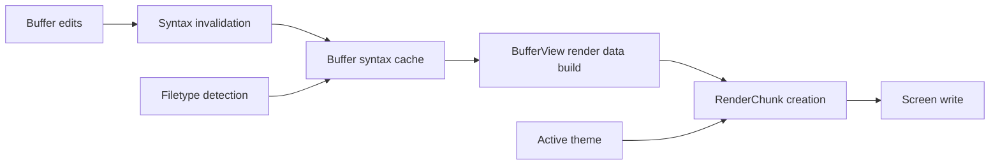

# Syntax Highlighting - Technical Design

## Architecture Overview
urvim will treat syntax highlighting as derived buffer state. Each `Buffer` will own a syntax cache that stores semantic token spans and line-continuation state for the current filetype. The renderer will read that cache when building visible content and will map syntax categories onto the active theme at draw time.

This keeps highlighting consistent across multiple windows that share one buffer, avoids duplicating syntax state in the view layer, and allows theme changes to affect rendered colors without rewriting the cache.

The first implementation will use built-in, filetype-aware tokenizers for a small supported set of common filetypes. Tokenizers will be intentionally lightweight and line-oriented, but they will preserve enough state across lines to handle multiline constructs that matter for the supported languages and formats.

## Interface Design

### Buffer-facing API
The `Buffer` type will gain syntax-aware helpers for:

- invalidating the cache from an affected line onward after text edits
- ensuring syntax data is up to date for a requested range
- returning highlighted spans for a visible line

Planned shape:

```text
Buffer::invalidate_syntax_from(line: usize)
Buffer::syntax_spans_for_line(line: usize) -> Option<&[SyntaxSpan]>
Buffer::ensure_syntax_for_visible_range(start_line: usize, end_line: usize)
```

### Tokenizer API
The syntax module will expose a small internal tokenizer interface that takes:

- the current `Filetype`
- the current line text
- the incoming lexer state from the previous line

It will return:

- a list of syntax spans for that line
- the outgoing lexer state for the next line

Planned shape:

```text
tokenize_line(filetype, line_text, incoming_state) -> (Vec<SyntaxSpan>, outgoing_state)
```

### Rendering API
`BufferView::build_render_data_with_style` will continue to produce `RenderData`, but it will no longer assume that each line is a single chunk. Instead, it will ask the buffer for syntax spans for each visible line and split the line into multiple render chunks as needed.

The renderer will still apply the base theme style as an overlay, so syntax chunks inherit the same default foreground/background handling already used elsewhere in the editor.

## Data Models

### SyntaxSpan
Represents one highlighted segment of text within a line.

- `start_byte: usize`
- `end_byte: usize`
- `kind: SyntaxStyleKey` or an equivalent internal syntax category

Constraints:
- Spans must be ordered by `start_byte`.
- Spans must not overlap.
- Spans must stay within the line's byte bounds.

### SyntaxLineState
Represents the lexer state after processing a line.

- `filetype: Filetype`
- `state: SyntaxState`
- `spans: Vec<SyntaxSpan>`
- `line_version_marker` or equivalent invalidation marker

### SyntaxState
An internal enum used by tokenizers to preserve multiline context.

Examples of stateful cases:

- open multiline string
- open block comment
- open fenced Markdown code block
- shell heredoc or equivalent long-form construct where supported

### Buffer Syntax Cache
The buffer-owned cache will store:

- the filetype that the cache was computed for
- the earliest dirty line
- a per-line list of syntax spans
- the final state after each processed line

This cache is derived data and will not be included in undo snapshots or save output.

## Key Components

### Buffer
Responsibilities:

- Own the text and the syntax cache together.
- Invalidate syntax data when edits, undo, redo, or filetype refreshes change the text.
- Provide cache access for the renderer.

Public-facing behavior:

- Existing text-edit methods continue to mutate text.
- Those methods also mark the syntax cache dirty from the earliest affected line.

### Syntax Module
Responsibilities:

- Define syntax categories compatible with the existing closed theme syntax slots.
- Provide a tokenizer implementation for each supported filetype.
- Preserve multiline state between lines.
- Fall back to plain text when a filetype has no tokenizer.

Tokenizer scope for v1:

- Rust
- Python
- JavaScript
- TypeScript
- Shell
- JSON
- TOML
- Markdown

### Window Rendering
Responsibilities:

- Ask the buffer for highlighted spans when building render data.
- Convert syntax spans into `RenderChunk`s.
- Preserve the existing gutter, scrolling, cursor, and base-style behavior.

### Theme Integration
Responsibilities:

- Reuse the existing `theme.syntax` styles.
- Map semantic categories like comment, keyword, string, and type to the current theme styles.
- Avoid schema changes for the first release.

## User Interaction
There is no new user-facing command or configuration in the first version.

Users will see highlighted code automatically for supported filetypes as soon as a file is opened or edited.

The feature should feel continuous:

- editing should update highlight state without a manual refresh
- opening the same buffer in another window should show the same syntax state
- unsupported filetypes should continue to render as plain themed text

## External Dependencies
No new external dependency is required for the MVP.

The design intentionally avoids parser libraries such as tree-sitter for the first release.

## Error Handling
- If a tokenizer does not exist for a filetype, the buffer should render the affected lines as plain text using the theme default style.
- If the cache is missing, stale, or invalidated, the renderer should rebuild the needed range on demand rather than fail the draw.
- If a line contains malformed UTF-8 from an internal invariant violation, the existing buffer assumptions still apply and the syntax layer should not add a new failure mode.
- If a theme omits or leaves blank syntax styles, the renderer should fall back to the base style overlay behavior already used in the editor.

## Security
Syntax highlighting does not introduce new security-sensitive behavior.

- No secrets are stored.
- No network access is required.
- The tokenizer operates on buffer text already present in memory.
- The feature should not evaluate code or interpret external markup beyond syntax classification.

## Configuration
No new configuration values are required for the first release.

The feature will use:

- the existing active theme
- the existing filetype detection result on each buffer

If future work adds syntax toggles or per-language controls, those should be modeled separately from this MVP.

## Component Interactions



Interaction flow:

1. A text edit mutates the buffer.
2. The buffer invalidates syntax from the earliest affected line.
3. When the window renders, it asks the buffer for syntax data in the visible range.
4. The buffer recomputes the missing portion using the filetype tokenizer and continuation state.
5. The renderer converts spans into chunks and overlays the active theme's base style.

## Platform Considerations
- The implementation must continue to respect UTF-8 and grapheme-width handling already used by the editor.
- Syntax spans should be tracked in byte offsets because buffer edits are byte-based, but rendering still needs to account for terminal cell width when placing chunks.
- The design should remain portable across supported terminal backends because it only changes editor-side data preparation, not terminal I/O.

