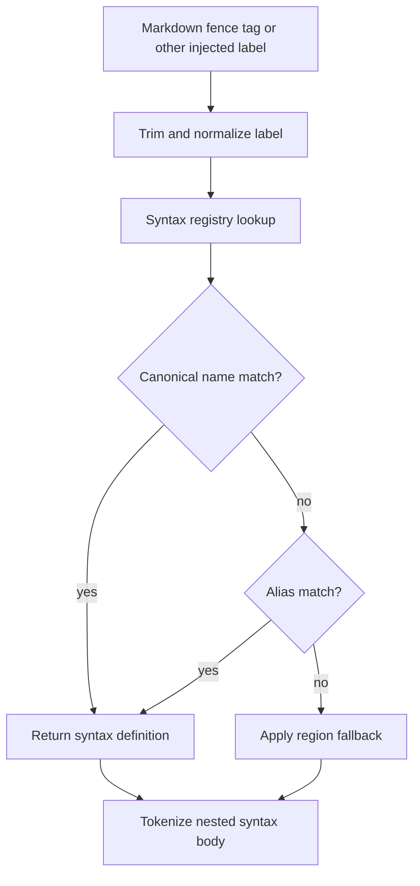

# Syntax Aliases - Technical Design
## Architecture Overview
urvim will extend syntax metadata with alias labels and teach the syntax registry to resolve canonical names and aliases through the same lookup path. The canonical syntax name remains the primary identifier for internal ownership, while alias labels become additional declarative labels that can be used by injected syntax selectors such as Markdown fence tags.

The key behavior change is that a user-provided language label is no longer required to match the canonical grammar name exactly. If a fence tag or other injected selector matches a registered alias, the registry returns the same syntax definition that the canonical name would have returned.

## Interface Design
### Syntax TOML shape
Each syntax file will extend its metadata block with alias labels:

```toml
[metadata]
name = "javascript"
display_name = "JavaScript"
alias = ["js", "node"]
filename = ["\\.(js|mjs|cjs|jsx)$"]
shebang = ["^#!.*\\b(?:node(?:js)?|bun|deno)(?:\\s|$)"]
```

Metadata fields:

- `name`: canonical identifier used for registry ownership and internal references
- `display_name`: user-facing label shown in the UI
- `alias`: zero or more alternate labels that resolve to the same syntax definition
- `filename`: ordered list of filename regexes
- `shebang`: ordered list of shebang regexes

### Registry lookup
The registry will expose label resolution that accepts either a canonical name or an alias.

```rust
pub fn resolve_label(&self, label: &str) -> Option<&SyntaxDefinition>;
```

Resolution rules:

- trim surrounding whitespace from the incoming label
- reject empty labels
- resolve the canonical syntax name first
- if no canonical match exists, resolve through the alias map
- return the unique matching syntax definition or `None` when no match exists

### Injected syntax resolution
Injected syntax selectors will use the same label-resolution path as any other label-based lookup. This keeps Markdown fences, capture-based injected syntax, and future label-driven selectors consistent.

Unknown labels still fall back according to the region's configured fallback policy. Alias support changes only successful resolution, not fallback behavior.

## Data Models
### `SyntaxMetadata`
`SyntaxMetadata` will gain:

- `alias: Vec<String>`

Constraints:

- alias labels are stored as normalized labels, not display labels
- alias labels must be non-empty after trimming
- alias labels must not duplicate each other within one syntax
- alias labels must not duplicate the syntax's canonical name

### `SyntaxRegistry`
`SyntaxRegistry` will maintain:

- canonical definitions keyed by syntax name
- a lookup table from alias label to canonical syntax name

Constraints:

- one alias label may point to exactly one syntax definition
- canonical names continue to remain unique
- alias label collisions across different syntaxes are load-time errors

### Built-in alias coverage
The shipped syntax set will include alias labels for all supported non-fallback syntaxes. The alias labels should reflect common injected labels and common shorthand names used in documents, with examples including `js`, `ts`, `py`, `rb`, `sh`, `bash`, `zsh`, `ps1`, `json`, `yaml`, `md`, and `cpp`.

The exact alias table lives in the built-in syntax TOML files so that the registry remains data-driven.

## Key Components
### Syntax loader
Responsibilities:

- parse the new `alias` metadata field
- normalize and validate alias labels during load
- detect duplicate alias labels before registration
- keep load errors specific to the syntax file and alias that failed validation

### Syntax registry
Responsibilities:

- resolve canonical names and aliases through one lookup path
- preserve existing canonical-name behavior
- reject duplicate alias ownership at load time
- provide resolved definitions to injected syntax selectors

### Built-in syntax files
Responsibilities:

- declare the alias label list for each shipped syntax
- cover the common injected labels users are expected to write in Markdown and similar content
- keep the alias data close to the syntax definition it belongs to

### Buffer syntax path
Responsibilities:

- continue passing selector text into the registry lookup path
- use resolved nested syntax definitions when alias labels match
- preserve current fallback behavior when resolution fails

## User Interaction
No new commands or editor UI are introduced. The visible change is that injected language labels become more forgiving and match user expectations in documents.

For example:

- a fence tagged `js` highlights as JavaScript
- a fence tagged `ts` highlights as TypeScript
- a fence tagged `py` highlights as Python
- unknown tags still render using the existing fallback policy for that region

## External Dependencies
No new external crates are required. The implementation continues to use the existing TOML and regex infrastructure already in the syntax loader.

## Error Handling
Expected failures should be handled as syntax-load validation errors.

### Load-time failures
- missing or empty alias label after trimming
- duplicate alias label within a single syntax definition
- alias label collision with another syntax's canonical name
- alias label collision with another syntax's alias label

### Runtime fallback
- unknown injected labels continue to use the region's configured fallback behavior
- empty injected labels continue to behave as unresolved labels
- canonical lookups continue to succeed even when alias data is absent

## Security
Alias support does not introduce executable code paths. Alias values are declarative labels used for registry lookup only.

The loader must continue to treat alias strings as data and must not interpret them as commands, expressions, or filesystem paths.

## Configuration
The built-in syntax TOML files under `src/syntax_builtin/` will be updated to include alias lists. No new user configuration file is introduced for this feature.

## Component Interactions


Interaction flow:

1. A region opener produces a label such as `js` or `ts`.
2. The label is normalized and passed into the syntax registry.
3. The registry resolves either the canonical name or one declared alias.
4. If resolution succeeds, the nested syntax tokenizer runs with the resolved definition.
5. If resolution fails, the region uses its configured fallback behavior.

## Platform Considerations
Alias matching should remain deterministic across platforms and independent of filesystem case behavior, because it is driven by declarative syntax labels rather than paths.

Normalization should be simple enough to avoid platform-specific surprises. The alias table itself lives in the syntax files, so platform differences should not affect registry ownership or injected label behavior.
