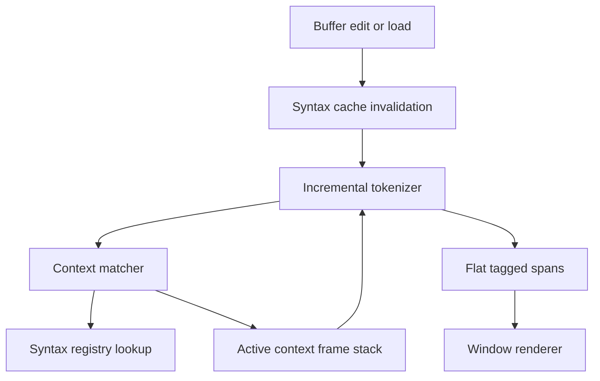

# Context-Sensitive Highlighting Engine - Technical Design

## Architecture Overview
urvim's syntax engine will evolve from a mostly flat region tokenizer into a context-sensitive highlighting engine. The engine will still produce line-oriented syntax spans for the renderer, but it will now track explicit syntax context frames so that the same token form can resolve differently depending on the active surrounding region.

The design keeps the current buffer-owned incremental cache and line-by-line rendering pipeline. The main change is that region matching will no longer be limited to text-only token rules. Instead, syntax definitions will be able to express context-sensitive openers, nested rule sets, and context predicates that inspect the active frame stack before a candidate region is accepted.

Rust formatting strings are the first concrete use case. In that case, the engine must recognize a formatting-call context, tag the callee as `function` or `function.macro`, tag the parentheses as `punctuation`, and apply a formatting-string rule set only to the first string argument inside that call. Ordinary strings must continue to use the existing string region behavior.

The engine does not need to become a full language parser for every syntax file, but it does need parser-like state management: opener recognition, nested context frames, and bounded re-evaluation when a line edit invalidates earlier assumptions.

## Interface Design
### Syntax definition surface
The syntax schema will gain a generalized way to describe context-sensitive regions. The interface should let a region declare:
- a normal match shape, such as regex or delimited text
- an optional context predicate
- an optional nested target, which may be another rule set or an injected syntax
- an optional capture source used to resolve nested behavior from opener text

For Rust formatting strings, syntax authors should be able to define a call-context opener and a nested rule set for the first argument without the engine hardcoding Rust-specific behavior.

### Syntax engine surface
The current syntax engine will continue to expose line spans to the renderer, but internally it will evaluate regions against a stack of context frames. A frame represents the active region, its nested target, and any state needed to continue across line boundaries.

The engine should support:
- context-aware region activation
- nested rule sets selected by the active frame
- captured selector text for injected syntax resolution
- fallback rendering when a nested context cannot be resolved
- bounded backtracking or re-evaluation from the last invalidated line

### Public-facing behavior
The renderer should continue to receive a flat list of tagged spans. No renderer API change is required for the first stage, because the new capability is entirely in the syntax resolution layer.

## Data Models
### Context Frame
Represents one active syntax context while scanning text.

Fields:
- `region`: the matched region or opener that created the frame
- `rule_target`: the nested rule set or injected syntax associated with the frame
- `state`: resumable state for multiline continuation
- `fallback`: how unresolved nested content should render
- `guard`: optional terminator or lookahead guard used while searching for the close

Constraints:
- frames must be cloneable or resumable across cache rebuilds
- frames must preserve enough information to continue after a line edit
- frames must not own buffer text directly

### Context Predicate
Represents the condition under which a region is allowed to activate.

Fields:
- `ancestor_match`: optional requirement on one or more enclosing frames
- `opener_match`: optional requirement on the opener text or capture
- `syntax_match`: optional requirement on the current syntax definition or nested target

Constraints:
- predicates must be deterministic
- predicates must be cheap enough to evaluate during incremental tokenization
- predicates must fail closed when the required context is unavailable

### Deferred Region Match
Represents a candidate region that has been recognized textually but not yet accepted because its context must be checked.

Fields:
- `start`
- `end`
- `tag`
- `nested_target`
- `predicate`
- `multiline`

Constraints:
- a deferred match must either resolve to a concrete frame or be rejected before the line is finalized
- rejection must not mutate buffer content or syntax state outside the cache

## Key Components
### Syntax Registry
The registry remains the source of truth for loaded syntax definitions and aliases. Its responsibility expands only enough to validate the new generalized context-sensitive declarations.

Responsibilities:
- load built-in and future file-based syntax definitions
- validate tag names, nested references, and new context-sensitive references
- resolve injected syntax labels and captures

Dependencies:
- syntax definition loader
- tag validation

### Context Matcher
The context matcher is the new decision layer that determines whether a candidate region is valid in the current stack.

Responsibilities:
- inspect the active frame stack
- compare opener text and captures against predicate rules
- accept or reject candidate regions
- choose nested targets for accepted regions

Dependencies:
- syntax definitions
- context frame stack

### Incremental Tokenizer
The tokenizer remains line-oriented but gains context awareness.

Responsibilities:
- scan a line using the current active frame stack
- emit tagged spans for the renderer
- carry state across lines for multiline contexts
- re-tokenize from the earliest invalidated line when edits change context

Dependencies:
- context matcher
- syntax registry
- buffer syntax cache

### Rust Formatting Rule Set
The first consumer of the new engine capability.

Responsibilities:
- recognize formatting-call contexts in Rust
- tag the callee name as `function` or `function.macro`
- tag call punctuation as `punctuation`
- activate a specialized formatting-string rule set only for the first string argument

Dependencies:
- context matcher
- Rust syntax definition
- existing string and interpolation tags

## User Interaction
There is no new user-facing command or setting for the first version. The change is visible only through syntax highlighting.

Expected result:
- Rust formatting calls are highlighted more accurately
- ordinary strings remain unchanged
- other syntax definitions are unaffected unless they opt into the new capability

## External Dependencies
No new runtime dependencies are required for the first stage.

The implementation should continue using:
- `regex` for pattern matching
- `serde` and `toml` for syntax definition loading
- the existing theme tag system for span styling

If later context predicates require more complex matching, that can be done inside the syntax engine without adding external crates unless profiling shows a clear need.

## Error Handling
The engine should fail safely when a context-sensitive declaration cannot be resolved.

Expected failures:
- invalid tags or invalid regexes in syntax definitions
- unknown nested rule sets or unknown injected syntax targets
- malformed context predicates
- unresolved captures for a context-sensitive opener

Recovery strategy:
- reject the invalid syntax definition at load time when possible
- fall back to plain or parent-style rendering when runtime resolution fails
- preserve the last known good cache state until a line edit forces re-evaluation

## Security
The feature does not introduce new security-sensitive behavior.

Relevant checks:
- syntax files remain data, not executable code
- regexes are already compiled at load time and should continue to be validated
- context predicates must not allow unbounded host-language execution

## Configuration
No new editor configuration is required for the first stage.

The capability should be enabled by the syntax definitions themselves, similar to other syntax features. Rust formatting support will ship as part of the built-in Rust syntax definition.

If the engine later exposes user-facing tuning for context-sensitive matching, that should be added as a separate configuration design.

## Component Interactions

Interaction flow:
1. A buffer edit invalidates the syntax cache from the changed line onward.
2. The tokenizer replays lines starting from the earliest dirty point.
3. Candidate regions are checked against the active frame stack.
4. Accepted regions push or pop context frames as the scan continues.
5. The renderer receives only flat spans and remains unchanged.

For Rust formatting strings, the call opener establishes a context frame that enables the specialized format-string rule set for the first argument. Ordinary strings never enter that context and therefore keep the existing string rules.

## Platform Considerations
The implementation must remain portable across the current supported platforms because the syntax engine is pure Rust and does not depend on platform-specific parsing APIs.

Important considerations:
- large files should remain responsive under incremental re-tokenization
- line edits near the top of the file should continue to invalidate correctly
- multiline contexts should resume predictably after scrolling or partial cache rebuilds

The first implementation should favor clarity over aggressive optimization, as long as the existing highlighting performance remains acceptable during normal editing.
