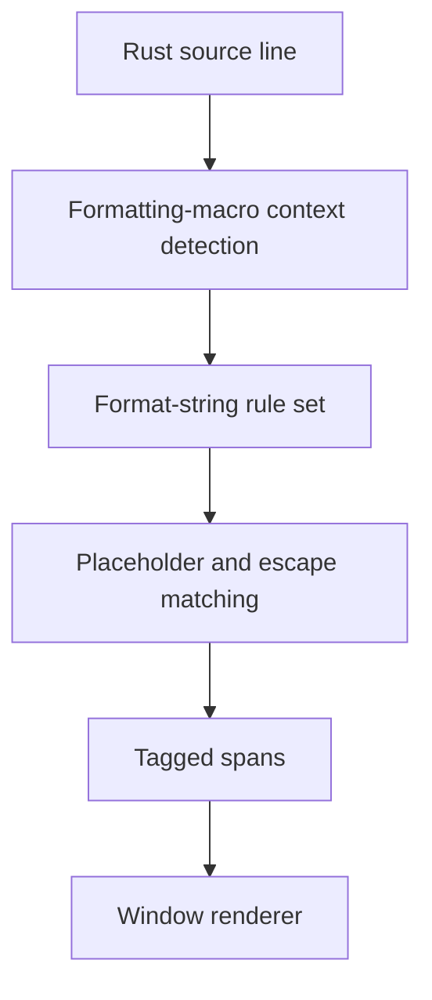

# Rust Format String Syntax Highlighting - Technical Design

## Architecture Overview
The Rust builtin syntax definition will model `std::fmt` format strings as a context-sensitive nested region inside formatting-macro invocations. The syntax engine will continue to emit flat line spans, but the Rust grammar will now distinguish ordinary strings from format strings by only enabling the specialized rules in the formatting-call context.

This design keeps the renderer unchanged. The work stays in the syntax definition and the syntax-tokenization layer, where the parser can recognize the first string argument of a formatting macro and apply a format-string rule set for braces, escaped braces, and placeholder content.

## Interface Design
### Syntax definition surface
The Rust builtin syntax file should express:
- a formatting-call context that starts when a formatting macro name is recognized
- a nested rule set for the first string literal argument
- placeholder rules for `{}`, `{0}`, `{name}`, and specifier content after `:`
- escape rules for `{{` and `}}`

### Highlighting surface
No public renderer API changes are required. The syntax engine should continue to return tagged spans using existing theme tags such as `string`, `punctuation`, `variable`, and `function.macro`.

## Data Models
### Format String Context
Represents the active Rust formatting-macro call in which the next string literal should be interpreted as a `std::fmt` format string.

Fields:
- `macro_name`: the formatting macro that opened the context
- `argument_index`: the argument slot being scanned
- `active`: whether the formatter is still waiting for the format-string literal

Constraints:
- the context must only activate for the leading format-string literal
- the context must clear when the call closes or when the first argument is consumed

### Placeholder Region
Represents one brace-delimited placeholder inside a format string.

Fields:
- `kind`: implicit, positional, or named placeholder
- `specifier`: optional format-specifier text after `:`
- `span`: the text range covered by the placeholder

Constraints:
- escaped brace pairs must not produce placeholder regions
- placeholder regions must remain line-oriented and resumable across edits

## Key Components
### Rust Builtin Syntax Definition
The Rust syntax file is the primary place where formatting-call and format-string behavior is declared.

Responsibilities:
- identify formatting-call contexts
- tag the macro name as `function.macro`
- tag call punctuation as `punctuation`
- apply format-string rules only where the context allows it

Dependencies:
- syntax registry
- context-sensitive syntax support

### Format String Rule Set
The specialized rule set for Rust format strings.

Responsibilities:
- recognize literal text, escaped braces, and placeholder delimiters
- distinguish placeholder body text from surrounding string content
- allow placeholder content to inherit existing nested syntax behavior where applicable

Dependencies:
- Rust builtin syntax definition
- existing string and punctuation tags

### Syntax Cache and Tokenizer
The cache and tokenizer remain responsible for incremental rebuilds when the buffer changes.

Responsibilities:
- invalidate affected lines after edits
- re-tokenize format strings without dropping surrounding context
- keep ordinary strings and format strings separate during replay

Dependencies:
- buffer syntax cache
- nested rule-set handling

## User Interaction
There is no new command, menu item, or configuration option. Users will see improved Rust formatting-string highlighting automatically when opening or editing Rust source files.

Expected result:
- formatting macros are visually easier to read
- format placeholders stand out from literal text
- escaped literal braces are not misidentified as placeholders

## External Dependencies
No new runtime dependencies are required.

The implementation should continue relying on:
- the existing `regex`-based syntax loader
- the current theme tag system
- Rust `std::fmt` format-string conventions as documented in the standard library

## Error Handling
The implementation should fail safely when the syntax definition cannot match a placeholder or format-specifier fragment.

Expected failures:
- malformed syntax rules in the Rust builtin syntax file
- unsupported or unknown nested rule targets
- invalid regexes or delimiter definitions

Recovery strategy:
- fall back to ordinary string highlighting for the affected span when a specialized rule cannot be applied
- preserve the last known good syntax cache until the next invalidation

## Security
The feature does not introduce new security-sensitive behavior.

Relevant checks:
- syntax data remains declarative
- regexes remain validated at load time
- format-string matching must not execute user code

## Configuration
No new user-facing configuration is required.

Format-string highlighting should be enabled by the built-in Rust syntax definition only.

## Component Interactions

Interaction flow:
1. The Rust syntax definition detects a formatting macro call.
2. The first string literal argument enters the specialized format-string rule set.
3. Placeholder and escape regions are matched against `std::fmt` syntax.
4. The tokenizer emits tagged spans for the renderer.
5. Ordinary strings continue through the default string rules when no formatting context is active.

## Platform Considerations
The feature should remain portable because it depends only on the existing Rust syntax engine and declarative syntax data.

Important considerations:
- multiline editing must keep format-string context intact across cache rebuilds
- large files should remain responsive under incremental re-tokenization
- the rules should not assume any platform-specific file or terminal behavior
