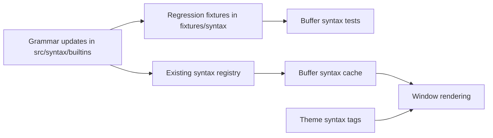

# Syntax Correctness Holes 1 - Technical Design

## Architecture Overview
This work will refine the existing built-in syntax definitions and their regression coverage without changing the syntax engine architecture. The current buffer-owned syntax cache, renderer integration, and theme mapping remain the foundation; the only changes are in the per-language grammar rules, the supporting fixtures, and the tests that prove the corrected lexical behavior.

The design keeps the implementation intentionally local:

- update the built-in TOML syntax definitions for Rust, Python, JavaScript, JSON, TOML, Markdown, and shell
- add or adjust syntax fixtures under `fixtures/syntax`
- extend buffer-level regression tests to exercise the corrected language forms

The objective is to make the existing partial grammars behave like solid lexical highlighters for ordinary editing, not to introduce parser-like precision or expand the runtime syntax model.

## Interface Design

### Built-in Syntax Definitions
Each affected language continues to be defined by a built-in syntax TOML document under `src/syntax/builtins/`.

The interface exposed to the rest of the editor does not change:

- syntax metadata still resolves by canonical syntax name and aliases
- buffer syntax selection still uses existing filetype resolution
- the renderer still consumes spans through the current buffer syntax cache

The only contract change is behavioral: the language definitions should emit more accurate spans for the same public syntax categories.

### Regression Fixtures
Each affected grammar will have one or more fixture files under `fixtures/syntax/` that capture the lexical forms the grammar is expected to recognize.

Planned fixture coverage:

- `fixtures/syntax/rust.rs`
- `fixtures/syntax/python.py`
- `fixtures/syntax/javascript.js`
- `fixtures/syntax/json.json`
- `fixtures/syntax/toml.toml`
- `fixtures/syntax/markdown.md`
- `fixtures/syntax/shell.sh`

Where the existing fixture already exists, the file will be extended rather than duplicated.

### Buffer Tests
The buffer test module already loads syntax fixtures directly and checks for recognizable token categories. The implementation will extend that existing pattern with assertions for the corrected forms, such as:

- valid and invalid number families
- multiline literal continuation
- interpolation or embedded expression regions
- markup block structure
- shell heredoc or quoted region stability

The test surface remains file-driven and does not require new public APIs.

## Data Models

No new persistent data models are required.

The work continues to use the existing syntax-layer concepts:

- `SyntaxSpan` for highlighted ranges
- line-oriented syntax state for multiline constructs
- built-in syntax metadata for filetype lookup

The only data additions are new fixture cases and, if needed, new internal token categories that map onto existing theme tag families.

## Key Components

### Rust Grammar
Responsibilities:

- distinguish Rust lexical forms that are currently conflated or missing
- support multiline raw strings and related delimiter-based literal forms
- keep lifetimes, labels, attributes, macros, and numeric literals visually distinct where the existing tag set allows it

Public effect:

- ordinary Rust source should stop looking like plain text in the most common token families

### Python Grammar
Responsibilities:

- recognize prefixed string families and other common literal forms
- preserve multiline string state
- highlight decorators and formatted-string regions in a way that keeps embedded expressions readable

Public effect:

- common Python source should read naturally, with strings and numbers no longer collapsing into generic identifiers

### JavaScript Grammar
Responsibilities:

- recognize the core JavaScript literal and token families
- preserve template literal state and interpolation
- support regular-expression and class-related lexical forms where the current engine can express them safely

Public effect:

- everyday JavaScript and JSX-adjacent text should no longer lose the distinction between comments, strings, templates, keywords, and numbers

### JSON Grammar
Responsibilities:

- restrict recognition to valid JSON lexical structure
- highlight valid JSON numbers, strings, booleans, null, and punctuation
- avoid generic identifier heuristics that make invalid JSON look valid

Public effect:

- malformed JSON becomes visually obvious instead of being normalized by loose token rules

### TOML Grammar
Responsibilities:

- recognize the full TOML number family
- keep keys, tables, arrays of tables, inline tables, and strings visually distinct
- preserve stable multiline behavior for table and value regions when needed

Public effect:

- ordinary TOML files should be easier to scan for table structure and numeric literals

### Markdown Grammar
Responsibilities:

- distinguish the major block and inline Markdown forms used in day-to-day editing
- preserve fenced and indented block state across lines
- keep links, images, emphasis, strong emphasis, quotes, lists, and headings readable as structure rather than plain text

Public effect:

- prose and documentation files should show visible structure without requiring a full CommonMark parser

### Shell Grammar
Responsibilities:

- distinguish shell comments, strings, expansions, substitutions, heredoc-like regions, and keywords or builtins
- preserve multiline quoted and heredoc bodies
- keep script bodies readable while remaining compatible with the current engine’s region model

Public effect:

- shell scripts should remain legible across line boundaries and not collapse into unstructured text

## User Interaction
There is no new user-facing command or configuration.

Users will see the effect automatically when opening or editing supported files:

- Rust, Python, JavaScript, JSON, TOML, Markdown, and shell content should show fewer obvious false positives and fewer missing highlights
- editing should continue to update highlight state through the existing buffer syntax cache
- unsupported constructs should remain readable as plain themed text rather than being forced into misleading categories

## External Dependencies
No external dependency changes are required.

The implementation remains within the current regex-and-region syntax engine and the existing regression test infrastructure.

## Error Handling
- If a language construct is not representable cleanly with the current engine, the grammar should fall back to a broader valid category rather than inventing a misleading specific one.
- If a fixture exercises an unsupported edge case, the test should make that gap visible rather than silently accepting it.
- If a multiline region cannot be continued safely, it should degrade to plain text or a broader enclosing style rather than corrupting later lines.
- If a JSON or TOML literal is invalid, the grammar should prefer exposing the invalidity through missing or partial highlighting instead of normalizing it into a valid-looking token.

## Security
This work does not introduce new security-sensitive behavior.

- no secrets are stored
- no network access is required
- grammars only classify buffer text already in memory
- the syntax layer should not evaluate code or execute markup

## Configuration
No new configuration values are required.

The behavior continues to be governed by:

- the active theme
- the existing syntax-enabled toggle
- the buffer's resolved filetype and canonical syntax name

## Component Interactions

Interaction flow:

1. The built-in syntax definition is updated for one of the target languages.
2. The matching fixture is extended to cover the corrected lexical forms.
3. Buffer tests load the fixture and confirm the expected token categories are produced.
4. The existing syntax registry continues to load the built-in grammar without API changes.
5. The buffer cache and renderer consume the updated spans as before.

## Platform Considerations
- Fixture text must remain UTF-8 and portable across supported development platforms.
- Grammar rules should remain line-oriented and deterministic so they behave consistently in terminal rendering.
- The implementation should continue to rely on the current byte-based buffer model and grapheme-aware rendering pipeline.
- Because the work is limited to grammar and test data, it should stay portable across all supported terminal backends.
