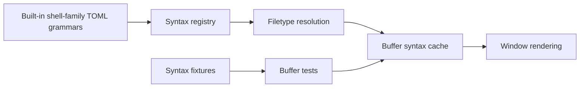

# Shell Family Grammars - Technical Design

## Architecture Overview
This work keeps the current syntax engine intact and reorganizes the shell family into a clearer grammar structure:

- `shell` remains the shared portable base for POSIX-style shell text
- `bash` becomes a real dialect grammar that extends the shared shell behavior
- `zsh` becomes a real dialect grammar that extends the shared shell behavior
- `fish` becomes a real dialect grammar that expresses Fish-specific lexical forms directly

The implementation should minimize duplication by reusing shared patterns where that keeps the grammar readable, but the public effect must be that each filetype has its own supported grammar rather than a metadata placeholder.

## Interface Design

### Built-in Syntax Definitions
The built-in syntax files under `src/syntax/builtins/` remain the public entry point for shell-family highlighting.

The expected behavior is:

- `shell.toml` continues to carry portable shell rules and aliases such as `sh`
- `bash.toml` becomes a complete Bash grammar definition with canonical metadata, filename matching, and Bash-specific rules
- `zsh.toml` becomes a complete Zsh grammar definition with canonical metadata, filename matching, and Zsh-specific rules
- `fish.toml` becomes a complete Fish grammar definition with canonical metadata, filename matching, and Fish-specific rules

This design does not require a new syntax API. The existing registry, filetype resolution, and buffer tokenizer should continue to work as-is once the grammars are populated.

### Fixture Surface
The test fixtures should distinguish the shared and dialect-specific grammars clearly enough that the tests can prove each filetype lands in the intended grammar.

Planned fixtures:

- `fixtures/syntax/shell.sh`
- `fixtures/syntax/bash.bash`
- `fixtures/syntax/zsh.zsh`
- `fixtures/syntax/fish.fish`

If the repository already uses a different extension or naming convention for shell-family fixtures, the chosen file names should match the existing fixture loading rules while still making the dialect explicit.

### Buffer Tests
The buffer test layer should verify:

- the filetype resolves to the intended shell-family grammar
- the shared shell grammar still highlights portable constructs
- the dialect grammars highlight their own distinct lexical forms
- multiline regions remain stable while editing

The tests should stay grammar-driven and file-based rather than introducing dialect-specific runtime helpers.

## Data Models
No new persistent data models are required.

The existing syntax concepts remain sufficient:

- syntax spans for highlighted regions
- line-oriented multiline state for strings, substitutions, and heredoc-like regions
- built-in syntax metadata for canonical names, aliases, and filetype matching

The only data changes should be the shell-family grammar definitions and their fixtures.

## Key Components

### Shared Shell Grammar
Responsibilities:

- keep portable shell comments, words, strings, substitutions, arithmetic forms, and heredoc-like regions highlighted
- preserve multiline string and heredoc stability
- serve as the common baseline for shell-family behavior that is shared by Bash, Zsh, and Fish where appropriate

Public effect:

- users editing portable shell scripts continue to see the current shell-family behavior

### Bash Grammar
Responsibilities:

- extend the portable shell baseline with Bash-specific lexical forms
- highlight Bash test syntax and arithmetic command forms when they are easy to identify lexically
- support Bash-specific string and array forms that are common in everyday scripts

Public effect:

- Bash scripts stop being treated as generic shell text when the dialect adds recognizable syntax

### Zsh Grammar
Responsibilities:

- extend the portable shell baseline with Zsh-specific lexical forms
- highlight Zsh parameter expansion and globbing forms where the engine can express them safely
- preserve readable treatment of ordinary shell constructs that Zsh shares with POSIX shell

Public effect:

- Zsh scripts gain visible dialect-specific structure without forcing full parsing

### Fish Grammar
Responsibilities:

- express Fish-specific expansion, command, and keyword forms directly
- avoid assuming Fish is simply POSIX shell with a few aliases
- keep multiline string forms stable where Fish syntax allows them

Public effect:

- Fish files read as Fish, not as a generic shell approximation

## User Interaction
There is no new user-facing command or configuration.

Users should see the effect automatically when opening or editing shell-family files:

- `sh` content remains supported by the shared shell grammar
- `.bash` and Bash shebang files receive Bash-specific highlighting
- `.zsh` and Zsh shebang files receive Zsh-specific highlighting
- `.fish` and Fish shebang files receive Fish-specific highlighting

## External Dependencies
No external dependency changes are required.

The work stays within the current syntax registry, buffer syntax cache, and regression fixture system.

## Error Handling
- If a dialect-specific form is too ambiguous for a safe regex rule, the grammar should fall back to the broader shell category instead of inventing a misleading token class.
- If a shared shell rule would conflict with a dialect-specific rule, the dialect rule should take precedence only where the distinction is clear and stable.
- If a multiline shell construct cannot be matched reliably, the grammar should prefer stable broader highlighting over a fragile partial match.
- If a filetype maps to a shell-family grammar that does not support a construct, the text should remain legible as plain themed content rather than erroring.

## Security
This work does not introduce new security-sensitive behavior.

- shell text is only classified, not executed
- no new code evaluation paths are introduced
- no network access is required
- the syntax layer should not interpret shell commands semantically

## Configuration
No new configuration values are required.

The behavior continues to be governed by:

- filetype detection and shell shebang resolution
- built-in syntax metadata
- the active theme and syntax tag mapping

## Component Interactions

Interaction flow:

1. The syntax registry loads the shared shell grammar and the dialect grammars.
2. Filetype detection resolves `.sh`, `.bash`, `.zsh`, and `.fish` to the intended built-in syntax.
3. The buffer syntax cache tokenizes the file with the selected grammar.
4. The renderer consumes the resulting spans as before.
5. Fixture-driven tests confirm each grammar highlights the intended lexical families.

## Platform Considerations
- Fixture files must remain UTF-8 and portable across supported development platforms.
- Grammar rules should remain line-oriented and deterministic so they behave consistently in the terminal renderer.
- Bash, Zsh, and Fish filename and shebang detection should remain platform-neutral because they are based on file text and names, not shell execution.
- The grammars should stay readable enough that future dialect-specific additions can be made without collapsing the shared shell baseline into a single mixed-responsibility file.
