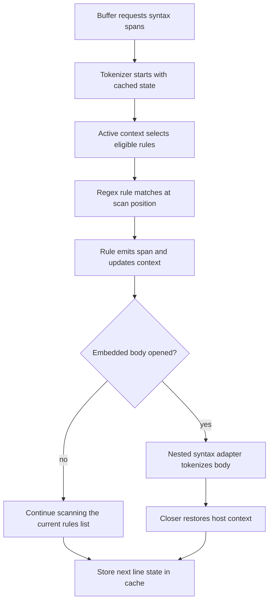

# Context-Driven Syntax Engine - Technical Design

## Architecture Overview
The syntax engine should be re-centered around two primitives:

1. `regex` rules that match at the current scan position, emit styles, and update context
2. `injection` rules that delegate the current body to a nested syntax when context says the body should switch languages

Instead of encoding multi-step parsing behavior in predefined region kinds, grammars should describe a sequence of context transitions. A `regex` rule can match text, emit a style, and push or pop context markers. Active context then determines both which rules are eligible to match and whether the tokenizer should delegate the current body to a nested syntax through an `injection` rule.

This architecture keeps highlighting line-oriented and incremental while making structured constructs easier to model. HTML-like open tags, embedded bodies, and closing tags can be represented as separate state transitions rather than as a single special region.

The refactor should preserve the existing buffer cache model, theme tag mapping, and renderer boundary. The visible change is in how grammars express parsing behavior, not in how the screen ultimately renders spans.

## Interface Design
The public buffer and renderer APIs should remain unchanged. The primary interface changes live in the syntax definition model and the tokenizer’s internal rule evaluation.

### Rule Model
Rules should be expressed as two kinds of declarative entries:

- `regex` rules for direct matches and context transitions
- `injection` rules for delegated nested-language bodies

Conceptually:

```rust
pub enum SyntaxRule {
    Regex {
        pattern: Regex,
        tag: Tag,
        context: Option<ContextControl>,
    },
    Injection {
        selector: InjectionSelector,
        context: Option<ContextControl>,
        fallback: InjectionFallback,
    },
}

pub struct ContextControl {
    pub requires: Vec<String>,
    pub push: Vec<String>,
    pub pop: Vec<String>,
}

pub enum InjectionSelector {
    Static { name: String },
    Capture { pattern: Regex },
}

pub enum InjectionFallback {
    ParentStyle,
    Unstyled,
}
```

`regex` rules are responsible for structural tokenization. `injection` rules are responsible for choosing and tokenizing the nested language body.

Rules are still ordered within the single `rules` list. The first matching rule at the current scan position wins, but context determines which entries are eligible at that point.

#### Example: Plain regex rule

```toml
[[rules]]
kind = "regex"
pattern = "#.*$"
tag = "comment.line"
```

Use this for simple one-line matches like comments, keywords, or punctuation.

#### Example: Context-gated rule

```toml
[[rules]]
kind = "regex"
pattern = "<"
tag = "punctuation"
context = { push = ["inside_tag"] }
```

This opens a tag-scanning mode.

#### Example: Attribute rules inside a tag

```toml
[[rules]]
kind = "regex"
pattern = "\\b[A-Za-z_:][A-Za-z0-9:._-]*="
tag = "variable.property"
context = { requires = ["inside_tag"] }

[[rules]]
kind = "regex"
pattern = "\"[^\"]*\"|'[^']*'"
tag = "string"
context = { requires = ["inside_tag"] }
```

This keeps attribute highlighting active only while the tokenizer is inside a tag opener.

#### Example: Embedded body opener

```toml
[[rules]]
kind = "regex"
pattern = "\\bscript\\b"
tag = "markup.tag"
context = { requires = ["inside_tag"], push = ["script_host"] }

[[rules]]
kind = "regex"
pattern = ">"
tag = "punctuation"
context = { requires = ["inside_tag"], pop = ["inside_tag"] }

[[rules]]
kind = "regex"
pattern = "</script>"
tag = "markup.tag"
context = { requires = ["script_host"], pop = ["script_host"] }

[[rules]]
kind = "injection"
context = { requires = ["script_host"] }
selector = { name = "javascript" }
fallback = "unstyled"
```

This is the pattern for a host element that should close the tag-scanning mode, let the closing element win when it appears, and then delegate the body to JavaScript while the host context remains active.

#### Example: Closing host element
The closing host element must be listed before the `injection` rule so it can preempt delegation when the tokenizer reaches `</script>`. This lets the closer render like normal HTML tag syntax while returning the tokenizer to the host grammar afterward.

#### Example: Capture-based embedded syntax

```toml
[[rules]]
kind = "regex"
pattern = "```"
tag = "markup.code"
context = { push = ["code_fence"] }

[[rules]]
kind = "regex"
pattern = "```"
tag = "markup.code"
context = { requires = ["code_fence"], pop = ["code_fence"] }

[[rules]]
kind = "injection"
context = { requires = ["code_fence"] }
selector = { capture = "^[ \\t]*([A-Za-z0-9_+-]+)" }
fallback = "unstyled"
```

This shape is useful when the opener itself chooses the nested language, such as Markdown code fences. The closing fence must be listed before the injection rule so it can end the code-fence context before any remaining body text is delegated.

### Context-Scoped Rule List
A syntax definition should express behavior as one ordered `rules` list, with context markers deciding which entries are active. Context markers are the state machine.

The intended model is:

- rules may require one or more context markers to match
- rules may push or pop context markers when they match
- active context determines which entries in the rules list are eligible at a given point
- nested syntax selection is derived from context-aware rule transitions

This keeps the grammar declarative while allowing a host language to express constructs like “inside tag”, “inside script host”, and “inside style host”.

### Nested Syntax Selection
Nested syntax selection should be attached to `injection` rules rather than to a special region kind.

The nested selector should support:

- a fixed syntax name for known embedded hosts
- capture-based lookup for language names that come from opener text
- fallback behavior when the nested syntax cannot be resolved

The tokenizer should treat embedded syntax as a body-mode decision made after the opener has established the relevant context.

## Data Models
The syntax schema should shift from region-centric data to a single ordered rule list with explicit context state.

Recommended data elements:

- `syntax.name`, `syntax.display_name`, `syntax.alias`, `syntax.filename`, `syntax.shebang`
- one ordered `rules` list containing regex and injection rules
- per-rule `context` data with `requires`, `push`, and `pop`
- per-rule optional nested syntax metadata
- per-syntax fallback behavior for unresolved nested syntax

The runtime state should preserve:

- the current active rule selection state
- the current context stack
- any active nested syntax state
- enough information to resume tokenization on the next line without reparsing from the start of the file

The cache line state should remain compact because it is stored for every scanned line.

## Key Components

### Syntax Loader
Responsibilities:

- parse the ordered `rules` list
- validate regexes and context metadata
- validate nested syntax references
- reject malformed rules before registration
- preserve helpful error messages that name the syntax file and rule

The loader should continue to support builtin syntax discovery and registry promotion as it does today.

### Context Resolver
Responsibilities:

- decide whether a rule is active at the current scan position
- apply push/pop transitions in a deterministic order
- maintain the stack of active markers for the tokenizer

The resolver should treat context markers as exact labels. Presence anywhere in the active stack should satisfy a `requires` check unless a future grammar feature explicitly asks for positional semantics.

### Tokenizer
Responsibilities:

- scan the current line left to right
- consult the active context to determine which rules can match
- emit highlight spans for the current match
- update context and nested syntax state when a rule opens or closes a mode
- start or continue injection tokenization when an active context enables an `injection` rule
- carry continuation state across line boundaries

The tokenizer should remain incremental. It should tokenize only the lines needed for the current render request and reuse cached state for earlier lines.

### Nested Syntax Adapter
Responsibilities:

- bridge from a context-driven opener to a nested syntax definition
- tokenize embedded body content with the selected nested syntax
- stop nested tokenization when the matching host closer is encountered

This component should let HTML-like constructs become ordinary context transitions rather than special parser branches.

### Syntax Cache
Responsibilities:

- store spans and per-line tokenizer state
- invalidate from the first changed line onward
- recompute downstream lines when context or nested syntax changes

The cache contract should not change, but the stored state must be rich enough to represent the new context-driven engine.

## User Interaction
There is no new direct UI surface.

The user-facing changes are visible through highlighted text:

- structured markup can model opener, body, and closer as separate states
- embedded languages can appear in the correct body span without hiding the host syntax around them
- existing plain regex highlighting remains available for simple grammar cases

The end result should feel like a more expressive syntax engine rather than a new feature the user has to enable.

## External Dependencies
The refactor depends on the current syntax and rendering infrastructure already in the repository.

Relevant dependencies:

- the builtin syntax registry and metadata loader
- the regex engine already used by syntax rules
- the buffer syntax cache and invalidation flow
- the theme tag resolution system
- existing syntax fixtures and tests for regression coverage

No new third-party parser library is required.

## Error Handling
Expected failures should be handled conservatively.

- invalid regexes must fail at syntax load time
- invalid context metadata must fail at syntax load time
- invalid nested syntax names or aliases must fail or fall back according to the grammar’s declared behavior
- if a context transition cannot be resolved safely, the tokenizer should render the text using the nearest valid host style rather than panic

The refactor should prefer stable, partial highlighting over brittle special cases.

## Security
The refactor does not introduce new execution risk.

- syntax data remains declarative
- no code execution or shell access is introduced
- nested syntax lookup stays local to the registry
- regex validation continues to happen through the existing loader path

## Configuration
No new runtime configuration is required.

The refactor should be transparent to users:

- filetype detection continues to choose the syntax
- syntax highlighting remains controlled by the existing highlight toggle
- theme mappings continue to resolve tags as they do today

## Component Interactions


## Platform Considerations
The refactor should remain portable across all supported platforms.

Key considerations:

- line-ending differences should not affect regex matching semantics
- context state must remain deterministic across incremental edits
- cached line state should stay stable regardless of terminal size or platform filesystem behavior
- existing regression fixtures should continue to work in the test environment on every supported OS
