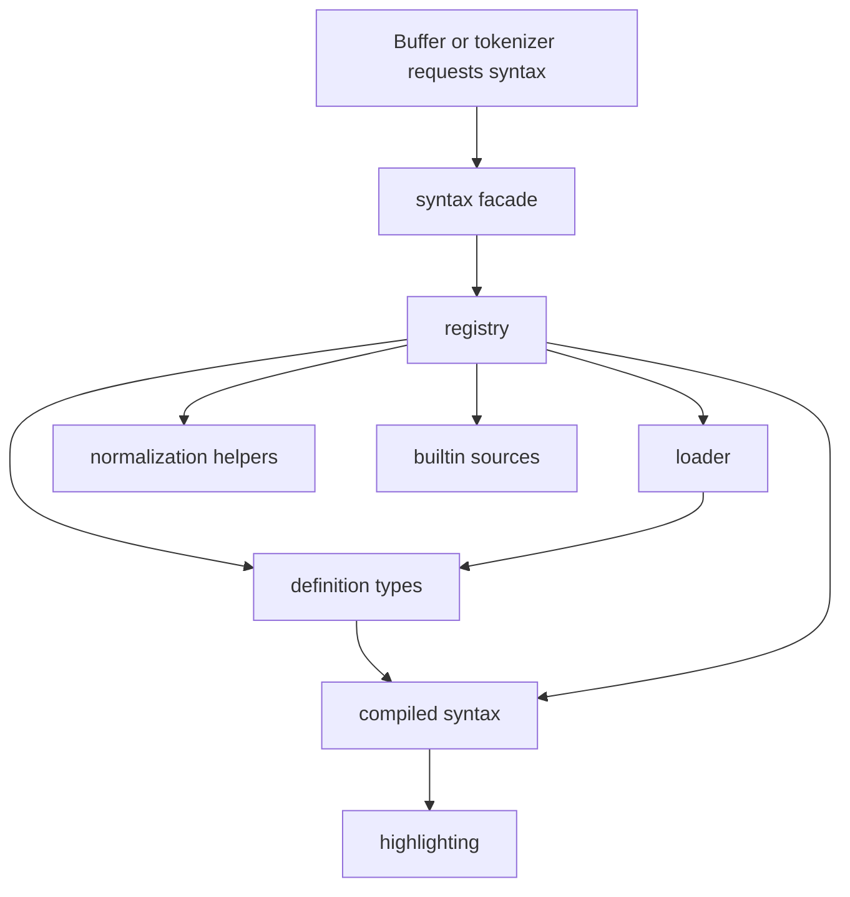

# Syntax Module Split - Technical Design

## Architecture Overview
The syntax subsystem will be reorganized into a small module tree with `src/syntax/mod.rs` acting as the public facade. The goal is to separate concerns without changing behavior:

- `mod.rs` will declare the submodules and re-export the public syntax API.
- `error.rs` will own syntax load errors and formatting.
- `definition.rs` will own syntax data models and compiled syntax types.
- `loader.rs` will own TOML parsing and raw-to-compiled conversion.
- `registry.rs` will own registry state, lookup, promotion, validation, and builtin loading orchestration.
- `builtin.rs` will own embedded builtin source registration.
- `normalize.rs` will own label and marker normalization helpers.

The public API should remain the same from the rest of the editor’s point of view. The split is organizational: code that currently lives together in one file will move into modules that match how the subsystem actually works.

## Interface Design
### Public facade
`src/syntax/mod.rs` should continue to expose the same public entry points used elsewhere in the codebase, including:

- syntax load errors
- syntax definitions and metadata
- syntax rules and injected syntax selectors
- syntax registry access and resolution helpers
- fallback syntax resolution helpers

The facade should re-export the items needed by callers so downstream code does not need to learn the new internal file layout.

### Module responsibilities
Each internal module should expose only what its neighbors need:

- `error.rs` should format and classify syntax load failures.
- `definition.rs` should define the data structures that represent loaded syntax state.
- `loader.rs` should parse raw TOML into raw syntax data and compile raw syntax into runtime syntax structures.
- `registry.rs` should manage lookup indexes, promotion, validation, and access to builtin syntax entries.
- `builtin.rs` should return the embedded builtin syntax source list.
- `normalize.rs` should normalize labels and markers consistently across the loader and registry.

### Test organization
Tests should move with the code they cover when practical:

- loader tests should verify raw parsing and compiled syntax conversion
- registry tests should verify lookup, promotion, and validation behavior
- helper tests should verify normalization behavior

## Data Models
### Syntax definition types
The current syntax models should remain the same semantically:

- raw syntax data still represents the parsed TOML document
- metadata still stores canonical names, display labels, aliases, filename regexes, and shebang regexes
- compiled syntax definitions still contain compiled rules and metadata

The refactor should not change field names or TOML schema unless a bug is uncovered during extraction.

### Registry state
The registry should keep the same state it has today:

- canonical syntax entries
- alias lookup tables
- filename pattern lookup tables
- shebang pattern lookup tables
- optional compiled payloads for lazy promotion

Only the ownership location changes; the in-memory model should remain stable.

## Key Components
### `SyntaxRegistry`
Responsibilities:

- load builtin syntax sources
- register raw syntax entries
- resolve syntax names and aliases
- resolve filename and shebang matches
- promote raw syntax into compiled syntax
- validate references and metadata collisions

Dependencies:

- syntax data models
- normalization helpers
- builtin source list

### `SyntaxLoader`
Responsibilities:

- parse TOML documents
- validate syntax metadata
- compile raw rules and nested selectors
- surface syntax load errors

Dependencies:

- raw syntax models
- error types
- normalization helpers

### `SyntaxDefinition` and metadata types
Responsibilities:

- represent compiled syntax state
- expose public read-only accessors
- carry resolved metadata and rules

Dependencies:

- tag types
- regex compilation

### Builtin source wiring
Responsibilities:

- provide the embedded builtin TOML file list
- keep builtin loading data-driven

Dependencies:

- the embedded builtin syntax files

## User Interaction
There is no user-facing workflow change. Users should not observe any difference in syntax behavior, labels, or highlighting.

Expected result:

- the codebase becomes easier to navigate
- syntax-related changes become easier to isolate
- existing editor behavior stays the same

## External Dependencies
No new dependencies are required.

The refactor should continue using the existing Rust standard library, `regex`, `serde`, and `toml` dependencies already present in the syntax subsystem.

## Error Handling
Error behavior should remain unchanged.

Expected failures:

- invalid TOML still produces parse errors
- invalid names, aliases, regexes, and nested references still produce load errors
- duplicate metadata mappings still produce deterministic load failures

Recovery strategy:

- preserve the current error messages and error classes where practical
- keep fallback behavior unchanged for unresolved runtime lookups

## Security
The split does not change the security model.

Relevant checks:

- syntax data remains declarative
- builtin sources remain embedded
- no new I/O or execution paths should be introduced

## Configuration
No new configuration is required.

The refactor should not add or remove syntax-related config options.

## Component Interactions

Interaction flow:

1. Callers continue to enter through `src/syntax/mod.rs`.
2. The facade routes requests to the registry or loader internals.
3. The registry uses builtin sources and normalization helpers to load and resolve syntax data.
4. The loader compiles syntax definitions and returns the same runtime types as before.
5. The rest of the editor receives the same syntax results it already expects.

## Platform Considerations
The split should remain portable because it is a code organization change, not a behavior change.

Important considerations:

- keep module paths simple and explicit
- avoid circular dependencies between the new internal modules
- preserve cross-platform behavior by leaving syntax semantics unchanged
