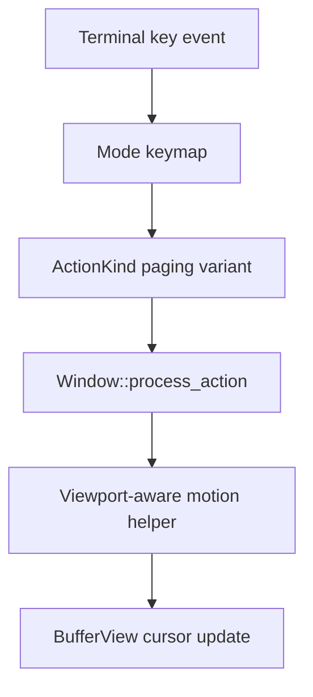

# Paging Keys - Technical Design

## Architecture Overview

Paging keys are implemented as cursor motions, not viewport-only scrolling commands. The editor should recognize four paging actions:

- `PageUp`
- `PageDown`
- `Ctrl-U`
- `Ctrl-D`

`PageUp` and `PageDown` move by one viewport height. `Ctrl-U` and `Ctrl-D` move by half of the viewport height, rounded down but never less than one line.

The feature follows the existing urvim action flow:

1. `NormalMode` and `InsertMode` map terminal key strings to actions.
2. The main event loop forwards the resulting action to `Window`.
3. `Window` performs the cursor move using the current viewport size and remembered column state.

This keeps paging behavior consistent with the rest of the editor's motion handling and preserves the existing separation between input decoding and cursor execution.

## Interface Design

### Action Variants

Add four action variants to represent the paging motions:

| Action | Meaning |
|--------|---------|
| `MovePageUp` | Move the cursor up by one viewport height |
| `MovePageDown` | Move the cursor down by one viewport height |
| `MoveHalfPageUp` | Move the cursor up by half a viewport height |
| `MoveHalfPageDown` | Move the cursor down by half a viewport height |

These actions are intentionally distinct from `MoveUp` and `MoveDown` so they do not reuse line-step count behavior.

### Key Bindings

Bind the keys in both mode keymaps:

| Mode | Key | Action |
|------|-----|--------|
| Normal | `<PageUp>` | `MovePageUp` |
| Normal | `<PageDown>` | `MovePageDown` |
| Normal | `<C-u>` | `MoveHalfPageUp` |
| Normal | `<C-d>` | `MoveHalfPageDown` |
| Insert | `<PageUp>` | `MovePageUp` |
| Insert | `<PageDown>` | `MovePageDown` |
| Insert | `<C-u>` | `MoveHalfPageUp` |
| Insert | `<C-d>` | `MoveHalfPageDown` |

### Movement Semantics

- `PageUp` and `Ctrl-U` move toward smaller buffer line numbers.
- `PageDown` and `Ctrl-D` move toward larger buffer line numbers.
- The cursor column should be preserved using the same remembered-visual-column behavior used by other vertical motions.
- The motions must clamp to valid buffer lines when the buffer is shorter than the requested movement.

## Data Models

No new standalone data structure is required. The feature extends the existing editor action model and uses the existing window viewport state:

- `ActionKind` stores the paging intent.
- `Window::size.rows` provides the current viewport height.
- `BufferView` provides the current cursor, scroll offset, and remembered column state.

The only new data carried by the feature is the action variant itself.

## Key Components

### `src/editor/action.rs`

Add the four paging action variants and update the action helper methods so:

- paging motions are countable only if the design explicitly wants count prefixes later; for now, they should not accept counts
- paging motions preserve remembered column behavior like other vertical motions
- paging motions update snapshot cursor state like other cursor movements

This keeps the action classification logic authoritative and makes the window layer simpler.

### `src/editor/normal.rs`

Bind `<PageUp>`, `<PageDown>`, `<C-u>`, and `<C-d>` in the normal-mode trie keymap.

The bindings should be direct, single-key mappings that do not conflict with existing multi-key sequences.

### `src/editor/insert.rs`

Bind the same four keys in insert mode so paging works without mode switching.

Insert mode should continue to treat the actions as navigation only. They should not affect repeat-capture text or exit insert mode.

### `src/window/widget.rs`

Route the new paging actions to dedicated window movement handlers.

### `src/window/motions.rs`

Add helper methods that move the cursor by a computed line delta:

- one viewport height for `PageUp` and `PageDown`
- half a viewport height for `Ctrl-U` and `Ctrl-D`

Each helper should reuse the existing cursor-setting path so visual column preservation stays consistent with other vertical motions.

## User Interaction

1. The user presses `PageUp`, `PageDown`, `Ctrl-U`, or `Ctrl-D`.
2. The active mode keymap resolves the key to a paging action.
3. `Window` computes the target line based on the viewport height.
4. The cursor moves to the resolved line, preserving the remembered column when possible.
5. Insert mode remains active if the motion was triggered from insert mode.

This should feel like standard terminal-editor paging: the document moves relative to the cursor's current context, and the cursor does not jump to an arbitrary column.

## External Dependencies

No new external dependencies are required.

The design relies on existing internal systems:

- terminal key parsing for special keys and control-key canonical strings
- window viewport sizing and cursor movement helpers
- existing action and keymap infrastructure

## Error Handling

Expected failure cases should be handled by clamping or no-op behavior rather than panics:

- Empty buffer: keep the cursor at line 0
- Short buffer: clamp movement to the first or last available line
- Zero-height viewport: treat paging as a no-op
- Movement beyond buffer bounds: clamp to valid line indices

The implementation should use existing cursor helpers and avoid duplicating manual line math where possible.

## Security

No security-sensitive behavior is introduced.

The feature only adds local key bindings and cursor movement logic. It does not handle input from untrusted external sources beyond the already-existing terminal input path.

## Configuration

No new configuration options are required.

Paging behavior is fixed and derived from the active viewport size at runtime.

## Component Interactions

The key interaction point is the window layer, which already owns the viewport size and the current cursor state needed for paging.

## Platform Considerations

Terminal backends differ in how they report paging keys, but urvim already normalizes those keys into canonical `KeyCode` values and strings. The feature only needs to bind the canonical forms that the terminal layer already emits.

Because viewport height is terminal-dependent, the motion should always use the current window size rather than hard-coded row counts.
