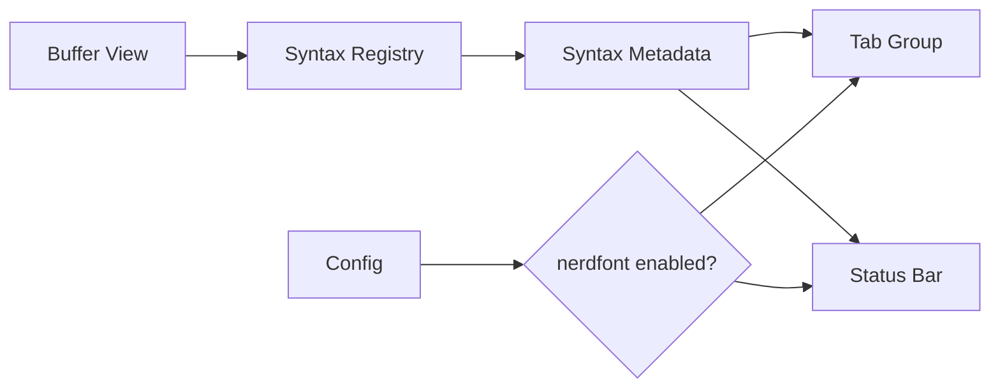

# Filetype Glyph Metadata - Technical Design

## Architecture Overview

The feature adds two small data extensions and one rendering decision point:

- Syntax metadata gains optional glyph fields for filetype-specific iconography.
- Startup configuration gains an optional set of advanced glyph capabilities, currently only `nerdfont`.
- The tab bar and status bar renderers decide at draw time whether to include the glyph based on syntax metadata plus the active config.

The design keeps syntax detection, highlighting, and filetype resolution unchanged. Glyphs are purely presentation metadata that sit beside the existing syntax display name.

## Interface Design

### Syntax metadata

The raw syntax schema gains these optional fields under `[metadata]`:

```toml
[metadata]
glyph = ""
glyph_color = "#ff5722"
```

The compiled syntax metadata exposes the resolved values as:

```rust
pub struct SyntaxMetadata {
    pub name: SmolStr,
    pub display_name: SmolStr,
    pub alias: Vec<SmolStr>,
    pub comment_prefix: Option<SmolStr>,
    pub glyph: Option<SmolStr>,
    pub glyph_color: Option<Color>,
    pub filename: Vec<Regex>,
    pub shebang: Vec<Regex>,
}
```

`glyph_color` should accept the same literal color shapes used elsewhere in urvim's TOML schema, then resolve into `terminal::Color`.

### Editor configuration

The config file gains an optional `advanced_glyphs` field:

```toml
advanced_glyphs = ["nerdfont"]
```

The resolved config stores the enabled capabilities as a `BTreeSet<AdvancedGlyphCapability>`, so renderers can ask whether `nerdfont` is active without caring how the file was written.

```rust
pub struct Config {
    pub theme: String,
    pub insert_escape: Option<String>,
    pub syntax: bool,
    pub auto_close_pairs: bool,
    pub advanced_glyphs: BTreeSet<AdvancedGlyphCapability>,
}
```

```rust
pub struct PartialConfig {
    pub theme: Option<String>,
    pub insert_escape: Option<String>,
    pub syntax: Option<bool>,
    pub auto_close_pairs: Option<bool>,
    pub advanced_glyphs: Option<Vec<AdvancedGlyphCapability>>,
}
```

## Data Models

### `AdvancedGlyphCapability`

A closed enum for config parsing:

```rust
#[derive(Clone, Debug, PartialEq, Eq, PartialOrd, Ord, Deserialize)]
#[serde(rename_all = "snake_case")]
pub enum AdvancedGlyphCapability {
    Nerdfont,
}
```

### Raw syntax glyph color

The raw syntax metadata should add a color enum mirroring the theme loader's literal color handling:

```rust
pub enum RawGlyphColor {
    Ansi(u8),
    Rgb(String),
}
```

This keeps syntax files expressive while still resolving to the terminal color type used by renderers.

### Presentation rule

A glyph is rendered only when all of the following are true:

1. The active syntax provides a glyph.
2. The active config enables `nerdfont`.
3. The target renderer has room for the resulting text.

If the glyph is omitted or the capability is disabled, the label stays text-only.

## Key Components

### `src/syntax/definition.rs`

Owns the new optional glyph fields in raw and compiled syntax metadata. The module remains the source of truth for what a syntax can advertise.

### `src/syntax/loader.rs`

Validates and compiles glyph metadata alongside the existing metadata fields. Invalid color literals or empty glyph strings should fail fast during syntax loading.

### `src/config.rs`

Adds `advanced_glyphs` to the resolved config and config-file schema. This module validates the set contents and rejects unknown capability names.

### `src/layout.rs`

Continues to coordinate the root UI. It should pass the active syntax name and resolved config state to the child renderers so they can decide whether to show glyphs.

### `src/tab_group.rs`

Renders tab titles with an optional leading glyph. The tab width calculation needs to include the rendered glyph and separator so scrolling and active-tab visibility still work correctly.

### `src/status_bar.rs`

Renders the syntax segment with an optional leading glyph. The modified marker logic should continue to align with the rendered syntax text after the glyph prefix is added.

## User Interaction

When `nerdfont` is enabled and a syntax defines a glyph, the user sees the icon in two places:

- In the tab bar, before the tab's file name.
- In the status bar, before the syntax label.

The glyph color applies only to the glyph cell or glyph run. The surrounding text keeps using the existing UI styles.

If the capability is disabled or the syntax has no glyph, the UI stays exactly as it is today.

## External Dependencies

No new external crate is required. The implementation can use the existing terminal color and style types, serde, and the current TOML loader.

## Error Handling

- Invalid `glyph_color` values should fail syntax loading with a clear loader error.
- Unknown `advanced_glyphs` values should fail config loading with a clear config error.
- Missing glyph data should not be treated as an error.
- If a renderer cannot fit the icon plus label, it should clip the rendered text using the existing width-aware truncation logic instead of panicking.

## Security

The feature does not add privileged operations, new file access, or network access. Input validation remains important so malformed TOML cannot smuggle invalid glyph capabilities or bad color literals into runtime state.

## Configuration

The new config schema is additive:

```toml
advanced_glyphs = ["nerdfont"]
```

This field is optional and defaults to empty. No CLI flag is introduced in this change; the feature is controlled through the existing startup config path.

## Component Interactions



At render time, the active buffer supplies the syntax name, the registry resolves the syntax metadata, and the renderers check config before deciding whether to prepend the glyph.

## Platform Considerations

Glyph support depends on the user's terminal font and locale. Nerd font icons are optional by design, so the application should continue to work on terminals that do not display them correctly. The design also needs to respect varying glyph widths and keep the existing width-aware clipping behavior intact on narrow screens.
