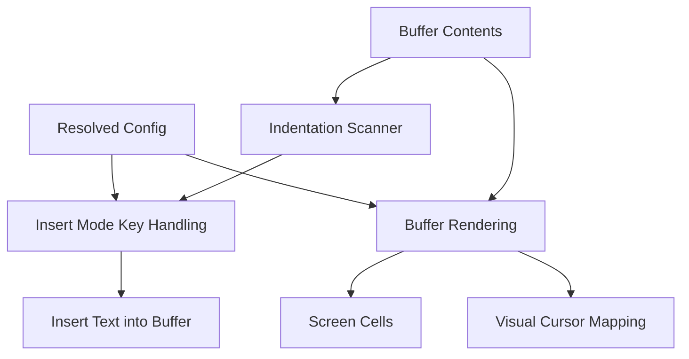

# Insert-Mode Tab Insertion - Technical Design
## Architecture Overview
This feature adds a small tab-handling layer that is shared by insert-mode key handling and buffer rendering.

- Insert mode asks a tab-resolution helper which indentation style to use for the active buffer.
- Rendering asks the same configuration for the visual tab width so `\t` characters occupy a consistent number of columns.
- The underlying buffer contents remain unchanged; only insertion behavior and screen presentation change.

The design keeps the feature split into two concerns:

1. Tab insertion behavior in insert mode.
2. Tab character rendering in buffer views.

Both concerns read from the resolved startup configuration, so the user can control them from a single config source.

## Interface Design
### Configuration
Add new config fields to the resolved config and TOML schema.

```rust
pub enum TabInsertionSetting {
    Tabs,
    Spaces,
}

pub enum TabBehaviorSetting {
    Simple,
    Smart,
}

pub struct Config {
    pub theme: String,
    pub insert_escape: Option<String>,
    pub syntax: bool,
    pub auto_close_pairs: bool,
    pub advanced_glyphs: BTreeSet<AdvancedGlyphCapability>,
    pub tab_insertion: TabInsertionSetting,
    pub tab_behavior: TabBehaviorSetting,
    pub tab_width: usize,
}

pub struct PartialConfig {
    pub theme: Option<String>,
    pub insert_escape: Option<String>,
    pub syntax: Option<bool>,
    pub auto_close_pairs: Option<bool>,
    pub advanced_glyphs: Option<Vec<AdvancedGlyphCapability>>,
    pub tab_insertion: Option<TabInsertionSetting>,
    pub tab_behavior: Option<TabBehaviorSetting>,
    pub tab_width: Option<usize>,
}
```

Validation rules:

- `tab_width` must be greater than zero.
- `tab_insertion` must resolve to `Tabs` or `Spaces`.
- `tab_behavior` must resolve to `Simple` or `Smart`.
- Unknown config values remain startup errors, consistent with the rest of the config schema.

### Tab Resolution Helper
Add a helper that resolves insert-mode tab behavior for a specific buffer.

```rust
pub enum ResolvedTabStyle {
    Tabs,
    Spaces,
}

pub fn resolve_tab_style(buffer: &Buffer, config: &Config) -> ResolvedTabStyle;
```

The helper returns the concrete style for insert-mode `Tab` presses:

- `Tabs` means insert a literal `\t`.
- `Spaces` means insert `tab_width` spaces.

Resolution rules:

- If `tab_behavior` is `Simple`, return the configured `tab_insertion`.
- If `tab_behavior` is `Smart`, scan the buffer for the first clear indentation style.
- If smart resolution fails to find a clear style, return the configured `tab_insertion`.

### Buffer Rendering Helper
Add a rendering helper that computes the visual width of a character in a given column context.

```rust
pub fn display_char_width(ch: char, visual_col: usize, tab_width: usize) -> usize;
```

Tab characters advance to the next tab stop:

```text
next_stop = tab_width - (visual_col % tab_width)
```

For a tab width of `4`, a tab at visual column `0` occupies `4` cells, at column `1` occupies `3` cells, and so on.

## Data Models
### TabInsertionSetting
A configuration enum with two user-facing values:

- `tabs`
- `spaces`

### TabBehaviorSetting
A configuration enum with two user-facing values:

- `simple`
- `smart`

### ResolvedTabStyle
A derived, non-persistent style used at the moment `Tab` is pressed.

- `Tabs`: insert a literal tab character.
- `Spaces`: insert a run of spaces sized by `tab_width`.

### Inferred Buffer Style
A derived buffer-level classification used by smart mode.

- `Tabs` if the first unambiguous indentation prefix encountered in the buffer uses tabs.
- `Spaces` if the first unambiguous indentation prefix encountered in the buffer uses spaces.
- Absent if no indentation can be inferred.

## Key Components
### Insert Mode Key Handling
Insert mode handles `Tab` by:

1. Reading `Config::tab_behavior`.
2. If the setting is `Simple`, using `Config::tab_insertion` directly.
3. If the setting is `Smart`, scanning the buffer for the first indentation style.
4. Falling back to `Config::tab_insertion` when the buffer provides no style.
5. Inserting either `\t` or `tab_width` spaces based on the resolved style.

This keeps the keybinding simple and makes the behavior deterministic for a given buffer state.

### Buffer Indentation Scanner
The scanner infers style from the current buffer contents without needing filetype metadata.

Recommended scan rule:

- Walk lines from top to bottom.
- Ignore empty lines and lines that are not indented.
- For the first line with leading whitespace, classify the leading whitespace prefix.
- If the prefix contains only tabs, resolve to `Tabs`.
- If the prefix contains only spaces, resolve to `Spaces`.
- If the prefix is mixed, treat it as ambiguous and keep scanning until a clear prefix appears.

This preserves the user requirement to follow the first style while avoiding a false inference from malformed mixed indentation.

### Buffer Rendering
Rendering should expand `\t` characters to the next tab stop instead of treating them as zero-width characters.

Responsibilities:

- Preserve the original buffer text.
- Use `tab_width` for display width only.
- Keep cursor positioning and horizontal scrolling aligned with the same width rule.

### Cursor and View Geometry
Visual cursor movement and buffer-to-screen column mapping must use the same tab expansion rule as text rendering.

If rendering and cursor positioning disagree about tab width, the cursor can appear to drift relative to the text. Using one shared helper avoids that mismatch.

## User Interaction
- In insert mode, pressing `Tab` inserts the resolved indentation style.
- In buffers where the first indentation style is tabs, smart mode behaves like tabs.
- In buffers where the first indentation style is spaces, smart mode behaves like spaces.
- In buffers with no indentation history, smart mode falls back to the configured insertion setting.
- Changing `tab_width` changes how tab characters are displayed and, when spaces are inserted, how many spaces are used for one tab insertion.

## External Dependencies
No new external crates are required.

The implementation can reuse existing Unicode-width and screen-rendering infrastructure, but it needs a tab-aware width branch.

## Error Handling
- Reject `tab_width = 0` at startup.
- Reject malformed `tab_insertion` and `tab_behavior` values during config parsing, consistent with existing config validation.
- If smart mode cannot infer a style, fall back to `tab_insertion` instead of failing.
- If the buffer contains mixed indentation, use the first clear indentation style rather than treating the buffer as invalid.

## Security
This feature does not introduce new security-sensitive behavior.

Configuration values are local-only startup settings, and the tab scanner operates on in-memory buffer content without external input or secret handling.

## Configuration
Add the following TOML fields:

```toml
tab_insertion = "spaces"
tab_behavior = "smart"
tab_width = 4
```

Suggested meanings:

- `tab_insertion`: `tabs` or `spaces`
- `tab_behavior`: `simple` or `smart`
- `tab_width`: positive integer, default `4`

These settings should be documented alongside the other user-facing config fields.

## Component Interactions


Interaction flow:

1. The editor loads `Config` at startup.
2. Insert mode receives a `Tab` keypress.
3. The tab resolver checks the active buffer contents when `tab_behavior` is `smart`.
4. The resolver chooses tabs or spaces and inserts the corresponding text.
5. Rendering expands tab characters to the configured width for display and cursor placement.

## Platform Considerations
- Terminal rendering width must be consistent across platforms because the editor draws directly into a fixed-width screen buffer.
- Tab expansion must work correctly with Unicode content on all platforms, so the cursor mapping must continue to respect existing grapheme-width behavior for non-tab characters.
- No platform-specific storage or OS integration is required.
