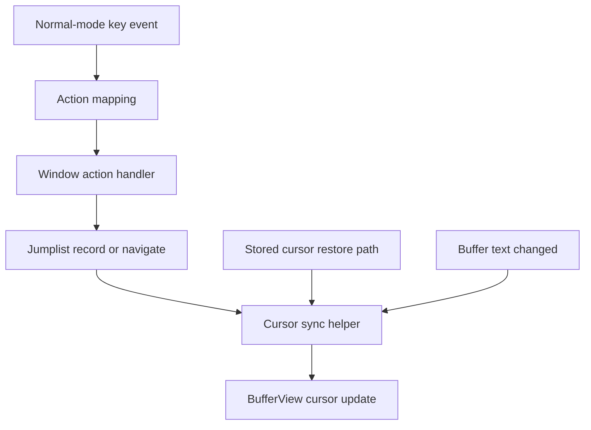

# Vim-Like Jumplist - Technical Design

## Architecture Overview

The jumplist is implemented as a per-window navigation history that sits alongside the window's live cursor state. Each window owns a session-local history of cursor locations, and cursor-restoring paths use a shared sync step before writing a stored position back into the active buffer view.

The feature has two related responsibilities:

1. Track meaningful navigation changes in the active window.
2. Restore stored positions safely even when the underlying buffer has changed since the entry was recorded.

The design keeps those responsibilities separate:

- `Window` remains responsible for interpreting cursor motion and applying it to the active view.
- A new jumplist component records and replays locations for the active window.
- A cursor-sync helper normalizes stored positions to valid grapheme boundaries before they are saved or restored.

This is intentionally broader than jumplist playback alone. Any editor path that restores a stored cursor position should use the same sync-aware restoration path so the editor never writes an invalid byte offset back into the view.

## Interface Design

### Jumplist API

Add a window-local jumplist type that manages recent cursor locations:

| Method | Input | Output | Description |
|--------|-------|--------|-------------|
| `new()` | none | `Self` | Creates an empty jumplist |
| `record(cursor)` | `cursor: Cursor` | `()` | Records a cursor position or refreshes the current entry |
| `jump_back()` | none | `Option<JumpEntry>` | Moves backward and returns the selected entry |
| `jump_forward()` | none | `Option<JumpEntry>` | Moves forward and returns the selected entry |
| `current_entry()` | none | `Option<&JumpEntry>` | Returns the current history entry |
| `can_jump_back()` | none | `bool` | Returns true when an older entry exists |
| `can_jump_forward()` | none | `bool` | Returns true when a newer entry exists |

### Jump Entry Shape

Each jumplist entry should capture:

- the buffer identity for the entry
- the cursor position associated with that location
- any internal bookkeeping needed to know whether the entry is the current head of the list

The public-facing behavior only depends on the buffer and cursor pair. The history index is an internal implementation detail.

### Cursor Sync API

Add a shared cursor-sync helper that normalizes a cursor against the current buffer before storage or restoration:

| Method | Input | Output | Description |
|--------|-------|--------|-------------|
| `sync_cursor()` | `cursor: Cursor` | `Cursor` | Returns a cursor clamped to a valid grapheme boundary in the current buffer |

This helper should preserve the closest valid cursor position instead of rejecting the update. If the requested position is already valid, it should be returned unchanged.

### Normal-Mode Key Bindings

Bind jumplist navigation in normal mode:

| Key | Action |
|-----|--------|
| `<C-o>` | Jump backward |
| `<C-i>` | Jump forward |

These bindings are normal-mode only. The design does not add insert-mode jumplist navigation.

## Data Models

### JumpEntry

```rust
/// A single jumplist entry for one window-local navigation point.
pub struct JumpEntry {
    pub buffer_id: BufferId,
    pub cursor: Cursor,
}
```

### JumpList

```rust
/// Session-local jump history for a single window.
pub struct JumpList {
    entries: Vec<JumpEntry>,
    current: usize,
}
```

**Invariants:**

- `entries` is ordered from newest to oldest, with the newest entry at the front.
- `current` points at the entry that should be restored next when navigating backward or forward.
- The history is bounded and drops the oldest entry when the limit is exceeded.
- Cursor positions stored in `JumpEntry` are always normalized before they are written into the list.

### Cursor Sync Data Flow

The stored cursor position is treated as a logical location, not as a raw byte offset. Before an entry is persisted or restored, the editor asks the current buffer to normalize the position to the nearest valid grapheme boundary.

This matters in two cases:

1. A buffer changed after a jump was recorded, so the old byte offset may no longer point to a valid grapheme boundary.
2. A cursor restore path is replaying stored state from a previous editor action, such as a jumplist jump or a window-state restore.

## Key Components

### `src/window/mod.rs`

`Window` is the natural owner of the jumplist because the feature is per-window and session-only. The window should expose high-level jumplist operations such as:

- record the current location after a meaningful cursor move
- jump to the previous entry
- jump to the next entry
- restore a stored entry through the sync-aware cursor path

This keeps history management close to the cursor state it governs.

### `src/window/motions.rs`

Cursor motion helpers continue to update the live cursor as they do today. After a movement completes, the window-level action handler can decide whether the movement should refresh the current jumplist entry or branch to a new entry.

The key distinction is:

- small movements update the current history entry when the active window is already tracking the same buffer
- threshold-crossing movements create a new entry and may discard forward history if the user had previously moved backward

### `src/window/view.rs`

`BufferView` remains the low-level cursor holder. It should gain or use a sync-aware restoration path so raw cursor writes from stored state are normalized before landing in the view.

This is the shared restore choke point for:

- jumplist playback
- undo/redo restoration
- window or tab restoration that rehydrates stored cursor state

### `src/editor/normal.rs`

Normal mode binds `<C-o>` and `<C-i>` to explicit jumplist actions. These actions are distinct from ordinary movement so they can restore history rather than altering it.

### `src/main.rs`

Main event dispatch should continue to route actions through the current window or active buffer view. The jumplist does not require a new top-level event pipeline, but any existing cursor-restoration branch should use the sync-aware restore helper.

### `src/buffer/cursor.rs`

The buffer layer should provide the grapheme-aware normalization logic used by cursor sync. That logic already understands line boundaries and grapheme positions, so it is the right place to clamp invalid byte offsets to a valid cursor location.

## User Interaction

1. The user moves the cursor in the active window.
2. The editor measures whether the move crosses the jumplist threshold.
3. If the move stays within the threshold, the current jumplist entry is refreshed in place.
4. If the move crosses the threshold, a new entry is created for the active buffer.
5. If the user has moved backward in the jumplist, a threshold-crossing move branches the history and discards the forward portion.
6. If the user presses `<C-o>` or `<C-i>`, the editor restores the selected entry through the sync-aware cursor path.

When the active cursor was previously restored from history, the same synchronization rules apply again if the buffer text has changed in the meantime.

## External Dependencies

No new external dependencies are required.

The feature uses existing internal building blocks:

- buffer grapheme utilities
- window-local cursor state
- the current keymap and action infrastructure

## Error Handling

Expected failure cases should degrade safely:

- Empty history: jumplist navigation is a no-op
- Missing entry: no cursor change occurs
- Out-of-date stored cursor: the restore path syncs to a valid grapheme boundary before applying it
- Empty buffer or empty line: the sync helper clamps to a valid location if one exists

The implementation should avoid panicking when a stored position can no longer be represented exactly.

## Security

No security-sensitive behavior is introduced.

The jumplist only stores in-memory cursor locations for the current session. It does not persist data or expose new external inputs.

## Configuration

No new configuration is required.

The jumplist size limit is fixed internally and is not user-configurable in this stage.

## Component Interactions



The important interaction is that the jumplist does not write raw cursor positions directly. All stored cursor playback passes through the same sync-aware restore path used by other cursor-restoring flows.

## Platform Considerations

This feature depends on Unicode grapheme boundaries, so cursor normalization must remain byte-accurate across multibyte characters and emoji.

Terminal platforms do not materially affect the jumplist logic itself. The only terminal-facing part of the feature is the canonical control-key mapping for `<C-o>` and `<C-i>`, which already fits the editor's existing key handling model.
