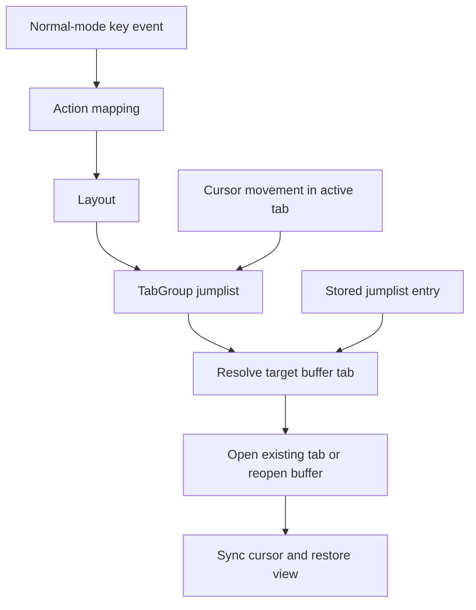

# Tab Group Owned Jumplist - Technical Design

## Architecture Overview

This change moves jumplist ownership from `Window` to `TabGroup`. The tab group becomes the session-local coordinator for cursor-history navigation across all open tabs, while windows continue to own live cursor state, scroll state, and rendering.

The design preserves the existing jumplist semantics from the completed feature:

- entries still record a buffer identity plus a cursor location
- small cursor moves refresh the current entry
- threshold-crossing moves branch the history
- backward and forward navigation still replays recorded entries

The key change is what happens when a jumplist entry is replayed. Instead of restoring cursor state only inside the current window, the tab group resolves the entry to an open tab, or reopens the buffer in a new tab if needed, and then applies the stored cursor position to that tab.

## Interface Design

### Tab Group Jumplist API

Add tab-group-level history operations that wrap the existing jumplist behavior:

| Method | Input | Output | Description |
|--------|-------|--------|-------------|
| `record_cursor_position()` | none | `()` | Records the active tab's current cursor position in the tab group's jumplist |
| `jump_backward()` | none | `bool` | Moves backward in jumplist history and activates the target tab or reopens its buffer |
| `jump_forward()` | none | `bool` | Moves forward in jumplist history and activates the target tab or reopens its buffer |
| `resolve_entry(entry)` | `JumpEntry` | `Option<usize>` | Returns the tab index for an already-open destination buffer, or opens a new tab for it |

### Jump Entry Shape

The history entry shape does not change:

- `buffer_id: BufferId`
- `cursor: Cursor`

The tab group owns the history list, but the entry payload still needs to be buffer-centric so the tab group can resolve whether the destination is already open.

### Window Responsibilities

`Window` no longer owns jumplist state. It remains responsible for:

- live cursor updates
- cursor syncing against the current buffer
- rendering the active buffer
- exposing its current `BufferView` and buffer identity to the tab group

Any window-local jumplist helper should be removed or turned into a private implementation detail if it is still useful during the transition.

## Data Models

### TabGroup

```rust
pub struct TabGroup {
    tabs: Vec<Window>,
    active_tab: usize,
    tab_bar_start: usize,
    jumplist: JumpList,
}
```

**Invariants:**

- The tab group owns exactly one active jumplist for the current session.
- The active tab index always refers to a live entry in `tabs` after normalization.
- The same buffer should not be opened twice inside one tab group when resolving jumplist playback.

### JumpList

The jump list can retain the existing internal representation from the completed feature. If moved into the tab group module, it should still behave as a bounded, branchable history list with deduplication by buffer-and-cursor pair.

## Key Components

### `src/tab_group.rs`

`TabGroup` becomes the primary owner of jumplist state and navigation behavior. It should:

- record cursor positions after meaningful movement in the active tab
- replay history entries by selecting an already-open tab when possible
- reopen a destination buffer into the tab group when no open tab currently owns it
- restore the cursor through the same sync-aware path used elsewhere in the editor

### `src/window/mod.rs`

`Window` should stop being the ownership boundary for jumplist history. Its public API should keep the pieces the tab group needs for navigation:

- current buffer identity
- current cursor
- sync-aware cursor restoration

### `src/main.rs`

Main action dispatch should continue to route cursor movement and jump actions through the layout and active tab group. The call sites that currently record jumplist state from the active window should be updated to call the tab-group-owned history API instead.

### `src/window/view.rs`

`BufferView` should remain the sync-aware cursor restoration choke point. Tab-group jump playback should reuse this path after the destination tab has been resolved.

## User Interaction

1. The user moves around inside a tab.
2. The active tab group's jumplist records meaningful cursor changes for that tab's buffer.
3. The user presses `Ctrl-O` or `Ctrl-I`.
4. The tab group selects the target buffer's existing tab if one is open.
5. If no tab currently owns that buffer, the tab group opens it into a new tab.
6. The tab group restores the recorded cursor position in the resolved tab.

This keeps the current jump-history semantics while making navigation feel tab-aware.

## External Dependencies

No new external dependencies are required.

The implementation should reuse the existing buffer pool and tab infrastructure already present in the editor.

## Error Handling

Expected failure cases should be handled safely:

- Empty jumplist history: navigation is a no-op
- Missing open tab for a history entry: reopen the buffer in the tab group
- Missing live buffer for a history entry: fail safely and leave the current tab unchanged
- Buffer text changed since recording: normalize the restored cursor before writing it into the destination view

When reopening a destination buffer, the tab group should avoid creating duplicate tabs if the buffer is already represented in `tabs`.

## Security

No security-sensitive behavior is introduced.

The jumplist remains an in-memory session feature and does not add new external inputs or persistence.

## Configuration

No new configuration is required.

The jumplist remains session-local, bounded internally, and not user-configurable in this stage.

## Component Interactions



The important interaction is that jumplist playback now resolves at the tab-group layer before cursor restoration. The history entry still describes a buffer and cursor, but the tab group decides which tab should own that buffer at restore time.

## Platform Considerations

The feature continues to depend on Unicode-aware cursor synchronization when restoring stored positions.

Terminal behavior does not materially change. The user-facing key bindings remain `Ctrl-O` and `Ctrl-I`, but the observable result is now tab-aware navigation and buffer reopening.
