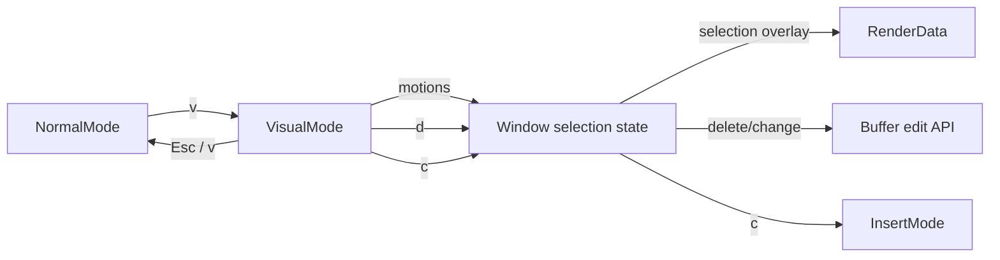

# Visual Mode - Technical Design

## Architecture Overview

Add a third editor mode, `Visual`, alongside the existing `Normal` and `Insert` modes. Visual mode is character-wise only in this release and is responsible for:

- tracking a fixed selection anchor and the live cursor position
- reusing the existing motion actions to grow or shrink the selection
- dispatching delete and change operations against the active selection
- returning to normal mode on `Esc` or `v`, matching Vim behavior

The implementation should reuse the current editor architecture instead of introducing a separate selection subsystem. The main changes are:

- `ModeKind` gains a `Visual` variant.
- A new `VisualMode` implementation of `Mode` handles visual key input.
- The active window stores a window-local visual selection state.
- Window rendering overlays the active selection with a dedicated theme-driven UI style.
- Visual delete and change reuse existing buffer mutation paths, with the cursor restored to the start of the selected range.

## Interface Design

### Mode layer

`ModeKind` is extended to include:

- `Visual`

`ModeKind::label()` should return `"VISUAL"` for the new mode so the status bar reflects the active state.

`VisualMode` implements `Mode` and exposes the same responsibilities as the other modes:

- `handle_key(&mut self, key: &Key) -> HandleKeyResult`
- `cursor_style(&self) -> CursorStyle`
- `is_waiting(&self) -> bool`
- `clear_buffer(&mut self)`
- `kind(&self) -> ModeKind`

Visual mode should use a block cursor, consistent with normal mode, while selection highlighting is shown through the buffer render layer.

### Visual key bindings

Visual mode should recognize the following key groups:

- motion keys already supported in normal mode
- `d` for delete
- `c` for change
- `Esc` to exit to normal mode
- `v` to exit to normal mode

Unsupported keys should not alter the current selection.

### Selection and edit interfaces

The active window should own a visual selection model that records:

- the anchor cursor set when visual mode starts
- the live cursor that follows motion keys

A normalized range should be derivable from that state as a `TextObjectRange` so the existing buffer edit APIs can consume it. The selection range should always be ordered by cursor position before deletion or change is applied.

The window should expose internal helpers for:

- entering visual mode and seeding the selection anchor
- updating the current selection cursor after a motion
- clearing the visual selection on exit
- deleting the active selection
- changing the active selection and switching to insert mode

## Data Models

### `ModeKind`

Add:

- `Visual`

This is a display and routing label used by the event loop and status bar.

### `VisualSelection`

A new window-local selection record should store:

- `anchor: Cursor`
- `cursor: Cursor`

Constraints:

- both cursors must be synced to valid buffer positions before use
- the selection represents a character-wise region only
- the normalized range derived from the selection must be stable across motions in either direction

### `TextObjectRange`

The existing `TextObjectRange` type remains the edit payload for visual delete/change after the selection is normalized.

## Key Components

### `VisualMode`

Owns visual-mode key bindings and emits actions for:

- motion updates
- selection delete
- selection change
- exit back to normal mode

It should not mutate buffers directly.

### `Window`

The window becomes the owner of visual selection behavior because it already owns the active cursor and buffer view. It should:

- create and clear selection state when visual mode starts or ends
- update the stored selection as motions move the cursor
- render the active selection overlay
- perform the actual buffer mutation for delete and change

### `BufferView`

`BufferView` is the natural place for the window-local selection state because it already stores cursor-related state such as the active cursor and remembered visual column. The view should expose helpers for reading and clearing the current visual selection.

### `RenderData`

Rendering should apply a visual-selection overlay to the chunks that intersect the active range. The existing syntax and UI styles should remain the base layer, and the selection overlay should be applied on top of them.

### `UiStyles`

Add a dedicated selection style to the resolved UI theme model, such as `selection`, so visual mode can render highlighted ranges without hardcoding terminal colors. This style should live alongside the existing status bar, gutter, tab, and window UI styles.

## User Interaction

### Entering visual mode

Pressing `v` in normal mode enters visual mode and seeds the selection anchor at the current cursor position.

### Extending the selection

Motion keys in visual mode move the active cursor while leaving the anchor fixed. The selection expands or contracts based on the current cursor position.

### Exiting visual mode

Pressing `Esc` or `v` again exits visual mode and returns to normal mode without changing the buffer.

### Deleting the selection

Pressing `d` deletes the active range and leaves the cursor at the start of the removed region.

### Changing the selection

Pressing `c` deletes the active range, leaves the cursor at the start of the removed region, and then switches immediately to insert mode.

## External Dependencies

No new external crates are required. The feature should use the existing buffer, cursor, rendering, and mode infrastructure.

## Error Handling

- If a motion cannot move the cursor, the selection should remain unchanged.
- If the visual selection cannot be normalized into a valid range, delete and change should be treated as no-ops.
- If the buffer changes underneath the selection and a cursor must be restored, the cursor should be synced before it is stored back into the window state.
- Exiting visual mode should always clear the stored selection state even if no edit occurred.

## Security

This feature does not introduce new security-sensitive behavior. It only changes local editor state and buffer editing semantics.

## Configuration

No new configuration options are required for the initial release.

## Component Interactions

Interaction summary:

- `NormalMode` hands control to `VisualMode` through the existing mode transition flow.
- `VisualMode` emits selection navigation and edit intents.
- `Window` updates the selection state, renders the highlight, and performs delete/change mutations.
- `Change` returns to insert mode after the selection is removed.

## Platform Considerations

The visual selection overlay should rely on terminal style reversal or equivalent style layering so it remains portable across supported terminals. No platform-specific input handling is required beyond the existing key event pipeline.
