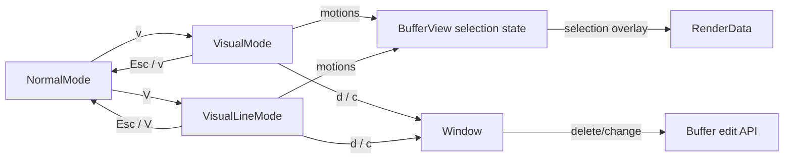

# Visual Line Mode - Technical Design

## Architecture Overview

Add a dedicated linewise visual mode alongside the existing character-wise `Visual` mode. The new mode should reuse the current editor architecture rather than introducing a separate selection subsystem, but it needs one additional piece of state: the active selection must remember whether it is character-wise or linewise so rendering and buffer edits can interpret the same anchor/cursor pair correctly.

The implementation should:

- introduce a linewise mode entry point from normal mode via `V`
- keep the existing visual mode for character-wise selection
- project linewise selections onto whole-line ranges for rendering and edits
- reuse existing buffer line delete/change helpers for the actual mutation
- return to normal mode on `Esc` or `V` again

## Interface Design

### Mode layer

`ModeKind` should gain a linewise variant, such as:

- `VisualLine`

`ModeKind::label()` should return a dedicated linewise label, such as `V-LINE`, so the status bar can distinguish it from character-wise visual mode.

Add a new `VisualLineMode` type that implements `Mode` and mirrors the responsibilities of the existing `VisualMode`:

- `handle_key(&mut self, key: &Key) -> HandleKeyResult`
- `cursor_style(&self) -> CursorStyle`
- `is_waiting(&self) -> bool`
- `clear_buffer(&mut self)`
- `kind(&self) -> ModeKind`

`VisualLineMode` should accept the same motion keys as the current visual mode, but its selection semantics are linewise. It should treat `d` and `c` as selection-based edit commands, and `Esc` and `V` as cancel keys.

### Selection interfaces

`BufferView` should store the active selection as a dedicated value instead of separate optional fields. A selection is always one concrete kind while it exists, so the state should be modeled as:

- `selection: Option<VisualSelection>`

`VisualSelection` should bundle the cursor and the selection kind together. `VisualSelectionKind` should distinguish:

- `Character`
- `Line`

The live cursor can remain the existing `BufferView::cursor()` value. A normalized selection range should be derivable from the stored selection and current cursor.

The selection helpers should expose the same basic operations as before, but with a kind parameter:

- `begin_visual_selection(kind: VisualSelectionKind)` seeds the anchor at the current cursor and records the selection kind
- `clear_visual_selection()` clears the active selection state
- `visual_selection_range()` returns a `TextObjectRange` for the active selection, normalized according to the selection kind

For linewise selections, the normalized range should snap to whole lines:

- the start cursor should be the first column of the first selected line
- the end cursor should be the end of the last selected line

This keeps the existing range-based render and edit code usable while changing the granularity from characters to lines.

### Buffer edit interfaces

Linewise visual delete and change should reuse the existing line-oriented buffer helpers:

- delete should call `Buffer::delete_lines(start_line, count)`
- change should call `Buffer::change_lines(start_line, count)`

`Buffer::change_lines` already leaves a single empty line in place, which matches the requested linewise change behavior.

## Data Models

### `ModeKind`

Add a linewise variant for display and routing:

- `VisualLine`

This is used by the event loop, mode switching, and the status bar.

### `VisualSelectionKind`

A new selection-kind enum should store whether the active visual selection is:

- `Character`
- `Line`

This enum belongs with the window-local selection state, not the buffer itself.

### `VisualSelection`

The active visual selection record should store:

- `anchor: Cursor`
- `kind: VisualSelectionKind`

Constraints:

- the anchor should be synced against the current buffer before use
- the selection kind must remain stable for the lifetime of the selection
- the normalized range must always be computed from the current cursor and the stored selection kind

### `TextObjectRange`

The existing `TextObjectRange` type remains the normalized payload for rendering and character-wise selection edits. For linewise selections, the same type can still be used after the endpoints are projected to whole-line boundaries.

## Key Components

### `VisualLineMode`

Owns the key bindings for linewise visual mode and emits actions for:

- motion updates
- linewise delete
- linewise change
- exit back to normal mode

It should not mutate buffers directly.

### `BufferView`

`BufferView` should own the visual selection record because it already owns the active cursor and other window-local state such as remembered visual columns. It should:

- seed a selection when visual mode starts
- clear the selection when visual mode ends
- compute the correct selection range for character-wise or linewise visual mode
- expose the normalized range to rendering and edit code

### `Window`

`Window` should continue to perform the actual edits. For linewise visual mode it should:

- delete the selected lines through `Buffer::delete_lines`
- change the selected lines through `Buffer::change_lines`
- restore the cursor to the start of the affected line range
- switch to insert mode after a linewise change

### `RenderData`

Rendering should continue to apply the active selection overlay through the existing selection pass. Because linewise selections normalize to full-line ranges, the current per-line chunk splitting logic can remain in place.

## User Interaction

### Entering linewise visual mode

Pressing `V` in normal mode enters linewise visual mode and seeds the selection anchor at the current cursor position.

### Extending the selection

Motion keys in linewise visual mode move the active cursor while leaving the anchor fixed. The displayed and edited selection should remain linewise even when the cursor moves within a line.

### Exiting linewise visual mode

Pressing `Esc` or `V` again exits linewise visual mode and returns to normal mode without changing the buffer.

### Deleting selected lines

Pressing `d` removes the selected lines entirely and leaves the cursor at the start of the deleted range.

### Changing selected lines

Pressing `c` replaces the selected lines with a single empty blank line, leaves the cursor at the start of that blank line, and then switches immediately to insert mode.

## External Dependencies

No new external crates are required. The feature should use the existing buffer, cursor, rendering, and mode infrastructure.

## Error Handling

- If a motion cannot move the cursor, the selection should remain unchanged.
- If the active selection cannot be normalized into a valid line range, delete and change should be treated as no-ops.
- If the buffer shrinks underneath the selection, the stored anchor should be synced before it is reused.
- Exiting linewise visual mode should always clear the stored selection state even if no edit occurred.
- The buffer helpers already clamp delete and change counts to the available line range, so selection operations should rely on that behavior instead of duplicating range checks.

## Security

This feature does not introduce new security-sensitive behavior. It only changes local editor state and buffer editing semantics.

## Configuration

No new configuration options are required.

## Component Interactions

Interaction summary:

- `NormalMode` routes `v` to character-wise visual mode and `V` to linewise visual mode.
- `VisualMode` and `VisualLineMode` both drive the same window-local selection state, but with different selection kinds.
- `Window` performs the actual buffer mutation for delete and change.
- `RenderData` applies the selection overlay using the normalized selection range.

## Platform Considerations

No platform-specific behavior is required. The linewise selection overlay should continue to rely on the existing terminal styling pipeline so the feature remains portable across supported terminals.
