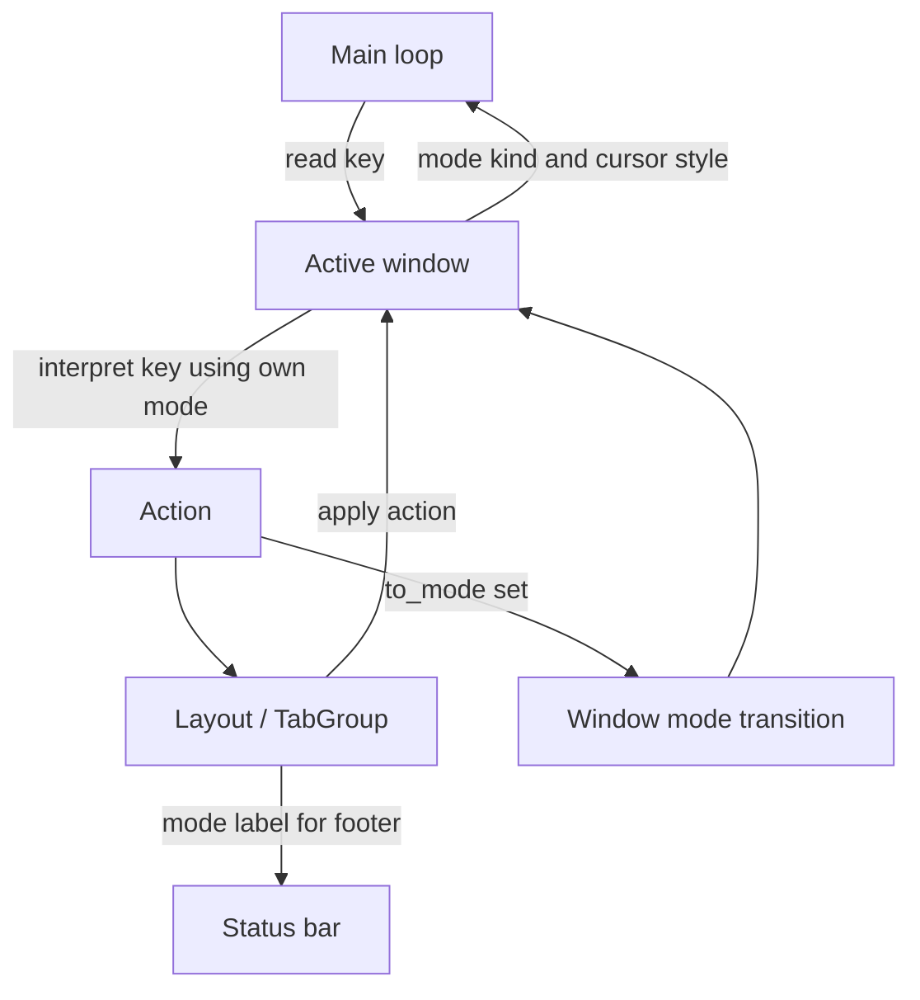

# Window-Owned Mode State - Technical Design

## Architecture Overview

urvim will move live mode ownership from the main event loop into each `Window`. The active window will carry the current `Mode` object, including its `ModeKind`, cursor style, and any mode-local repeat capture state.

The main loop will remain responsible for reading terminal events and dispatching editor actions, but it will no longer store a single editor-wide mode. Instead, it will ask the active window for its current mode when it needs to interpret input, update the cursor style, or show the mode label.

This keeps mode state aligned with the window that actually owns the cursor and selection state. Switching tabs will naturally restore the mode that was last active in that window because the window object itself persists inside the tab group.

## Interface Design

### Window

`Window` will become the owner of a live mode instance.

Expected public interface additions:

```rust
pub fn mode_kind(&self) -> ModeKind
pub fn mode_label(&self) -> &'static str
pub fn cursor_style(&self) -> CursorStyle
pub fn handle_key(&mut self, key: &Key) -> HandleKeyResult
pub fn switch_mode(&mut self, to_mode: ModeKind) -> Option<String>
```

Interface behavior:

- `mode_kind` returns the active mode’s `ModeKind`.
- `mode_label` returns the current user-facing label for the active mode.
- `cursor_style` returns the terminal cursor style for the active mode.
- `handle_key` delegates key interpretation to the active mode object stored in the window.
- `switch_mode` replaces the active mode object with the requested mode and applies any mode-entry or mode-exit side effects for that window.

### TabGroup

`TabGroup` will continue to own multiple windows and route buffer-editing actions to the active window. It will also expose the active window’s mode state so higher layers can update the status bar and terminal cursor style without consulting global mode state.

Expected additions:

```rust
pub fn active_window_mode_kind(&self) -> ModeKind
pub fn active_window_mode_label(&self) -> &'static str
pub fn active_window_cursor_style(&self) -> CursorStyle
pub fn active_window_mut(&mut self) -> &mut Window
```

The tab group’s tab-switching behavior will not mutate hidden mode state in non-active windows.

### Layout

`Layout` will stop storing a separate `mode_kind` field. The footer status bar will read the current mode label directly from the active window.

Expected interface impact:

```rust
pub fn mode_label(&self) -> &'static str
```

This method will become a thin proxy to the active window’s mode label.

### Main Loop

The main loop will no longer own `Box<dyn Mode>`.

Input flow will become:

1. Read a key event.
2. Ask the active window to interpret the key through its own mode.
3. Process the resulting action through the layout/tab group.
4. If the action requests a mode transition, switch the active window to the requested mode.
5. Update the terminal cursor style from the active window’s current mode.

## Data Models

### Window Mode State

Each live `Window` will store:

- a `Box<dyn Mode>` for the active mode behavior
- the currently selected `BufferView`
- render and scroll state that already belongs to the window

Constraints:

- New windows initialize with `NormalMode`.
- Recreated windows do not inherit any mode state from previously dropped windows.
- Only the live window object owns its current mode state.

### Mode Transition Result

Mode transitions will continue to be driven by `Action` metadata:

- `from_mode` indicates the mode that produced the action
- `to_mode` indicates the mode that should be active after the action completes

This lets existing action semantics remain intact while changing where the live mode object lives.

## Key Components

### Window

Responsibilities:

- Own the active mode object for that window
- Interpret keys using the active mode
- Apply mode transitions locally
- Preserve mode state across tab switches

Dependencies:

- Existing `Mode` implementations
- Existing `BufferView` visual selection state
- Existing repeat-capture behavior for insert mode

### TabGroup

Responsibilities:

- Own and switch between windows
- Route actions to the active window
- Report the active window’s mode state to callers

Dependencies:

- `Window`
- Existing tab-switching and jumplist behavior

### Layout

Responsibilities:

- Render the active tab group
- Render the footer with the active window’s mode label

Dependencies:

- `TabGroup`
- `StatusBar`

### Main Loop

Responsibilities:

- Read terminal input
- Delegate key interpretation to the active window
- Apply editor actions
- Perform mode transitions on the active window
- Keep the terminal cursor style in sync with the active window

Dependencies:

- `Layout`
- `TabGroup`
- `Window`
- `Mode` implementations

## User Interaction

- A user can work in insert mode in one window, switch to another window, and return to find the original window still in insert mode.
- A new window always appears in normal mode, which makes its first interaction predictable.
- Closing a window removes its current mode state entirely; recreating a window starts it again in normal mode.
- The mode label in the footer and the terminal cursor style should always reflect the currently focused window.

## External Dependencies

No new external dependencies are required. This change uses the existing mode system, window container, and terminal cursor styling support.

## Error Handling

- If a new window cannot be initialized with anything other than normal mode, it should fall back to normal mode and continue rendering.
- If a mode transition requests a mode that is not supported by the existing mode set, the editor should preserve the current mode and continue running.
- Existing action handling failures remain unchanged; this change should not introduce new failure modes in buffer editing or tab switching.

## Security

No new security concerns are introduced. Mode state is local editor state and does not affect authentication, authorization, or secrets handling.

## Configuration

No new configuration option is required. This behavior should be unconditional and should preserve the editor’s current mode semantics, only changing ownership.

## Component Interactions



Interaction notes:

- Key interpretation stays tied to the focused window.
- Tab switches do not reconstruct mode state.
- The footer and cursor style follow the active window, not a global mode slot.

## Platform Considerations

The change is platform-neutral because it only reshapes internal editor ownership. It should behave the same on all supported terminals and operating systems.
