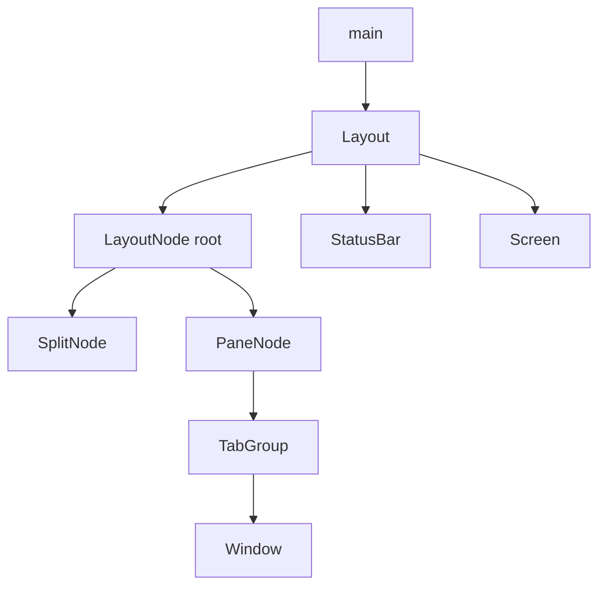

# Nested Splits - Technical Design

## Architecture Overview
Nested splits turn `Layout` from a thin wrapper around one `TabGroup` into the owner of a recursive split tree. The tree has two kinds of nodes:

- `Split` nodes, which divide space vertically or horizontally and own child nodes.
- `Pane` leaves, which own a `TabGroup`.

This keeps `TabGroup` as the editing workspace unit while allowing the root layout to manage complex pane geometry, focus movement, and split lifecycle. The important design choice is to avoid teaching `Window` or `TabGroup` about recursive layout concerns. Split creation, collapse, and directional pane navigation all belong to `Layout`.

Runtime flow becomes:

1. `main` still owns the terminal loop, snapshots, undo/redo, and mode transitions.
2. Keymaps emit split-management actions for `Ctrl-w` commands.
3. `Layout` handles split-management actions against the split tree.
4. `Layout` forwards all ordinary editing actions to the focused pane's `TabGroup`.
5. The focused pane's active window remains the source of the visible cursor, mode label, and active buffer view.

This separates concerns cleanly:

- `Layout` owns pane topology and focus.
- `TabGroup` owns tabs inside one pane.
- `Window` owns editing inside one tab.

## Interface Design

### Layout

```rust
pub struct Layout {
    root: LayoutNode,
    focused_pane: PaneId,
    status_bar: StatusBar,
    origin: Position,
    size: Size,
}

impl Layout {
    pub fn new(tab_group: TabGroup) -> Self;
    pub fn from_paths(paths: &[PathBuf]) -> Self;

    pub fn active_tab_group(&self) -> &TabGroup;
    pub fn active_tab_group_mut(&mut self) -> &mut TabGroup;
    pub fn active_buffer_view(&self) -> &BufferView;
    pub fn active_buffer_view_mut(&mut self) -> &mut BufferView;
    pub fn visual_cursor(&self) -> Option<Position>;

    pub fn render(&mut self, screen: &mut Screen, origin: Position, size: Size);
}

impl Widget for Layout {
    fn process_action(&mut self, action: &Action) -> ActionResult;
}
```

The existing `tab_group()` accessor should be replaced or complemented with focused-pane accessors so `main` no longer assumes there is only one tab group in the layout.

### Split tree model

```rust
pub enum LayoutNode {
    Pane(PaneNode),
    Split(SplitNode),
}

pub struct PaneNode {
    id: PaneId,
    tab_group: TabGroup,
}

pub struct SplitNode {
    axis: SplitAxis,
    first: Box<LayoutNode>,
    second: Box<LayoutNode>,
    split_size: SplitSize,
}

pub enum SplitAxis {
    Horizontal,
    Vertical,
}

pub struct SplitSize {
    first_weight: u16,
    second_weight: u16,
}
```

The split tree should be strictly binary. Each split node owns exactly two children plus a stored size relationship between them. Even though user-facing resize commands are out of scope for this feature, storing split sizes now gives the tree a stable representation that future resize work can update directly instead of redesigning the layout model later.

### Split-management actions

Add layout-level actions:

```rust
pub enum ActionKind {
    SplitVertical,
    SplitHorizontal,
    FocusPaneLeft,
    FocusPaneDown,
    FocusPaneUp,
    FocusPaneRight,
    ClosePane,
    // existing variants...
}
```

Normal mode maps:

- `Ctrl-w v` -> `SplitVertical`
- `Ctrl-w s` -> `SplitHorizontal`
- `Ctrl-w h` -> `FocusPaneLeft`
- `Ctrl-w j` -> `FocusPaneDown`
- `Ctrl-w k` -> `FocusPaneUp`
- `Ctrl-w l` -> `FocusPaneRight`
- `Ctrl-w q` -> `ClosePane`

These actions should be classified as layout navigation/management actions:

- they are not dot-repeatable edits,
- they do not modify buffers directly,
- they should not reset unrelated window state,
- they should bypass `Window::process_action` when handled by `Layout`.

## Data Models

### Layout state

| Field | Type | Purpose |
|-------|------|---------|
| `root` | `LayoutNode` | Root of the recursive split tree |
| `focused_pane` | `PaneId` | Stable identity of the currently focused pane |
| `status_bar` | `StatusBar` | Footer widget rendered below the tree |
| `origin` | `Position` | Last rendered root origin |
| `size` | `Size` | Last rendered root size |

### Pane identity

Each pane needs a stable `PaneId` so the layout can:

- keep focus anchored while the tree is restructured,
- find the active pane during action routing,
- move focus directionally,
- remove the correct pane when its tab group empties.

`PaneId` can be a small newtype over `usize` with monotonic assignment owned by `Layout`.

### Split size model

Each `SplitNode` stores relative sizing for its two children:

- `first_weight` is the share for the first child.
- `second_weight` is the share for the second child.
- the two values form a ratio rather than an absolute terminal measurement.

The initial split should default to an even `1:1` ratio. Rendering converts the ratio into concrete rows or columns for the current terminal size. Future resize commands can adjust the divider by concrete rows or columns and then store the resulting sizes back into `first_weight` and `second_weight`, which allows fine-grained one-cell changes without changing the tree structure or action routing design.

### Geometry model

Each node is rendered into a rectangular region:

- vertical splits divide columns between the first and second child according to `split_size`,
- horizontal splits divide rows between the first and second child according to `split_size`,
- remainder cells are assigned deterministically so the full region is consumed,
- a `Pane` passes its assigned region to its `TabGroup`.

The footer status bar remains outside the split tree, just as the current status bar sits below the single tab group.

## Key Components

### Layout

**Responsibilities**
- Own the recursive split tree.
- Track the focused pane.
- Handle split creation, split closure, and directional focus movement.
- Collapse redundant split nodes after pane removal.
- Render the split tree and footer status bar.
- Expose the focused pane's active buffer view and cursor to `main`.

**Public behavior**
- `new` wraps one startup `TabGroup` in a single-pane tree.
- `process_action` intercepts split-management actions and forwards all other actions to the focused pane's `TabGroup`.
- `render` stores geometry, renders the split tree, then renders the footer.
- `visual_cursor` resolves the focused pane cursor in screen coordinates.

### Split tree operations

#### Splitting the focused pane

When the user splits the focused pane:

1. Find the focused `PaneNode`.
2. Create a new sibling `PaneNode` with a fresh `TabGroup`.
3. Replace the focused pane with a new binary `SplitNode` on the requested axis containing:
   - the original focused pane as one child
   - the new sibling pane as the other child
   - an initial `1:1` `split_size`
4. Move focus to the new pane, matching Vim behavior.

Because the tree is intentionally binary, repeated splits will naturally build nested structure rather than flattening same-axis siblings into one n-ary node.

#### Closing panes and collapse

There are two closure paths:

1. Explicit `Ctrl-w q` closes the focused pane.
2. A pane's `TabGroup` becomes empty because its last window closed.

Both paths should flow through the same layout removal logic:

1. Remove the target `PaneNode`.
2. If the parent split loses one child, replace the split with the surviving child.
3. If the tree becomes empty, signal that the editor should exit.
4. Otherwise, choose a surviving pane as the new focus.

The collapse logic should normalize the tree after every pane removal so rendering and navigation never have to account for empty split nodes.

### TabGroup

`TabGroup` remains the owner of tabs and window-local behavior inside a pane. The only design change is that it can now become empty, which was not previously allowed because the editor always needed one active tab.

Required behavioral shift:

- `TabGroup` must support a temporary empty state or a close result that tells `Layout` the pane should be removed.
- It must still preserve all existing tab behavior for non-empty panes.

The design should prefer an explicit close outcome over silently recreating an empty tab, because split collapse depends on knowing when a pane is truly empty.

### Main loop integration

`main` should stop reaching through `layout.tab_group()` and instead use layout-focused accessors:

- `layout.active_tab_group()`
- `layout.active_buffer_view()`
- `layout.active_buffer_view_mut()`

Key handling should also change:

1. The active window's mode still parses keys.
2. The emitted action may now be a layout action such as `SplitVertical`.
3. `main` dispatches that action to `layout.process_action`.
4. `main` continues to own app-level fallbacks such as quit, save, undo, redo, snapshots, and mode transitions.

If `layout.process_action` indicates that the last pane closed, `main` should exit the event loop the same way it currently exits on `Quit`.

## User Interaction

### Split creation

- `Ctrl-w v` creates a new pane beside the focused pane in a vertical split.
- `Ctrl-w s` creates a new pane beside the focused pane in a horizontal split.
- The new pane becomes focused immediately.
- The original pane keeps its tab group and window state unchanged.

### Focus movement

Directional navigation should be geometric rather than tree-local:

- `Ctrl-w h` chooses the nearest pane whose region lies to the left.
- `Ctrl-w j` chooses the nearest pane below.
- `Ctrl-w k` chooses the nearest pane above.
- `Ctrl-w l` chooses the nearest pane to the right.

The implementation should use rendered pane rectangles or equivalent computed bounds so movement works across nested split levels.

### Close behavior

- `Ctrl-w q` closes the focused pane.
- If a pane's tab group loses its last window through normal window/tab closure, the pane closes automatically.
- When one child remains in a split, that child expands to occupy the freed space.
- When the last pane disappears, the editor exits.

## Error Handling

| Scenario | Handling |
|----------|----------|
| Split command is issued in the only pane | Create a new split normally |
| Directional focus command has no pane in that direction | Return `NotHandled` or keep focus unchanged without error |
| Pane removal leaves one child in a split | Collapse the split into the remaining child |
| Pane removal empties the entire tree | Return an outcome that causes the editor to exit |
| Very small terminal regions produce zero-sized child areas | Clamp child render sizes safely and avoid panics |
| Focused pane ID cannot be found due to a bug | Normalize to the first available pane before continuing |

## Configuration

No new configuration is required for the first split stage.

The split system is fixed to Vim-style window mappings and stored binary split ratios with an initial even split. Persisted layouts, interactive resizing commands, and custom key bindings remain out of scope.

## Component Interactions



### Runtime action flow

1. The focused pane's active window parses a key sequence.
2. The resulting `Action` is sent to `Layout::process_action`.
3. If the action is a split-management action, `Layout` updates the tree and focus.
4. Otherwise, `Layout` forwards the action to the focused pane's `TabGroup`.
5. `main` performs app-level follow-up for snapshots, undo/redo, saves, and mode transitions using the focused pane accessors.

## Testing Strategy

Unit tests should cover:

- splitting a root pane vertically and horizontally,
- storing an initial even split ratio for newly created binary split nodes,
- nesting splits across mixed axes,
- moving focus with `Ctrl-w h/j/k/l` across nested layouts,
- collapsing splits after explicit pane close,
- collapsing splits after a tab group becomes empty,
- preserving unaffected panes' buffer and cursor state,
- exiting when the last pane/window closes,
- rendering child bounds correctly for uneven terminal sizes.

## Platform Considerations

The split tree remains terminal-only and must preserve the editor's current rendering guarantees:

- Unicode-aware width calculations still belong to `TabGroup` and `Window`.
- Terminal resizes must recompute split bounds on every redraw.
- No assumptions should be made about a minimum terminal size beyond safe clamping.

No new external crates are required.
