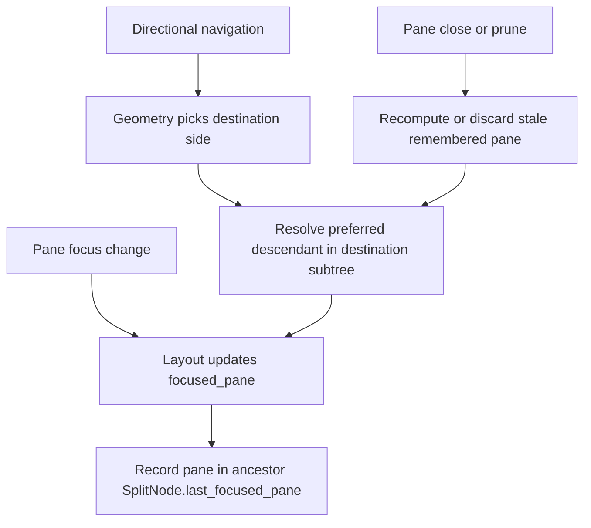

# Split Pane Focus History - Technical Design

## Architecture Overview

Split pane focus history extends the layout tree with split-local memory about which descendant pane was focused most recently. The feature keeps directional pane selection geometric at the subtree boundary, then refines the final destination inside that subtree using remembered focus.

The design keeps focus memory inside `Layout` rather than adding a separate global history component. This matches the user-facing behavior more closely:

- geometry still determines which subtree lies in the requested direction,
- split-local memory determines which pane inside that subtree should become focused,
- unrelated pane visits elsewhere in the layout do not rewrite the destination subtree's preferred pane.

## Interface Design

### Layout state

Extend split-tree metadata with remembered descendant focus:

```rust
pub struct SplitNode {
    axis: SplitAxis,
    first: Box<LayoutNode>,
    second: Box<LayoutNode>,
    split_size: SplitSize,
    last_focused_pane: PaneId,
}
```

No new public actions, commands, or configuration are required. Existing `FocusPaneLeft`, `FocusPaneDown`, `FocusPaneUp`, and `FocusPaneRight` actions continue to drive pane navigation.

### Internal layout helpers

Add internal helpers on `Layout` for:

- recording focus changes into ancestor split nodes,
- resolving the preferred descendant pane for a split subtree,
- validating or recomputing remembered panes when a pane is removed,
- detecting whether directional navigation is crossing into a different subtree.

These helpers remain layout-internal and do not change the external editor API.

## Data Models

### `SplitNode::last_focused_pane`

`last_focused_pane` stores the most recently focused descendant `PaneId` for that split subtree.

Invariants:

- The stored pane must be a descendant of the split node whenever possible.
- Every ancestor split of the currently focused pane must eventually store that pane as its remembered descendant.
- If a remembered pane is removed, the split must either adopt another surviving descendant or be collapsed by existing tree-pruning logic.

### Focus-resolution helpers

The layout should expose internal traversal helpers with behavior equivalent to:

| Helper | Purpose |
|--------|---------|
| `record_focus(pane_id)` | Update remembered descendant focus on all ancestor splits that contain `pane_id` |
| `contains_pane(node, pane_id)` | Return whether a pane belongs to a subtree |
| `resolve_preferred_pane(node)` | Return the best surviving pane in a subtree, preferring remembered descendants |
| `prune_focus_memory(node)` | Recompute remembered panes after removal or collapse when needed |

Exact signatures can be chosen during implementation, but these responsibilities should remain separate so navigation and mutation code stay readable.

## Key Components

### `src/layout/node.rs`

Extend `SplitNode` with remembered descendant focus metadata and initialize it when a new split is created. The initial value should reflect the pane that should be considered last focused immediately after split creation.

### `src/layout/tree.rs`

Tree mutation helpers should maintain valid remembered focus:

- split creation should initialize the new parent split's remembered descendant,
- pane closure and pruning should remove stale remembered pane ids,
- surviving splits should recompute remembered focus from remaining descendants when necessary.

This file should also own the subtree traversal helpers because it already contains the tree-structure and pane lookup logic.

### `src/layout/render.rs`

Directional navigation should remain a two-step process:

1. Use existing geometry-based filtering to identify the candidate pane region in the requested direction.
2. If that move crosses into another split subtree, resolve the final focused pane by consulting the destination subtree's remembered descendant.

If no valid remembered descendant exists, keep the current geometric candidate behavior as fallback.

### `src/layout/mod.rs`

Focus-changing actions should route through a shared path that updates `focused_pane` and then records that focus into ancestor splits. This avoids duplicating focus-memory maintenance across split creation, directional navigation, and pane removal paths.

## User Interaction

The user keeps using the existing Vim-style pane commands:

- `Ctrl-W h`
- `Ctrl-W j`
- `Ctrl-W k`
- `Ctrl-W l`

Behavior changes only when the destination side contains a split subtree with multiple panes:

1. The user navigates away from a pane inside a split subtree.
2. The layout records that pane as the subtree's remembered descendant.
3. The user later navigates back toward that subtree from outside it.
4. Geometry chooses the destination subtree.
5. Split-local memory restores the remembered descendant pane inside that subtree.

This keeps "go back where I was working in that split" semantics without introducing new commands.

## External Dependencies

No new external dependencies are required.

The feature uses existing internal layout components:

- split-tree rendering,
- pane-id tracking,
- pane removal and prune logic,
- directional navigation based on rendered regions.

## Error Handling

Expected failure cases should degrade safely:

- Missing remembered pane after a closure: fall back to another surviving pane in the subtree.
- Collapsed subtree after pruning: use the surviving pane or existing collapse result.
- No directional candidate in the requested direction: preserve the current no-op behavior.
- Invalid or stale remembered state during navigation: ignore the stale reference and use subtree fallback or generic geometry.

The implementation should not panic because of outdated remembered pane ids during ordinary layout changes.

## Security

No security-sensitive behavior is introduced.

The feature only tracks in-memory pane focus metadata for the current editor session.

## Configuration

No new configuration is required.

Split-local focus restoration is part of the default pane navigation behavior.

## Component Interactions



The main interaction is that geometry decides which subtree is eligible, while split-local memory decides which descendant pane inside that subtree should win.

## Platform Considerations

This feature depends only on the editor's in-memory layout tree and rendered pane regions. Terminal platforms do not materially affect the logic beyond the existing geometry calculations already used for pane navigation.
