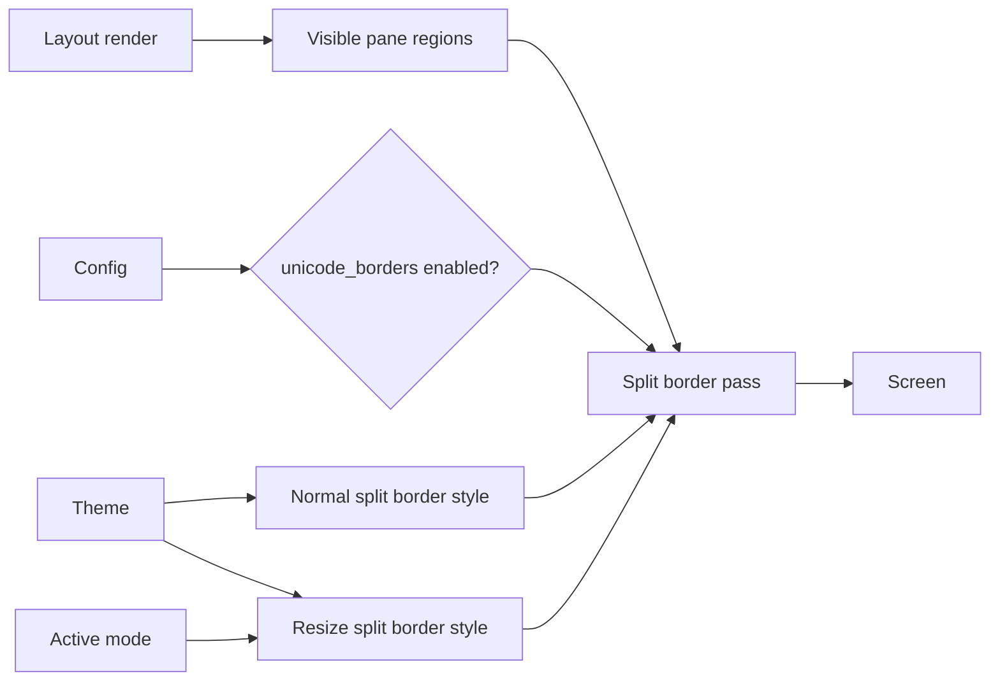

# Split Borders - Technical Design

## Architecture Overview

Split borders will be rendered as a layout concern, not as part of individual panes. The layout tree already computes flattened pane regions for focus navigation and resize logic, so the renderer can reuse those regions to draw separators that match the final on-screen arrangement rather than the nested binary tree structure.

The feature adds three pieces of state that participate in rendering:

- A new advanced glyph capability, `unicode_borders`, alongside the existing `nerdfont` capability.
- Two theme UI styles for split borders: a normal border style and a resize-mode border style.
- A border glyph set selection step that chooses Unicode line-drawing characters when `unicode_borders` is enabled and ASCII-compatible fallbacks otherwise.

The border pass should run only when the rendered layout contains more than one visible pane. When the layout collapses to a single pane, the layout should skip border drawing entirely and keep the content surface uncluttered. Border separators should be allocated as their own reserved gap between panes so the content rectangles themselves never include the cells used for border glyphs.

## Interface Design

### Advanced glyph capabilities

Extend the closed config enum with a second supported value:

```rust
#[derive(Clone, Debug, PartialEq, Eq, PartialOrd, Ord, Deserialize)]
#[serde(rename_all = "snake_case")]
pub enum AdvancedGlyphCapability {
    Nerdfont,
    UnicodeBorders,
}
```

The resolved configuration continues to store enabled capabilities in `BTreeSet<AdvancedGlyphCapability>`. Rendering code should ask the config whether `unicode_borders` is enabled in the same style it currently asks whether `nerdfont` is enabled.

### Theme UI styles

The UI style set gains two new entries:

```rust
pub struct UiStyles {
    pub status_bar: Style,
    pub modified_marker: Style,
    pub selection: Style,
    pub active_line: Style,
    pub tab_active: Style,
    pub tab_inactive: Style,
    pub tab_scroll_indicator: Style,
    pub gutter: Style,
    pub window: Style,
    pub split_border: Style,
    pub split_border_resize: Style,
}
```

The raw theme schema should add matching style fields so theme authors can customize both states independently. The normal border style should be used in regular editing, and the resize-specific border style should be used whenever the focused pane is in resizing mode.

### Border glyph selection

The renderer should choose one of two border glyph families:

- Unicode line-drawing characters when `unicode_borders` is enabled.
- ASCII-compatible characters otherwise.

The chosen glyph family only affects the separator characters themselves. Border styling still comes from the theme UI style selected for the current mode.

## Data Models

### Split border geometry

The renderer should work from the same flattened pane regions used for focus movement. Each visible pane region can contribute one or more border segments, but the layout must reserve a one-cell separator band between adjacent regions so the border cells are not part of either pane:

- vertical segments between side-by-side panes
- horizontal segments between stacked panes
- corner joins where segments meet

The border pass should not depend on the shape of the split tree beyond the final pane rectangles. That keeps the visual result stable even when the tree is deeply nested.

### Border cell classification

Border segments can be classified into simple cell roles so the renderer can emit the correct glyph at each screen position:

- top and bottom edge
- left and right edge
- intersection or corner
- straight continuation

The exact set of glyphs can stay internal to the renderer, but the classification should be explicit enough to keep the drawing logic testable.

## Key Components

### `src/config.rs`

Add the `UnicodeBorders` advanced glyph capability to the config enum and expose a helper such as `unicode_borders_enabled()` on `Config`, mirroring the existing `nerdfont_enabled()` convenience method.

### `src/theme/schema.rs`

Add raw UI style fields for split borders. The schema should remain closed and deny unknown fields, so the new names must be added explicitly.

### `src/theme/loader.rs`

Resolve the new split border style fields into `UiStyles`. Validation should follow the existing pattern: missing or malformed style sections should fail at theme load time rather than during rendering.

Builtin theme sources should be updated at the same time so every shipped theme defines both split border styles. That keeps the runtime loader and the bundled themes in sync and avoids shipping a config schema change that leaves the default theme set incomplete.

### `src/theme/model.rs`

Store the resolved split border styles on `UiStyles` and keep them accessible through `Theme.ui`.

### `src/theme/keys.rs`

Add UI style key variants for the new border styles so theme definitions can bind them consistently with the rest of the closed UI key set.

### `src/layout/render.rs`

Own the border rendering pass. After pane content is rendered and before the footer status bar is drawn, the layout should:

1. Gather visible pane regions.
2. Skip border drawing if there is only one visible pane.
3. Choose the glyph family from the active config.
4. Select the normal or resize border style from the active theme.
5. Draw the border segments around the flattened pane arrangement.

The render pass should continue to preserve the existing pane content and status bar rendering order. The separator band is owned by the layout itself, so the content renderers should never target it.

### `src/layout/geometry.rs`

Continue to provide overlap and neighbor calculations for focus movement and border placement. If the border renderer needs any additional region helpers, they should live here rather than in the UI layer.

### `src/editor/resizing.rs`

Resizing mode remains responsible for mode state and key translation. It does not need special border logic itself; instead, the layout should observe the active mode kind and select the resize border highlight when rendering.

## User Interaction

In normal editing, pane borders should appear as a lightweight structural cue. In resizing mode, the same border network should remain visible but switch to the resize-specific theme style so the user can see which layout edges are active.

If only one pane is visible, no borders should be drawn, regardless of advanced glyph capability or mode.

When `unicode_borders` is enabled, the rendered separators should use Unicode line-drawing characters. When it is disabled, the same border network should render using ASCII-compatible characters that remain legible in simple terminals and font setups.

## External Dependencies

No new external crates are required. The implementation should continue to use the existing screen renderer, terminal style types, and theme loader.

## Error Handling

- If the theme does not define a split border style, loading should fail in the same way it fails for other required UI styles.
- If the config contains an unknown advanced glyph capability, config loading should fail with a clear error.
- If the layout has no visible panes, the border renderer should do nothing.
- If a border segment would fall outside the visible screen, the renderer should clip it using the existing screen bounds rather than panic.

## Security

The feature does not introduce new privileged operations or data sources. It only changes how already-trusted theme and configuration data are interpreted during rendering. Input validation remains important so malformed config or theme files cannot introduce invalid capability names or incomplete style definitions.

## Configuration

The config schema stays additive. Users can opt into Unicode borders with:

```toml
advanced_glyphs = ["nerdfont", "unicode_borders"]
```

The `unicode_borders` capability is optional and defaults to disabled. If it is absent, the border renderer falls back to ASCII-compatible border glyphs.

The theme schema also gains additive split border styles. A theme should be able to define separate values for the normal and resize states without affecting existing style keys.

All builtin themes must provide appropriate values for the new split border styles before this feature is considered complete.

## Component Interactions



The layout render path should determine the current mode, inspect the active config and theme, and then draw border segments using the appropriate glyph family and style before rendering the footer status bar.

## Platform Considerations

Unicode line-drawing glyphs are terminal- and font-dependent, so the ASCII fallback must remain a first-class rendering path. Border drawing should also account for narrow terminal sizes, because the layout may shrink to a state where borders and pane content compete for very limited space. The renderer should prefer readability and clipping safety over exact decorative symmetry in those cases, and separator space should stay reserved even when panes become narrow.
