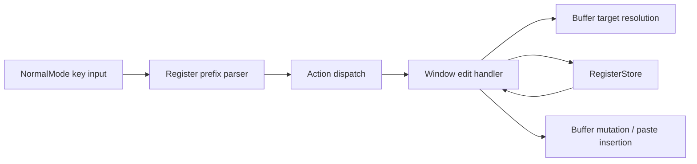

# Basic Register Support - Technical Design

## Architecture Overview

Add a small editor-wide register subsystem that sits beside the existing global state and is fed by normal-mode and window-level editing actions. The design keeps the feature intentionally smaller than Vim's register model:

- three built-in default registers for yank, delete, and change
- one explicit register selector syntax for redirecting a command to another register
- the selector keys `y`, `d`, and `c` map directly to the built-in default registers
- the remaining lowercase ASCII letters are available as user-named registers
- yank, delete, and change all resolve the same target shapes already used by the editor
- paste reads a register value and inserts it according to whether the stored content is characterwise or linewise
- the configured default destination for yank, delete, and change can be remapped independently through startup config

The register system should live at the same scope as the other editor globals so the copied text survives mode switches, window focus changes, and repeated paste operations during the session.

## Interface Design

### Register types

Introduce a focused register model with the smallest set of concepts needed for the feature:

```rust
pub enum RegisterName {
    Yank,
    Delete,
    Change,
    Named(char),
}

pub enum RegisterContentKind {
    Characterwise,
    Linewise,
}

pub struct RegisterContent {
    pub text: String,
    pub kind: RegisterContentKind,
}
```

Constraints:

- `Named(char)` should accept a single lowercase ASCII letter for the first version
- selector keys `y`, `d`, and `c` are reserved for the built-in yank, delete, and change registers
- all other lowercase ASCII letters map to user-named registers
- default registers are fixed and do not depend on the explicit selector syntax
- `RegisterContentKind::Linewise` indicates that the stored text should be pasted as whole lines

Add a register store with the minimal public API needed by the editor:

```rust
pub struct RegisterStore;

impl RegisterStore {
    pub fn new() -> Self;
    pub fn get(&self, name: RegisterName) -> Option<RegisterContent>;
    pub fn set(&mut self, name: RegisterName, content: RegisterContent);
    pub fn clear(&mut self, name: RegisterName);
}
```

The store should return owned content on read so paste and replay paths can use the data without holding a lock.

### Action and mode flow

Extend the operator model so yank can reuse the same target-resolution code as delete and change:

```rust
pub enum Operator {
    Delete,
    Change,
    Yank,
}
```

Add paste actions that let normal mode dispatch `p` and `P` without treating them as operators:

```rust
pub enum ActionKind {
    Yank,
    PasteAfter,
    PasteBefore,
    // existing variants
}
```

Normal mode should keep a small transient register-selection state:

- `"` starts register selection
- the next register key selects the target register
- the following command consumes that register and clears the pending selector

If no explicit register selector is present, yank/delete/change use their built-in default registers and `p`/`P` read from the yank register.

## Data Models

### `RegisterName`

Represents the target slot for a copy, delete, change, or paste operation.

### `RegisterContent`

Stores the copied text plus its paste semantics.

- `text: String`
- `kind: RegisterContentKind`

The content should be stored exactly as copied, including newlines for linewise selections.

### `RegisterContentKind`

Defines how paste should place the stored text:

- `Characterwise` inserts inline at the cursor
- `Linewise` inserts whole lines relative to the current line

### Selection result

The editor already computes operator targets and text-object ranges. The register feature should reuse those resolved ranges and only add a copy path around them.

## Key Components

### `globals::RegisterStore`

Owns the session-wide registers and exposes read/write access through the existing global-state pattern.

Responsibilities:

- store the three default registers
- store any explicit named registers
- return register contents for paste
- replace register contents after yank/delete/change

### `NormalMode`

Adds register-prefix parsing and new key bindings:

- `y` for yank operations
- `p` for paste after the cursor or current line
- `P` for paste before the cursor or current line
- `"` followed by a register key to select a non-default register

Normal mode should resolve counts and prefixes before dispatching the final action so register selection does not interfere with existing count parsing.

### `Window`

Executes the actual register-aware editing behavior.

- yank: resolve the target, copy the text, and store it in the selected register without mutating the buffer
- delete/change: continue mutating the buffer, but also write the removed text to the selected register
- paste: fetch the register contents and insert inline or linewise based on `RegisterContentKind`

### `Buffer`

If the existing mutation helpers do not already expose the removed text in a usable form, add a focused extraction helper that returns the exact text and linewise/characterwise classification for a resolved target. The goal is to avoid duplicating range slicing logic in multiple callers.

## User Interaction

### Register selection

Register selection should use a compact prefix syntax:

- press `"` first
- press one lowercase register key next
- press the yank, delete, change, `p`, or `P` command immediately after that

The default-register selector keys are `y`, `d`, and `c`; the remaining lowercase letters select user-named registers.

Examples:

- `"ayw` yanks into register `a`
- `"adw` deletes into register `a`
- `"ap` pastes from register `a`

### Yank

`y` should mirror the existing delete/change target vocabulary:

- boundary motions such as `yw`, `y$`, `y^`, `ygg`, `yG`
- text objects such as `yiw` and `yaw`
- linewise forms such as `yy`

The exact text copied should match the same resolved region the corresponding delete/change path would operate on.

### Paste

`p` and `P` should use the yank register unless an explicit register prefix is provided.

- characterwise content: paste inline
- linewise content: paste as full lines relative to the current line

## External Dependencies

No new crates are required. The feature should reuse the existing editor, buffer, and terminal input stack.

## Error Handling

- An invalid register selector should cancel the current command sequence and leave the buffer unchanged.
- A yank or paste against an empty resolved region should be treated as a no-op and must not clobber the destination register.
- If a register has no stored value, paste should be a no-op.
- If the current target cannot be resolved, yank/delete/change should fail without partially updating any register.

## Security

The feature only stores text already present in the user's editor session. It does not add external trust boundaries, permissions, or secret handling.

## Configuration

Add a `default_registers` config table that lets users remap the default yank, delete, and change destinations.

Example:

```toml
default_registers = { yank = "y", delete = "d", change = "c" }
```

Rules:

- each value must be a single lowercase ASCII letter
- omitted entries fall back to the built-in defaults
- the selectors `y`, `d`, and `c` continue to target the configured default destinations for their matching operators

## Component Interactions



Interaction summary:

- `NormalMode` captures the optional register prefix before dispatching a final command.
- `Window` resolves the target once, then either copies, deletes, changes, or pastes the resulting text.
- `RegisterStore` remains the session-wide source of truth for copy/paste content.

## Platform Considerations

No platform-specific behavior is required. The feature should remain portable across supported terminals because it only changes local editing state.
