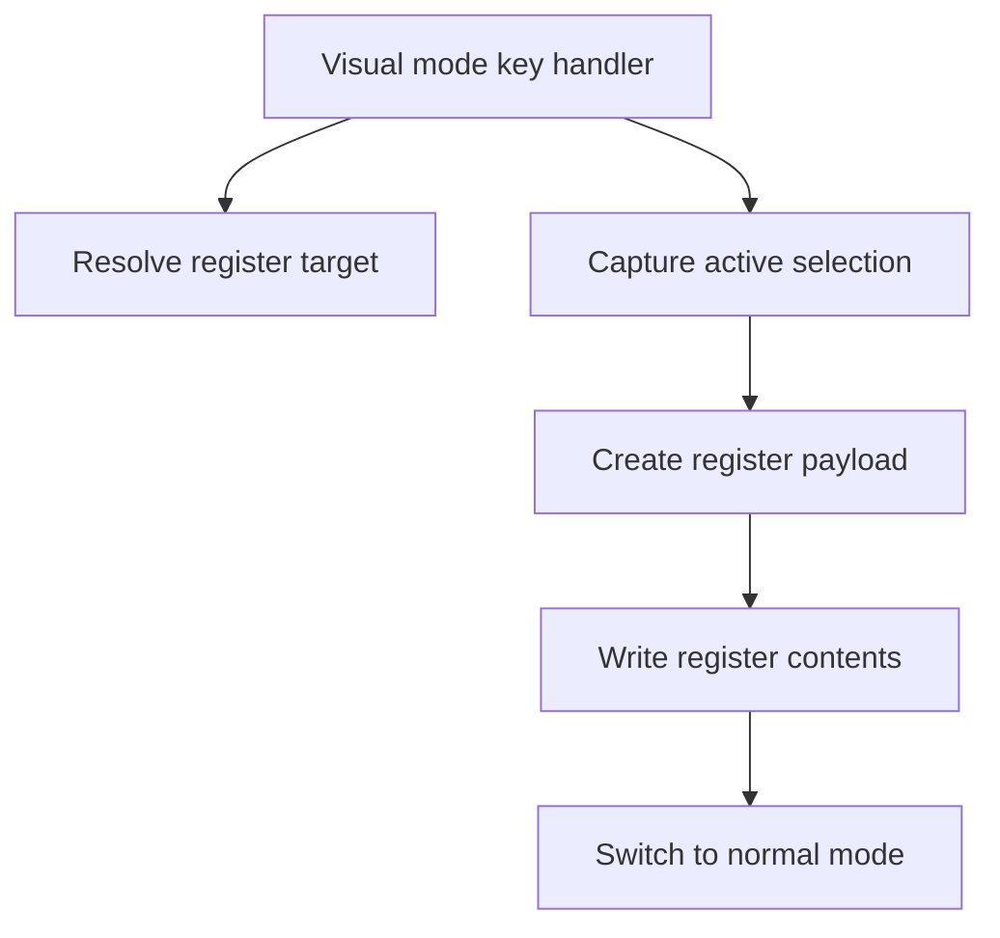

# Visual Yank Support - Technical Design

## Architecture Overview

Visual yank support should extend the existing visual-mode action flow rather than introduce a new selection subsystem.

When the user presses `y` in character-wise visual mode or visual-line mode, the mode handler should:

1. Resolve the active register target.
2. Extract the selected text from the current visual range.
3. Tag the copied payload with the correct text kind.
4. Store the payload in the register system.
5. Transition back to normal mode.

The design should reuse the same selection boundaries already used by visual delete and visual change so yank follows the current visual range exactly.

## Interface Design

### Visual mode key handling

Visual modes should recognize `y` as a selection action alongside the existing edit actions.

Expected behavior:

- Input: `y` while a visual selection is active
- Output: register write, no buffer mutation, mode transition to normal mode

### Register write path

The yank path should write to the resolved register target using the same register-selection rules already available to normal-mode register-aware commands.

Payload shape:

- text contents
- text kind: characterwise or linewise

### Selection capture

Selection capture should reuse the active visual anchor and cursor positions, then normalize the range according to the current visual mode:

- character-wise visual mode captures the exact selected span
- visual-line mode captures whole-line boundaries

## Data Models

The existing register payload should be sufficient if it already records text contents and text kind.

If a shared selection payload is introduced for reuse, it should include:

- `text`: the copied string or line list
- `kind`: characterwise or linewise
- `target_register`: the resolved register destination

No new persistent schema is required.

## Key Components

### Visual mode controller

Responsibilities:

- Bind `y` in character-wise visual mode and visual-line mode
- Resolve the active register target when present
- Request selection capture from the current visual range
- Exit to normal mode after a successful yank

### Selection capture helper

Responsibilities:

- Read the current visual anchor and cursor
- Normalize the captured range for the active visual mode
- Produce a payload suitable for register storage

### Register store

Responsibilities:

- Store copied text and its kind
- Preserve existing default register behavior
- Keep explicit register targeting working for visual yank

## User Interaction

Users should be able to:

- select text with `v`
- press `y` to copy the selection
- select whole lines with `V`
- press `y` to copy whole-line ranges
- paste later with `p` or `P` using the stored text kind

The interaction should mirror the familiar Vim workflow closely enough that users do not need a separate copy command.

## External Dependencies

No external services or libraries are required.

## Error Handling

Expected failures should be treated as no-ops:

- unresolved register selection
- selection extraction failure
- empty or invalid selection state

In those cases, the editor should leave the buffer unchanged and avoid overwriting register contents.

## Security

This feature does not introduce new security-sensitive behavior. It only moves text already present in the current buffer into the editor's in-memory register storage.

## Configuration

No new configuration options are required.

## Component Interactions

The key interaction is one-way: visual mode owns the command, capture produces text, and the register store retains the payload for later paste operations.

## Platform Considerations

- Unicode text should remain safe because the feature reuses existing selection extraction and register storage paths.
- The behavior should be consistent across platforms because no platform-specific input or clipboard integration is involved.
