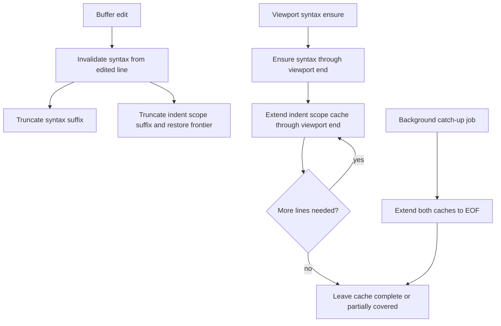

# Partial Indent Scope Cache - Technical Design
## Architecture Overview
The indent scope cache will evolve from a full-rebuild snapshot into a resumable cache with a clear scan frontier. The syntax subsystem will continue to own both syntax spans and indent scope state, but indent scope maintenance will no longer require rescanning the entire buffer whenever only a suffix is affected.

The key change is that the cache will preserve enough state to resume from the last valid line instead of discarding all scope information on every invalidation. This state includes:

- the list of scope records accumulated so far
- a line-to-scope membership index for the cached prefix
- the stack of scopes that are open at the current scan frontier
- the first line after the valid cached prefix

Foreground viewport work and background catch-up work will both use the same incremental scope-extension path:

1. Syntax highlighting ensures cache coverage through the requested line.
2. The indent scope cache extends from its current frontier to the same target line.
3. If the target line is before the frontier, no additional scope work is needed.
4. If the target line is beyond the frontier, the cache resumes from the saved open-scope stack and continues scanning.

Syntax highlighting behavior stays unchanged. The cache changes are internal to indent scope tracking and do not alter token classification or rendered syntax spans.

## Interface Design
### Buffer-facing surface
The public buffer API should remain focused on read access and invalidation:

- `Buffer::invalidate_syntax_from(line: usize)` continues to invalidate syntax state from a line onward and also marks the indent scope cache as needing more work.
- `Buffer::cached_indent_scopes() -> &[IndentScope]` continues to expose the current scope records.
- `Buffer::cached_line_indent_scope_ids(line: usize) -> Option<&[IndentScopeId]>` continues to expose per-line membership for cached lines.
- `Buffer::indent_scope_cache_stale() -> bool` continues to report whether the cache still has unbuilt suffix work remaining.

### Incremental cache operations
The scope cache itself needs three internal operations:

- `invalidate_from(line: usize)` truncates cached suffix data at the line boundary and restores the open-scope frontier that was active immediately before that boundary.
- `ensure_through(line_texts: &[&str], target_line: usize, tab_width: usize)` scans from the current frontier through the requested line, if necessary.
- `finalize_to_eof()` closes any remaining open scopes when the scan reaches the end of the buffer.

The design intentionally keeps these operations internal to the syntax cache flow. Callers should not manipulate open-scope state directly.

### Coverage semantics
The cache must distinguish between three states:

- fully covered prefix lines
- a resumable frontier of open scopes at the last valid line
- unscanned suffix lines

That distinction is what allows viewport passes to do partial work while preserving the ability to continue later from the same cached prefix.

## Data Models
### `IndentScope`
`IndentScope` becomes a record that can represent either an open or closed scope.

Fields:

- `id: IndentScopeId`
- `start_line: usize`
- `end_line: Option<usize>`
- `indent_width: usize`

Constraints:

- `start_line` is always less than or equal to the line where the scope is first observed.
- `end_line = Some(line)` means the scope is closed and the closing line is known.
- `end_line = None` means the scope is open at the current cache frontier.

This lets the cache preserve both open and closed scopes in a single stable record model.

### `IndentScopeCache`
The cache will carry both completed prefix data and resumable frontier state.

Fields:

- `scopes: Vec<IndentScope>`
- `line_to_scopes: Vec<Vec<IndentScopeId>>`
- `open_scope_stack: Vec<IndentScopeId>`
- `scanned_through_line: usize`

Semantics:

- `line_to_scopes` is valid for lines strictly before `scanned_through_line`.
- `open_scope_stack` reflects the scopes active at the frontier and is ordered outer-to-inner.
- `scanned_through_line` is the first line that still needs to be scanned.

Scope ids remain stable within one cache snapshot so later lookups can reference the same records even as the cache extends.

## Key Components
### Syntax cache coordinator
Responsibilities:

- extend syntax spans and indent scopes through the same requested line
- preserve the current cache frontier when only a viewport slice is needed
- keep background catch-up and foreground viewport refreshes on the same code path

Dependencies:

- `SyntaxCache`
- `IndentScopeCache`
- existing syntax tokenization logic

### Incremental indent scope builder
Responsibilities:

- compute normalized indentation width for each scanned line
- open new scope records when indentation increases
- close scope records when indentation decreases or matches a prior boundary
- preserve open scopes at the frontier for future resumption

Dependencies:

- current tab width configuration
- buffer line text snapshot

### Cache frontier recovery
Responsibilities:

- reconstruct the active open-scope stack after suffix invalidation
- convert scopes that remain valid before the boundary back into open frontier state when needed
- discard only the suffix data that can no longer be trusted

Dependencies:

- stored scope records
- line-to-scope memberships for the valid prefix

## User Interaction
There is no new user-facing command or setting. The only observable effects should be:

- less work during viewport-limited syntax refreshes
- less work when edits only invalidate a suffix of the file
- unchanged syntax highlight output

Any debugging output should still describe indent scope state in the same general terms as before, but it may now report partially covered caches instead of only fully rebuilt ones.

## External Dependencies
No new crates or services are required.

The design continues to use:

- existing syntax and buffer infrastructure
- current configuration resolution for tab width
- existing job/catch-up machinery for background completion

## Error Handling
Expected failure cases and recovery behavior:

- If the cache frontier cannot be advanced because the buffer snapshot is stale, the cache should remain in its current valid state and continue to report itself as incomplete.
- If the tab width configuration is unavailable, the builder should continue to use the existing fallback width.
- If syntax catch-up is interrupted, partial scope state already built for the prefix should remain valid and resumable rather than being thrown away.

The design should avoid partial state that cannot be resumed. A scan interruption should leave the cache at a clean frontier, not midway through a corrupted record update.

## Security
No security-sensitive behavior changes are introduced.

Relevant constraints:

- all data remains derived from buffer contents
- no new file I/O, network access, or code execution paths are introduced
- cache state is internal to the editor process

## Configuration
No new user-facing configuration is required.

The cache still uses the resolved tab width from editor configuration, with the same fallback behavior as the current implementation.

## Component Interactions

Interaction flow:

1. An edit invalidates syntax and indent scope data from the edited line onward.
2. The cache keeps the valid prefix and restores the open-scope frontier immediately before the invalidated suffix.
3. A viewport-limited syntax ensure pass extends the cache only as far as the viewport requires.
4. A background catch-up pass later resumes from the same frontier and completes the remaining suffix.
5. Syntax span output is unaffected throughout the process.

## Platform Considerations
The change should remain platform-neutral because it depends only on buffer text and tab-width configuration.

Important considerations:

- keep indentation normalization consistent across all supported terminals
- avoid assumptions about display width beyond the existing tab expansion logic
- preserve deterministic scope ids and membership ordering across repeated refreshes
