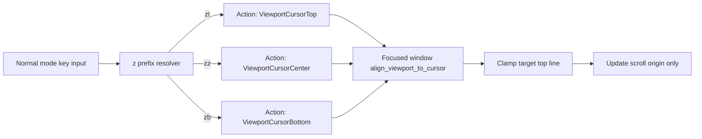

# Z Viewport Keys - Technical Design

## Architecture Overview
Implement `zt`, `zz`, and `zb` as normal-mode `z` prefixed viewport commands that update only the focused window's vertical scroll origin. The command path should reuse existing normal-mode multi-key handling for pending prefixes and existing window scroll/viewport infrastructure used by rendering.

The design keeps cursor state unchanged and treats viewport alignment as a pure window view operation. Alignment targets (top, center, bottom) map to a desired first visible line and then clamp to the valid scroll range for the current buffer and viewport height.

## Interface Design
### Normal mode command interfaces
Add three action-level commands for viewport positioning:

- `ViewportCursorTop`
- `ViewportCursorCenter`
- `ViewportCursorBottom`

Normal mode key handling should:
- continue using `z` as a pending prefix key
- resolve `zt`, `zz`, and `zb` to the new actions
- reject or ignore unsupported `z` continuations without mutating cursor or viewport

Count handling constraints:
- these commands must execute with no-count semantics in this feature
- any numeric prefix present before `z` must not affect resulting viewport placement

### Window viewport interface
Expose or reuse focused-window methods that can align viewport to cursor with a requested anchor:

```rust
pub enum ViewportAnchor {
    Top,
    Center,
    Bottom,
}

pub fn align_viewport_to_cursor(&mut self, anchor: ViewportAnchor)
```

Behavior contract:
- read current cursor line and viewport dimensions
- compute desired top visible line from anchor
- clamp to valid range `[0, max_top_line]`
- update scroll origin only
- never mutate cursor line or column

## Data Models
### `ViewportAnchor`
A small enum identifying requested alignment target:

- `Top`
- `Center`
- `Bottom`

Constraints:
- maps one-to-one with `zt`, `zz`, `zb`
- not user-configurable in this phase

### Window viewport state
Reuse existing per-window scroll/viewport state. No new persisted editor-global state is required.

Required inputs for alignment:
- current cursor line index
- viewport body height in lines
- total buffer line count

## Key Components
### Normal mode key dispatcher
Responsibilities:
- keep two-key `z` command resolution deterministic
- emit the correct viewport action for `zt`, `zz`, `zb`
- preserve behavior for non-feature `z` sequences

Dependencies:
- existing pending-key or operator-like prefix machinery
- action dispatch path from mode to window/layout

### Action execution path (window/layout)
Responsibilities:
- route viewport actions to focused window only
- avoid side effects on non-focused windows
- keep command handling compatible with existing redraw lifecycle

Dependencies:
- active tab/window lookup
- existing action execution plumbing

### Focused window viewport aligner
Responsibilities:
- convert anchor request into desired top visible line
- clamp to legal scroll bounds
- apply scroll change without cursor movement

Dependencies:
- buffer line count
- viewport height
- current cursor position

## User Interaction
1. User presses `zt`, `zz`, or `zb` in normal mode.
2. Editor resolves the sequence as a viewport action.
3. Focused window scroll origin is updated so cursor line appears at top, center, or bottom when possible.
4. If exact alignment is impossible near file boundaries, window clamps to nearest valid scroll offset.
5. Cursor remains on same line and column throughout.

## External Dependencies
No new crates or external services are required.

## Error Handling
- If viewport height is zero or unavailable, treat command as a no-op.
- If buffer has zero lines, clamp to scroll origin `0` and no-op effectively.
- If cursor line falls outside transiently valid range due to concurrent buffer updates, sync/clamp cursor line before computing viewport target.
- Unsupported `z` key continuations should clear pending prefix state safely without panics.

## Security
No new security-sensitive behavior is introduced. The feature operates only on in-memory editor view state.

## Configuration
No configuration changes in this iteration:
- no user option for enabling/disabling these commands
- no user-configurable alignment offsets
- no count support

## Component Interactions


## Platform Considerations
Behavior should be platform-neutral because it relies on existing terminal/editor viewport logic and line-based scrolling math. No OS-specific input or rendering handling is required.
