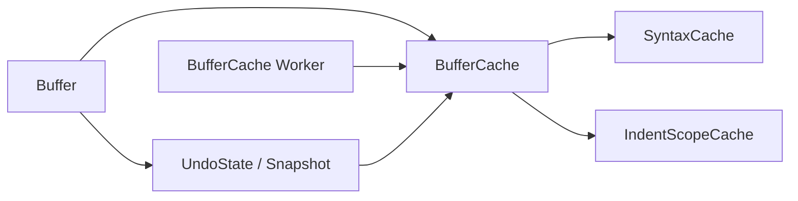

# Buffer Cache Refactor - Technical Design

## Architecture Overview
This refactor introduces a new `BufferCache` container as the owner of all buffer-derived cache state. `SyntaxCache` becomes syntax-only, while indent-scope cache state moves out of it and into `BufferCache` alongside any future buffer-level caches.

The design keeps the current single background-worker model and the current cache-refresh trigger points, but broadens the worker contract so it refreshes buffer caches rather than syntax cache internals. Undo/redo snapshots store the complete `BufferCache` so restored text and restored cache state stay aligned.



## Interface Design

### `BufferCache`
The new top-level cache container for a buffer.

Core responsibilities:
- Own syntax cache state and indent-scope cache state together.
- Expose read-only accessors for cached syntax spans and indent-scope metadata.
- Provide invalidation and refresh helpers for text edits and background catch-up.
- Serve as the snapshot unit for undo/redo and worker completion.

Representative interface:

```rust
pub struct BufferCache { /* ... */ }

impl BufferCache {
    pub fn new(syntax_name: impl Into<SmolStr>) -> Self;
    pub fn set_syntax_name(&mut self, syntax_name: impl Into<SmolStr>);
    pub fn invalidate_from(&mut self, line: usize);
    pub fn replace_with(&mut self, other: BufferCache);
    pub fn syntax_cache(&self) -> &SyntaxCache;
    pub fn syntax_cache_mut(&mut self) -> &mut SyntaxCache;
    pub fn cached_spans_for_line(&self, line: usize) -> Option<Vec<SyntaxSpan>>;
    pub fn spans_for_line(&mut self, syntax_name: &str, line_texts: &[&str], line: usize) -> Option<Vec<SyntaxSpan>>;
    pub fn ensure_through(&mut self, syntax_name: &str, line_texts: &[&str], line: usize);
    pub fn indent_scope_cache_stale(&self) -> bool;
    pub fn indent_scopes(&self) -> &Vector<IndentScope>;
    pub fn line_indent_scope_ids(&self, line: usize) -> Option<&Vector<IndentScopeId>>;
}
```

### `SyntaxCache`
`SyntaxCache` becomes the syntax-specific cache segment only.

Core responsibilities:
- Track the active syntax name.
- Store tokenized line spans and per-line syntax state.
- Support incremental syntax invalidation and refill.
- Remain clonable for background work and history snapshots.

Its public surface continues to cover syntax-only reads and refreshes. Any indent-scope accessors or stale flags move to `BufferCache`.

### `BufferCache Worker`
The current syntax catch-up worker becomes a buffer cache worker that refreshes the whole buffer cache snapshot.

Input shape:
- `buffer_id: BufferId`
- `generation: u64`
- `syntax_name: SmolStr`
- `cache: BufferCache`
- `line_texts: Vector<Arc<str>>`

Output shape:
- `buffer_id: BufferId`
- `generation: u64`
- `cache: BufferCache`

The worker still runs serially through the existing job framework and still uses latest-only submission for stale cache work.

## Data Models

### `BufferCache`
Fields:
- `syntax_cache: SyntaxCache`
- `indent_scope_cache: IndentScopeCache`
- `indent_scope_cache_stale: bool`

Constraints:
- Must stay cheap to clone for undo/redo and worker handoff.
- Must be safe to snapshot and restore without aliasing mutable state between buffers.
- Must preserve the existing cache semantics for visible lines and partially built prefix caches.

### `SyntaxCache`
Fields:
- `syntax_name: SmolStr`
- `lines: Vector<SyntaxLine>`

Constraints:
- No indent-related fields.
- No dependency on buffer-level cache ownership.

### Undo snapshot
`Snapshot` changes from storing `SyntaxCache` to storing `BufferCache`.

Fields:
- `lines: Vector<Arc<str>>`
- `cursor: Cursor`
- `buffer_cache: BufferCache`

## Key Components

### Buffer
`Buffer` becomes the integration point for cache ownership.

Responsibilities:
- Hold the active `BufferCache`.
- Increment a cache-generation counter when edits invalidate derived data.
- Dispatch buffer-cache refresh jobs when a full cache is not yet available.
- Apply worker results only when the generation still matches.
- Restore `BufferCache` from undo/redo snapshots.

Public cache-facing methods should continue to exist where they fit current callers, but they should delegate to `BufferCache` rather than directly to syntax internals.

### UndoState
`UndoState` stores and returns complete buffer snapshots, including the full `BufferCache`.

Responsibilities:
- Preserve text, cursor, and cache state together.
- Update the active snapshot cache when the buffer refreshes.
- Restore the cache alongside text for undo and redo.

### Buffer cache refresh job
The worker job encapsulates the current cache snapshot and the current line texts, then fills in any missing cache state for the snapshot it owns.

Responsibilities:
- Tokenize syntax lines up to the latest requested line.
- Refresh indent-scope cache using the current tab width.
- Stop early if the job becomes stale.
- Return a completed `BufferCache` snapshot.

## User Interaction
There is no new user-facing command or configuration surface in this refactor. The visible effect is that syntax highlighting, indent guides, and undo/redo continue to behave correctly after the ownership split.

For visible lines, the buffer can still answer cache reads synchronously before the background worker finishes. For deeper or uncached regions, the existing catch-up behavior remains in place.

## External Dependencies
- Existing job framework types: `Job`, `JobContext`, `JobKind`, `JobPriority`, `JobToken`.
- Existing syntax tokenization code and syntax definition loader.
- Existing indentation analysis code and tab-width configuration from `globals`.
- Existing undo/redo and buffer mutation paths.

## Error Handling
- If a background result arrives with a stale generation, the buffer discards it.
- If a worker job is pruned or interrupted because a newer generation supersedes it, the buffer keeps the newer invalidated state and can resubmit work later.
- If a buffer cache snapshot is restored from undo/redo, the restored cache replaces the active cache atomically at the buffer level.
- If the cache is requested beyond the current line count, read methods return `None` as they do today.

## Security
This refactor does not introduce new security-sensitive behavior.

- No new external inputs are trusted.
- No secrets are stored in buffer cache state.
- Cache snapshots remain in-memory and process-local.

## Configuration
The cache refresh logic continues to use the current tab width from configuration when computing indent-scope data.

No new configuration options are required.

## Component Interactions
1. A buffer edit invalidates cache state from the edited line onward.
2. The buffer increments its cache generation and clears any pending background generation marker.
3. If cache data is incomplete, the buffer submits a latest-only buffer-cache worker job.
4. The worker clones the current `BufferCache`, refreshes missing syntax and indent state, and returns a completed snapshot.
5. The buffer accepts the result only if the generation still matches.
6. The undo stack stores and restores the full `BufferCache` together with text and cursor state.

## Platform Considerations
- The current single-threaded worker model remains sufficient and unchanged.
- The cache container remains clone-friendly so main-thread and worker-thread handoff stays cheap.
- The design avoids `unsafe` and relies on existing Rust ownership boundaries for isolation.
